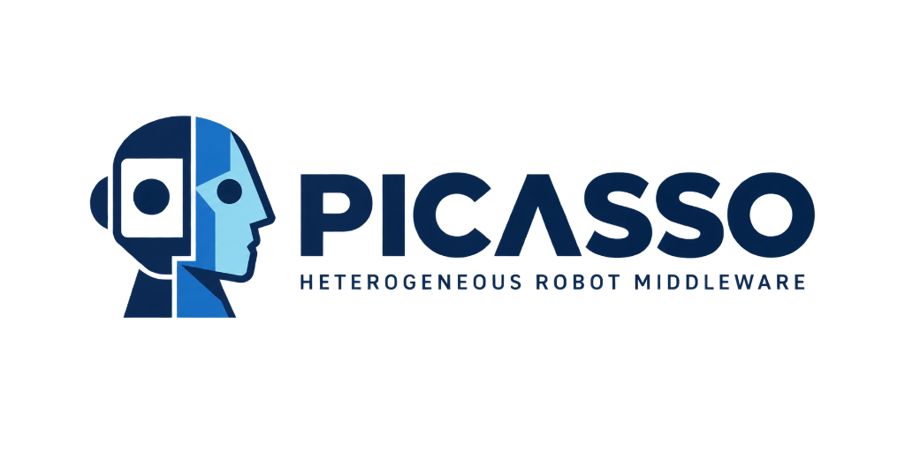
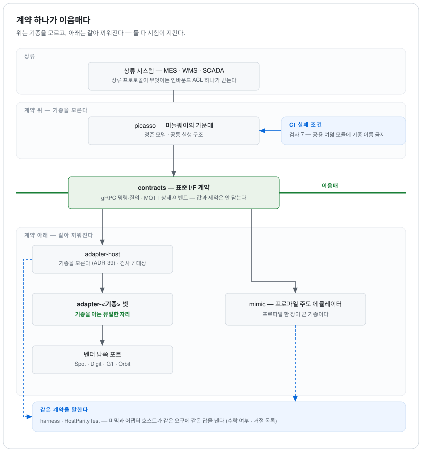
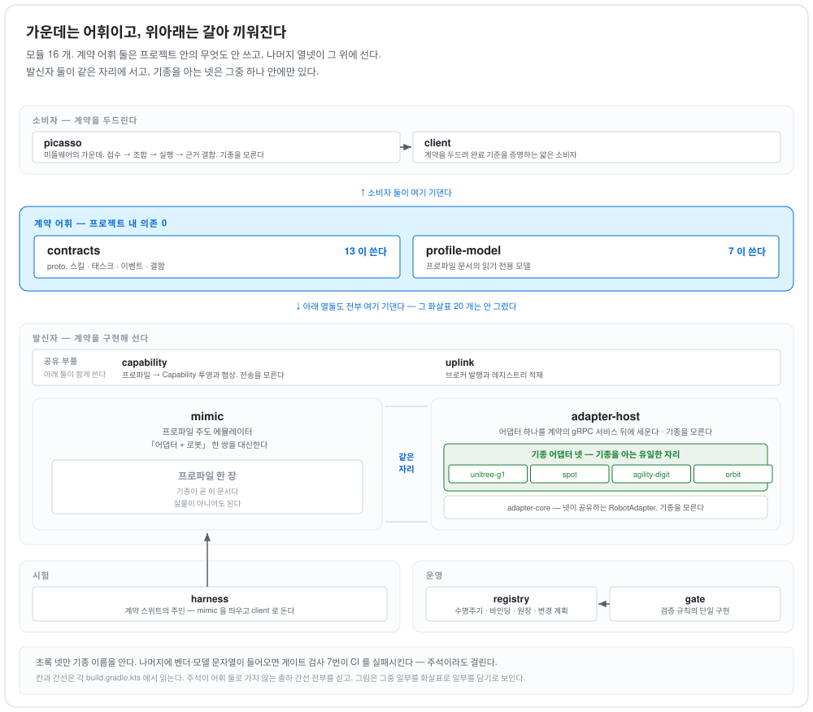

<p align="center">
  
</p>

# picasso — 이기종 로봇 표준 인터페이스 계약 및 운영 변경 체계

[](https://github.com/LivingLikeKrillin/picasso/actions/workflows/ci.yml)
[](LICENSE)

공장 운영 시스템(MES·WMS)과 이기종 모바일 로봇(휴머노이드 및 4족보행 로봇) 간의 **표준 인터페이스 계약(Standard Interface Contract)**을 정의하고, 실물 로봇 없이 계약의 정합성을 검증할 수 있는 **결정론적 에뮬레이터(`mimic`)** 및 **운영 중 변경 파급도 사전 계산 체계**를 제공하는 엔지니어링 미들웨어 PoC 프로젝트입니다.

본 시스템은 다음 두 가지 핵심 명제를 기반으로 설계되었으며, 단순한 개념 증명이 아닌 **CI 빌드 실패 조건 및 런타임 조작 거부 조건**으로 강제됩니다:

1. **이기종 대응은 코드 수정이 아닌 프로파일(Profile) 교체로 달성되어야 한다.**
2. **운영 변경은 파급 영향도를 사전에 정량적으로 계산할 수 있어야 한다.** 변경 파급을 계산할 수 없으면 변경 리스크가 극대화되어 시스템 확장이 불가능해집니다.

<picture>
  <source media="(prefers-color-scheme: dark)" srcset="docs/diagrams/seam.dark.svg">
  
</picture>

**기종별 식별자와 종속성은 최하위 어댑터 계층에만 격리됩니다.** 상류 연계 계층부터 어댑터 호스트(Adapter Host)까지의 전 계층은 특정 기종에 대한 의존성을 갖지 않으며, 게이트 검사 7번이 공용 모듈의 소스코드를 정적 분석하여 기종 종속성 누출을 **CI 실패 조건**으로 차단합니다. 계약 하위 계층은 상호 호환 가능한 구조로 설계되어, 실물 기종 어댑터 넷이 배치되는 위치에 프로파일 주도 에뮬레이터인 `mimic`을 동일하게 바인딩할 수 있으며, `HostParityTest`를 통해 동일한 요청 사양에 대해 수락·거절 판정의 동등성을 검증합니다.

**운영 변경 원칙 (비대칭성)**: 시스템 변경 통제는 *"신규 엔티티 추가는 안전하고, 기존 엔티티 삭제·수정은 잠재적 위험을 내포한다"*는 비대칭성 원리에 기초합니다.

> **설계 정본:** 아키텍처 및 상세 명세의 정본은 [공식 설계 문서](docs/superpowers/specs/2026-09-05-picasso-design.md)입니다. 본 README는 입문 개요이며, 상충하는 내용이 있을 경우 설계 문서를 우선합니다.

## 시스템 모듈 구성

<picture>
  <source media="(prefers-color-scheme: dark)" srcset="docs/diagrams/components.dark.svg">
  
</picture>

```
contracts/                proto. 스킬·태스크·이벤트·결함. 프로젝트 내 의존 0
profile/
  schema/                 능력 프로파일 JSON Schema (+ 조사·거리·출처 스키마)
  profiles/               기종 프로파일 문서 (실물 셋 + 시험용 가상 기종)
  fixtures/ requirements/ 게이트·시험 전용 픽스처와 소비자 요구 집합
  vendors/                벤더 1차 자료 조사 — 무엇을 선언하고 무엇을 안 하는가
  distance/               계약 어휘와 벤더 표면의 거리 측정 (survey_scope 필수)
  provenance/             프로파일의 각 값이 어느 원문에서 왔는가
profile-model/            프로파일 문서의 읽기 전용 모델 — gate·mimic 공유
capability/               능력의 투영과 판정 — 프로파일 → Capability, 요구 집합 대 Capability 협상.
                          mimic·어댑터 호스트 공유. 전송을 모른다
uplink/                   발신자의 위쪽 결선 — 브로커 발행과 레지스트리 적재. mimic·어댑터 호스트 공유
gate/                     검증 규칙의 단일 구현. CI 와 registry 가 같은 코드를 호출
mimic/                    프로파일 주도 에뮬레이터 — "어댑터 + 로봇" 한 쌍을 대신
client/                   계약을 두드려 완료 기준을 증명하는 얇은 소비자
harness/                  계약 스위트의 주인. mimic 을 띄우고 client 로 돈다
registry/                 개정판·어댑터 수명주기, 바인딩, 의존 원장, 변경 계획, 카탈로그
picasso/                  미들웨어의 가운데 — 정준 모델(실행 상태 두 축·근거 등급·논리적 능력·취소 응답)과
                          공통 실행 구조. 접수 → 조합 → 실행 → 근거 결합 → 결과 통보. 기종을 모른다 (ADR 38)
adapter-core/             어댑터들이 공유하는 계약 쪽 어휘와 RobotAdapter. 기종을 모른다
adapter-host/             어댑터 하나를 계약의 gRPC 서비스 뒤에 세우는 서버. 기종을 모른다(ADR 39)
adapter-unitree-g1/       실물 어댑터 — 기종을 아는 유일한 자리 (기종마다 모듈 하나)
adapter-boston-dynamics-spot/
adapter-agility-digit/
adapter-boston-dynamics-orbit/
                          기체가 아니라 **플릿**에 붙는 어댑터 + 배치 런처. 발견이 여기서 실증된다(ADR 37)
tools/buf                 buf 를 Docker 로 실행하는 래퍼
tools/vendor-manifest/    벤더 원문에서 심볼 이름만 뽑아 남쪽 포트의 인용을 대조하는 도구
docs/adr/                 결정 기록
docs/environment-preconditions.md
                          이 일감을 시키려면 현장에 무엇이 있어야 하는가 — 설계 입력
docs/vendors/             로봇이 아닌 벤더 표면의 측정 노트 (플릿 관리 API)
```

모듈 간 의존성 규칙과 상세 책임은 설계 문서 §3 및 [`docs/architecture.md` §4b](docs/architecture.md)의 배포 의존성 매트릭스에 정의되어 있으며, 이는 빌드 정의와 직접 대조 검증됩니다.

- **`contracts/` 모듈의 내부 프로젝트 의존성은 0**입니다.
- 기종별 단일 기체 어댑터 셋(`adapter-unitree-g1`, `adapter-boston-dynamics-spot`, `adapter-agility-digit`)은 오직 `adapter-core`와 `contracts`에만 의존합니다.
- 플릿 관리 시스템에 연계되는 `adapter-boston-dynamics-orbit`은 배치 런처 및 서비스 호스팅 구조를 포함하여 5개 모듈에 의존합니다. (ADR 37·39)

## 핵심 동작 메커니즘

- **인터페이스 계약 (Contracts)**: 명령/질의는 gRPC, 상태/이벤트/연결 스트리밍은 MQTT를 사용합니다. 태스크는 `(task_id, revision)` 튜플로 멱등성을 보장하며, 수명주기 상태 전이와 파지 상태(`hold`) 갱신을 전달합니다. 계약은 특정 도메인 수치나 파라미터 제약조건을 하드코딩하지 않으며, 이는 프로파일에 위임합니다.
- **기종 프로파일 (Profile)**: 각 로봇 기종의 지원 역량을 선언하는 JSON 스펙 문서입니다. 기능 지원 여부는 3값 논리(`YES`, `NO`, `UNKNOWN`)를 채택하여, 명확히 입증되지 않은 사양을 `NO`로 단정하여 발생하는 정보 왜곡을 방지합니다.
- **품질 및 아키텍처 게이트 (Gate)**: 계약 스펙과 프로파일 간의 불일치 시 PR 병합을 차단합니다. 검사 아홉이 있고 CI 와 `registry` 가 기준선만 달리해 같은 코드를 부른다. 네거티브 테스트 케이스는 코드가 아닌 데이터 기반으로 관리됩니다.
- **프로파일 에뮬레이터 (Mimic)**: 기종 프로파일을 로드하여 계약 인터페이스를 에뮬레이션합니다. 시드(Seed)와 가상 클록(Virtual Clock)을 고정하여 결정론적(Deterministic) 이벤트 시퀀스를 생성하며, 제어 채널을 통해 네트워크 지연·유실·래치 위반 등의 결함을 주입할 수 있습니다.
- **로봇 어댑터 (Adapter)**: 노스바운드(Northbound)는 표준 계약을 구현하고, 사우스바운드(Southbound)는 벤더 API 포트로 연결됩니다. 벤더 독점 SDK는 저장소에 일절 포함하지 않으며, `@VendorSurface` 어노테이션과 `vendor-manifest.txt` 매니페스트(심볼명 및 SHA-256 해시)를 통해 정합성을 검증합니다. 어댑터가 벤더의 어느 추상화 계층에 연동되든 상위 계약 면에서는 투명해야 합니다.
- **운영 레지스트리 (Registry)**: Spring Boot 및 PostgreSQL 기반의 서비스 관리 모듈입니다. 개정판 관리, 어댑터 라이프사이클, 의존성 원장, 변경 계획 수립, 사이트 카탈로그 및 진단 표면 열 개를 제공합니다. 환경변수 기반 무상태 구성을 원칙으로 합니다.

## 검증 현황 및 한계 관리

저장소 내 대외 문서 53종은 자동화 대조 검증을 완료한 상태입니다. 문서에 명시된 모든 기술적 주장은 자동화 테스트로 증명되거나, [`docs/limits.md`](docs/limits.md)의 미결 항목 대장에 등록되어 추적 관리됩니다. 각 문서 하단의 대조 도장(Hash Stamp)은 본문 내용과 연결되어 있어, `CompletionCriterionTest`를 통해 임의 변경 시 도장 갱신을 요구합니다.

한계 대장(`limits.md`)에 등록된 미결 항목은 **37개**(내부 25개 · 외부 12개, 의도적 제외 13개 제외)이며, 그 상세 목록과 해결 조건은 `limits.md`에 명시되어 있습니다. 특히 실물 어댑터가 넷 있다(기체 셋, 플릿 하나). 다만, 어댑터 넷 중 어느 것도 실물에 붙여 보지 못했다(C-3)는 물리적 검증 한계가 존재하며, 이는 SDK 라이선스, JVM 바인딩 부재, 플릿 실기체 인스턴스 부재 등에 기인합니다.

실물 넷이 계약에 얼마나 닿나 확인한 정량 분석 결과는 [`profile/distance/`](profile/distance)에서 확인할 수 있습니다. 계약 개정판은 **0.9.0** 이다.

## 라이선스

[Apache License 2.0](LICENSE). 본 저장소에는 특정 벤더의 독점 SDK가 포함되어 있지 않으며, 벤더 API 사양의 심볼명 및 해시 매니페스트(`vendor-manifest.txt`)만을 포함합니다.

## 빌드 및 테스트 실행

- **필수 환경**: **JDK 21**, **Docker** (buf 래퍼, Testcontainers 기반 PostgreSQL/Mosquitto 실행용), Kotlin/Gradle 환경.

```bash
./gradlew build -Dpicasso.negative.strict=true -Dpicasso.buf="$PWD/tools/buf"
```

계약 디스크립터(`picasso.desc`)는 Gradle의 `protoc` 태스크를 통해 자동 생성되며, `:gate:test`가 이를 런타임 입력으로 참조하여 구버전 디스크립터 참조로 인한 정합성 왜곡을 원천 방지합니다.

CLI 도구 실행:
```bash
# mimic 에뮬레이터 실행
mimic --robot <id>=<profile.json> [--robot ...] --schema <path> [--port 0] [--clock real|virtual] [--seed N]

# 검증 클라이언트 실행
client --target <host:port> --robot <id> --requirements <file> --skill <type> [--param k=v ...]
```

## 문서 체계 가이드

| 문서 분류 | 대상 문서 및 링크 | 설명 |
|---|---|---|
| **검증 신뢰도** | [`docs/verification.md`](docs/verification.md) | 구간별 실물 기체, 실 네트워크, 모의 대역(Mock) 적용 범위 및 검증 수준 정의 |
| **아키텍처** | [`docs/architecture.md`](docs/architecture.md) | 4단계 어휘 모델(ADR 36), 데이터 흐름, 상태 전이 모델 및 의존성 규칙 |
| **오케스트레이션과 자원 소유** | [`docs/orchestration.md`](docs/orchestration.md) | 배정·실행 보증·경로 세 층의 구분, 자원별 소유자와 관문 대장, 배선도 |
| **인터페이스 계약** | [`docs/contract.md`](docs/contract.md) | 계약 진입 게이트 규칙, 지원 범위 한계, 계약 담보 항목 및 1:1 테스트 매핑 |
| **인터페이스 이음매** | [`docs/seams.md`](docs/seams.md) | 9대 교체 지점(Seam) 명세, 대상 인터페이스 및 실물 전환 가이드 |
| **어댑터 개발** | [`tools/adapter-template/`](tools/adapter-template/README.md) | 신규 기종 어댑터 구현을 위한 7개 필수 구성 요소 및 템플릿 가이드 |
| **어휘 거리 측정** | [`docs/vocabulary-distance.md`](docs/vocabulary-distance.md) | 벤더 API 명세와 계약 스킬 간의 어휘 거리 측정 절차 및 유의점 |
| **상류 표준 연계** | [`docs/isa95.md`](docs/isa95.md) | ISA-95 표준 데이터 모델 매핑 및 미들웨어 계층의 근거 등급 정의 |
| **현장 시운전** | [`docs/commissioning.md`](docs/commissioning.md) | 마스터 데이터 설정, 10단계 시운전 절차 및 관리 API 표면 명세 |
| **모듈별 상세 명세** | 모듈별 `README.md` 참조 | 각 모듈의 단일 책임 원칙, 경계 조건, 테스트 항목 명세 ([`contracts`](contracts/README.md) → [`picasso`](picasso/README.md) → [`adapter-host`](adapter-host/README.md)) |
| **설계 정본 스펙** | [공식 설계 문서](docs/superpowers/specs/2026-09-05-picasso-design.md) | 목적, 비목표(Non-goals), 세부 아키텍처, 계약, 프로파일, 변경 관리 종합 사양 |
| **한계 및 이력** | [설계 문서 §15 알려진 한계](docs/superpowers/specs/2026-09-05-picasso-design.md#15) | 설계 변경 이력 및 누적 정정 기록 |
| **운영 시나리오** | [`docs/scenarios.md`](docs/scenarios.md) | 공장 3대 시나리오(용기 공급 AMR, 부품 시퀀싱, 설비 점검) 및 완료 증명 체계 |
| **미들웨어 코어** | [`docs/superpowers/specs/2026-09-09-middleware-core-design.md`](docs/superpowers/specs/2026-09-09-middleware-core-design.md) | 정준 실행 모델, 논리적 능력 정의, 근거 등급 결합 및 장애 전이 모델 |
| **설계 결정 기록** | [ADR 색인](docs/adr/README.md) | 주요 아키텍처 결정 레코드 (ADR 9, 31, 32, 33, 34, 35, 36, 37, 38, 39 등) |
| **벤더 인터페이스** | [`profile/vendors/`](profile/vendors) · [`docs/vendors/orbit.md`](docs/vendors/orbit.md) | 벤더 API 표면 분석 및 플릿 관리 인터페이스 측정 노트 |
| **현장 전제조건** | [`docs/environment-preconditions.md`](docs/environment-preconditions.md) | 로봇 도입 현장의 인프라(도어, 바닥, 조명 등) 엔지니어링 전제조건 |
| **벤더 매니페스트** | [`tools/vendor-manifest/README.md`](tools/vendor-manifest/README.md) | 어댑터의 사우스바운드 포트 벤더 심볼 인용 대조 검증 도구 |
| **미결 과제 대장** | [`docs/limits.md`](docs/limits.md) | 미결 한계 항목 44개(내부·외부) 및 해결 조건 관리 대장 |

## 핵심 엔지니어링 규율

- **3값 논리 준수**: 벤더 1차 자료에서 미확인된 사양은 `NO`가 아닌 `UNKNOWN`으로 선언하여 추정에 의한 왜곡을 방지합니다.
- **조사 범위 명시**: 벤더 기능 조사는 반드시 분석 대상 API 서비스 범위를 명시(`survey_scope`)해야 합니다.
- **부재 판정 검증**: 벤더 사양 추출기의 0건 결과는 결함 주입을 통해 도구의 정상 동작 여부를 선행 검증합니다.
- **벤더 원문 바이너리 격리**: 저장소 내 벤더 소스/SDK를 격리하고 심볼 식별자와 해시만 보관합니다.
- **결함 주입(Mutation Testing)**: 테스트 케이스 작성 시 의도적 결함을 주입하여 검증 유효성을 선행 확인합니다.
- **엄격한 실패 정책**: 사전 선언된 요구 검사 목록(`--require`)을 충족하지 못하는 경우 조용한 통과를 허용하지 않습니다.

> 마지막 대조: 2026-09-18 · sha256:0e9610614cfe · 열림: C-3, §15.81
