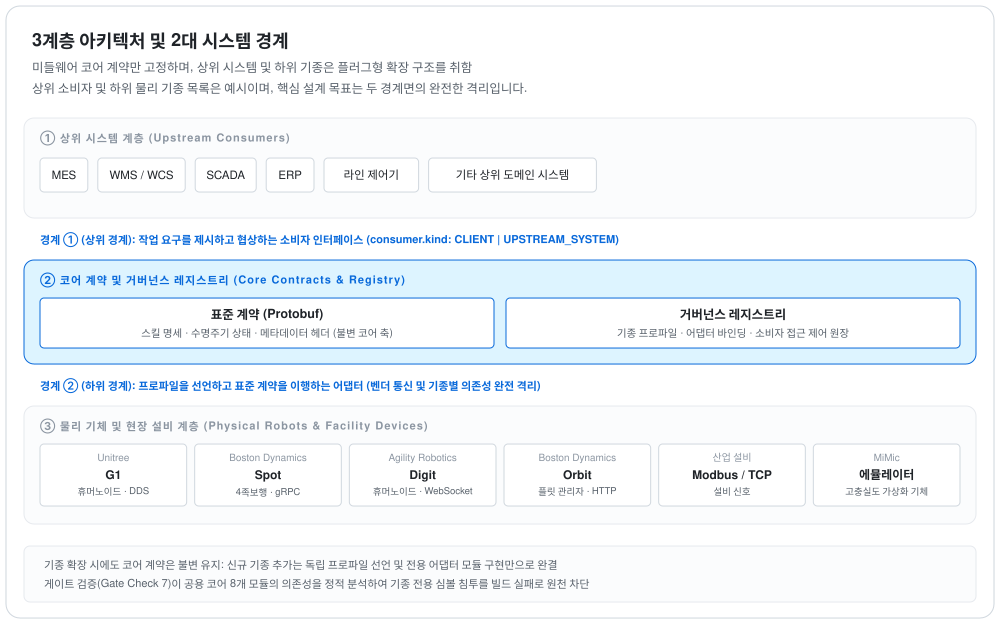
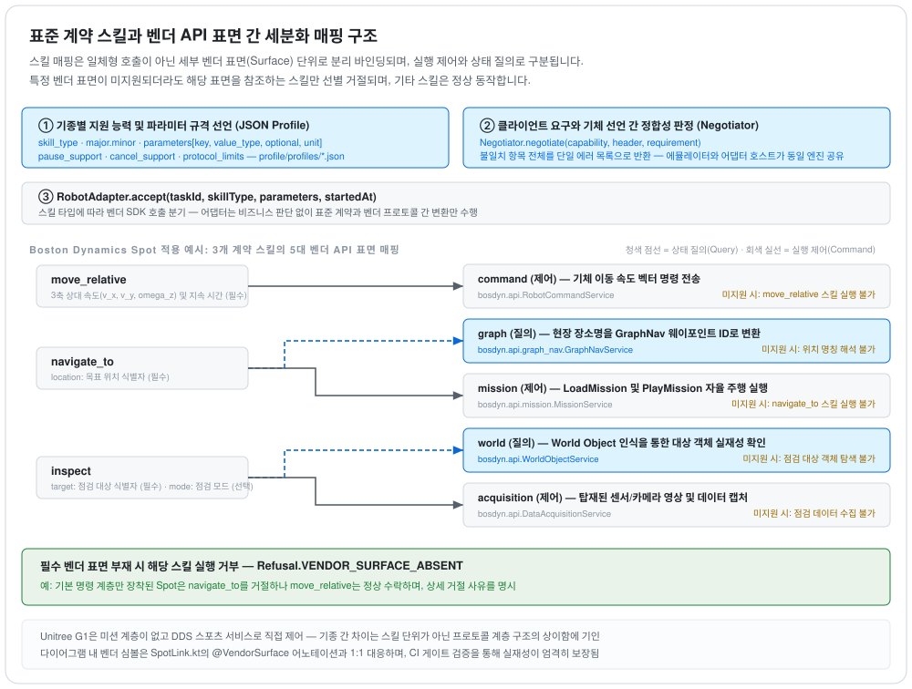
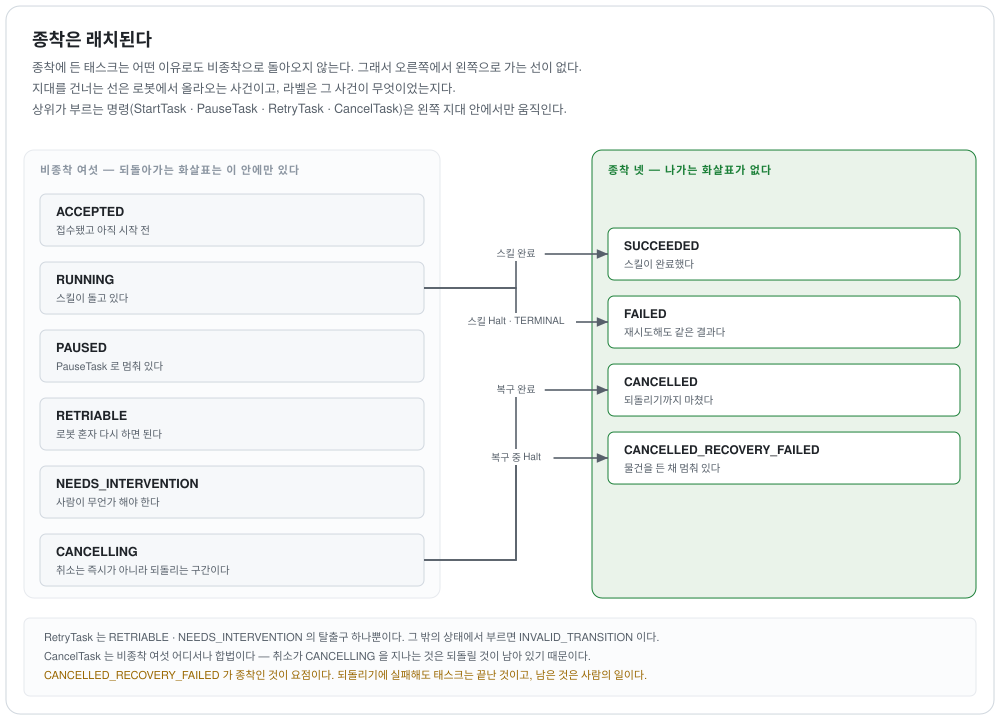

# 아키텍처 — 시스템 경계 및 계층 설계 원칙

본 문서는 `picasso` 미들웨어의 **시스템 경계 설정 근거, 4단계 추상화 계층 모델, 데이터 흐름 및 의존성 규칙**을 정의하는 아키텍처 명세서입니다.

---

## 0. 시스템 3대 영역 및 경계 정의

<picture>
  <source media="(prefers-color-scheme: dark)" srcset="diagrams/three-layers.dark.svg">
  
</picture>

본 시스템의 아키텍처 경계는 다음 3대 영역으로 구분됩니다:
1. **상위 시스템 영역 (Upstream Systems)**: MES, WMS, ERP, SCADA 등 공장 상위 운영 체계.
2. **미들웨어 코어 및 계약 영역 (picasso Core & Contracts)**: 표준 계약 프로토콜(Contracts), 미들웨어 오케스트레이션 엔진, 운영 레지스트리.
3. **하위 실행 및 벤더 영역 (Execution & Vendors)**: 단일 로봇 기체, 플릿 관리 솔루션(Orbit), 현장 PLC 설비, 그리고 에뮬레이터(`mimic`).

**상·하위 시스템에 대한 중립성 보장**: 중앙의 인터페이스 계약과 미들웨어 코어는 특정 상위 플랫폼이나 특정 하위 로봇 기종에 종속되지 않습니다. 공용 모듈에 특정 기종 식별자가 침투하지 못하도록 정적 게이트 검사 7번이 이를 강제합니다.

---

## 1. 4단계 추상화 계층 모델 (ADR 36)

본 아키텍처는 **"일감의 배정·결정 어휘와 물리적 실행 계약 어휘는 반드시 분리되어야 한다"**는 설계 원칙(ADR 36)에 따라 시스템을 4개 계층으로 엄격히 분리합니다.

```
 ①  현장 작업 발주       "랙 204에 대해 생산 시퀀스 17 작업을 수행하라"   ← 상류 시스템 (MES·WMS)
     ─────────────────────────────────────────────────────────────
 ②  논리적 능력 어휘     "부품 시퀀싱(Sequencing)" 논리적 능력 규격        ← 상류 명칭 준용, 자체 스키마 정의
 ③  일감 분해 및 결정    작업 단위를 태스크 목록으로 분해, 다중 근거 결합  ← picasso 미들웨어 코어
     ─────────────────────────────────────────────────────────────
 ④  실행 계약 인터페이스 pick_place(object_id, destination)               ← contracts (gRPC + MQTT)
     ─────────────────────────────────────────────────────────────
 ⑤  벤더 제어 명령       StopMission → LoadMission → PlayMission           ← 어댑터 내부 (상류에 비노출)
```

- **벤더 제어 계층의 은닉**: ⑤번 벤더 고유 제어 명령 및 상태는 ④번 표준 계약 인터페이스 상위로 누출될 수 없습니다 (ADR 36 결정 5). 어댑터가 벤더의 어떤 계층(플릿 API, 미션 엔진, 저수준 모터 명령)에 연동되는지는 계약 소비자에게 투명하게 은닉됩니다.
- **논리적 능력 명칭 체계**: ②번 논리적 능력의 고유 명칭(`WorkMasterID` 등)은 실제 상류 시스템과의 인터페이스 정의를 따르며, 미들웨어는 정규화된 스키마로 이를 수용합니다.

---

## 2. 데이터 흐름 아키텍처

### 2.1 다운스트림 흐름: 상위 일감 발주부터 기체 제어까지

```
JobOrder (작업 식별자 SEQ-204, 리비전 17, 요구 근거 등급 E2)
   │                                   상류 시스템이 발주한 최종 목표
   ▼  picasso : LogicalCapability.plan()
ExecutionUnit × 4   (슬롯 단위 분해)
   │                                   원자 단위 작업 분해 (배차·경로 배정은 스코프 외: ADR 36)
   ▼  contracts : StartTask(task_id, revision, skill_type, parameters)
TaskHandle
   │                                   단일 로봇 기체 할당 및 인터페이스 전송
   ▼  adapter : RobotAdapter.accept()
벤더 API 호출 (Orbit: POST dispatch · Spot: LoadMission+PlayMission · Digit: action-sequential · G1: SetVelocity)
```

- **원자적 태스크 매핑**: 분해된 각 작업 단위(`ExecutionUnit`)는 1개의 계약 태스크(`Task`)로 일대일 매핑됩니다. 따라서 각 태스크의 완료 상태 자체가 공정 진행 상황을 반영하므로, 계약 내에 별도의 모호한 부분 완료 상태를 둘 필요가 없습니다.

### 2.2 계약 스킬과 벤더 API 표면 간의 매핑 구조

<picture>
  <source media="(prefers-color-scheme: dark)" srcset="diagrams/skill-mapping.dark.svg">
  
</picture>

- **표면(Surface) 기반 바인딩**: 계약 스킬은 단일 API 호출이 아닌 벤더가 제공하는 개별 기능 표면(Surface) 단위로 바인딩됩니다. 예컨대 `navigate_to` 스킬은 토폴로지 그래프 표면(좌표 변환 조회용)과 미션 실행 표면을 조합하여 수행됩니다.
- **부분 실패 격리**: 특정 기능 표면이 지원되지 않을 경우, 해당 표면을 요구하는 스킬만 `VENDOR_SURFACE_ABSENT` 에러로 거절되며, 다른 표면을 사용하는 스킬은 정상 동작합니다.
- **계층 불일치 해소**: 기종 간의 능력 차이는 스킬 파라미터의 차이가 아니라 벤더가 제공하는 소프트웨어 추상화 계층의 불일치에서 비롯됩니다. `Negotiator`는 작업 요구사항과 로봇 프로파일을 대조하여 호환되지 않는 항목을 일괄 검출합니다.

### 2.3 업스트림 흐름: 질의(Pull) 및 이벤트 발행(Push) 이원화

```
로봇 / 벤더 시스템
   │
   ├─ 질의(Pull)  : WatchTask · GetSnapshot · ReplayEvents  (gRPC — 소비자가 능동 조회)
   │        └→ picasso 가 상위 실행 상태로 동기화
   │
   └─ 발행(Push)  : state · event · connection              (MQTT — 기체가 능동 발행)
            ├→ 상위 소비자가 토픽 구독
            └→ IngestBridge 를 통해 registry 로 원장 적재
```

- **신뢰 원천으로서의 스냅샷**: 상태의 절대적 권위(Source of Truth)는 정기/수시 조회되는 스냅샷에 있으며, 이벤트 스트림은 스냅샷 간의 상태 전이를 보충합니다.
- **시퀀스 유실 통보**: 링 버퍼 한계를 초과하여 이벤트 유실이 발생한 경우, 조용히 누락하지 않고 `SEQUENCE_EVICTED` 오류를 통보하여 소비자가 스냅샷부터 상태를 재동기화하도록 강제합니다 (§15.107).

---

## 3. 이원화된 상태 전이 모델 (FSM Dual Model)

상위 비즈니스 관점의 **실행 상태(`picasso`)**와 하위 제어 관점의 **태스크 상태(계약)**는 서로 다른 계층의 관심사를 처리하며, 상호 독립적으로 운용됩니다.

| 항목 | 실행 상태 (`picasso` 미들웨어) | 태스크 상태 (표준 계약) |
|---|---|---|
| **관리 대상** | 논리적 능력(일감) 전체의 진행 상태 | 단일 로봇 기체에 할당된 원자적 태스크 1건 |
| **값** | `REQUESTED`·`ACCEPTED`·`RUNNING`·`PARTIAL`·`IN_DOUBT`·`OPERATOR_HOLD`·`PHYSICALLY_DONE`·`UNVERIFIED`·`FAILED`·`CANCELING`·`ABORTED` | `ACCEPTED`·`RUNNING`·`PAUSED`·`SUCCEEDED`·`FAILED`·`RETRIABLE`·`NEEDS_INTERVENTION`·`CANCELLING`·`CANCELLED`·`CANCELLED_RECOVERY_FAILED` |
| **추가 상태 축** | `upstream_ack` (상류 통보 도달 여부 — 물리 상태와 독립) | 없음 |
| **결정 주체** | 계약 상태 + **현장 PLC 설비 신호** 종합 판단 | 개별 로봇 기체의 보고 상태 |

- **`UNVERIFIED` 상태의 의의**: *"로봇은 물리적 작업을 완료했다고 보고했으나 현장 설비 센서 신호가 확인되지 않은 불일치 상태"*는 기체 단독 상태를 다루는 계약 계층에서는 정의할 수 없으며, 다중 소스 신호를 통합하는 미들웨어 코어 계층에서만 판정할 수 있습니다.

### 3.1 태스크 상태 전이 불변성 (Terminal State Latch)

<picture>
  <source media="(prefers-color-scheme: dark)" srcset="diagrams/task-states.dark.svg">
  
</picture>

- **종착 상태 불변 원칙**: 일단 종착 상태(Terminal State)에 진입한 태스크는 어떤 후속 이벤트나 명령에 의해서도 비종착 상태로 역전이될 수 없습니다.
- **복구 실패 종착**: 작업 취소 후 물리적 롤백에 실패하더라도 상태는 `CANCELLED_RECOVERY_FAILED`라는 확정적 종착 상태로 래치(Latch)되며, 이후 처리는 운영자 개입 절차로 이관됩니다.

---

## 4. 모듈 의존성 및 아키텍처 규칙

```
contracts        ← 프로젝트 내부 의존성 0 (순수 명세 계층, 게이트 검사 5번 집행)
profile-model    ← gate 및 mimic 공용 프로파일 데이터 모델 (ADR 29)
capability       ← mimic 및 adapter-host 공용 (능력 투영 및 협상 로직 단일화)
uplink           ← mimic 및 adapter-host 공용 (브로커 발행 및 레지스트리 적재)
adapter-core     ← 전체 어댑터 공용 (RobotAdapter 인터페이스 표준)
adapter-host     ← 계약 gRPC/MQTT 서비스를 구동하는 어댑터 호스팅 런타임 (ADR 39)
adapter-<기종>   ← 특정 기종 의존성을 갖는 유일한 계층 (ADR 33), adapter-core 및 contracts에 의존
picasso          ← 미들웨어 오케스트레이션 코어 (기종 무관, ADR 38)
registry         ← 메타데이터 및 카탈로그 레지스트리 (무상태 풀링 모델 지원, §3.2)
```

- **기종 격리 원칙**: 특정 기종에 종속된 코드는 오직 `adapter-<기종>` 모듈에만 존재할 수 있으며, 타 모듈에 벤더 키워드가 유입되는 것을 CI 게이트 검사 7번이 엄격히 차단합니다.
- **레지스트리 결합도 최소화**: 레지스트리는 하위 모듈에 실시간 푸시를 수행하지 않으며, 각 클라이언트가 설정 주기에 따라 데이터를 풀링(Pull)함으로써 레지스트리 장애가 기체 제어 런타임 중단으로 확산되는 것을 방지합니다.

---

## 4b. 출하 의존 — 빌드가 대는 표

<picture>
  <source media="(prefers-color-scheme: dark)" srcset="diagrams/components.dark.svg">
  
</picture>

본 다이어그램과 의존성 표는 임의 작성된 산문이 아니며, 각 모듈의 `build.gradle.kts` 출하 의존성 선언을 `DocumentClaimsTest`가 직접 파싱하여 정합성을 검증합니다.

```text
adapter-agility-digit          → adapter-core · contracts
adapter-boston-dynamics-orbit  → adapter-core · adapter-host · contracts · profile-model · uplink
adapter-boston-dynamics-spot   → adapter-core · contracts
adapter-core                   → contracts
adapter-host                   → adapter-core · capability · contracts · profile-model · uplink
adapter-unitree-g1             → adapter-core · contracts
capability                     → contracts · profile-model
client                         → contracts · profile-model
contracts                      → (없음)
gate                           → profile-model
harness                        → client · contracts · mimic · profile-model · uplink
mimic                          → capability · contracts · profile-model · uplink
picasso                        → client · contracts
profile-model                  → (없음)
registry                       → contracts · gate
uplink                         → contracts
```

> **특이사항:** `adapter-boston-dynamics-orbit`은 단일 기체가 아닌 플릿 제어 플랫폼과 연동되며, 자체 배치 런처를 통해 계약 서비스를 구동하므로 5개 모듈 의존성을 가집니다 (ADR 37·39).

---

## 5. 시스템 비목표 (Non-goals 및 책임 외 범위)

| 제외 항목 | 제외 사유 및 아키텍처 경계 |
|---|---|
| **글로벌 배차·동적 라우팅·교통 관제** | 복수 로봇 간의 동적 경로 경합 및 공장 자원 최적 배차는 상위 플릿/미션 관리 시스템의 책임 영역입니다. |
| **하드웨어 안전 기능 (비상정지, 보호정지)** | 안전(Safety) 계통은 미들웨어 소프트웨어 가용성과 분리된 독립 하드웨어 안전 루프(Safety PLC 등)로 처리되어야 합니다 (ADR 32). |
| **상위 시스템 전용 맞춤 어댑터 (MES ACL)** | 본 시스템에서 상위 시스템은 표준 인터페이스 소비자로 간주되며, 전용 레거시 프로토콜 변환은 상류 경계에 위치합니다. |
| **무선 통신 단절에 대한 강제적 안전 조치** | 계약은 통신 단절 상태를 상위에 가시화할 뿐이며, 구체적인 기체 정지/복구 정책은 현장 배포 정책에 따릅니다. |
| **벤더 독점 SDK 바이너리 내장** | 라이선스 제약 및 크로스 플랫폼 호환성 유지를 위해 벤더 SDK는 저장소에 포함하지 않으며, 심볼 매니페스트를 통한 정합성만을 검증합니다. |

---

## 6. 권장 문서 탐색 경로

1. [`verification.md`](verification.md) — 각 구간별 검증 수준 및 신뢰 등급 확인 (가장 먼저 확인 권장)
2. [`contract.md`](contract.md) — 인터페이스 계약의 보증 사항 및 세부 RPC 규격
3. [`seams.md`](seams.md) — 실물 기체 및 신규 시스템 확장을 위한 9대 교체 지점 명세
4. [`isa95.md`](isa95.md) — ISA-95 공장 표준 모델과 미들웨어 정준 모델 간의 매핑
5. [`commissioning.md`](commissioning.md) — 현장 시운전 절차 및 운영 설정 REST API 명세
6. [공식 설계 문서](superpowers/specs/2026-09-05-picasso-design.md) — 시스템 전체 설계 정본 스펙

> 마지막 대조: 2026-09-15 · sha256:27055bdc9db5 · 열림: 시나리오 §8, §15.34, §15.5, ADR 32 · 시나리오 5, §1.3 B-1, §15.126
