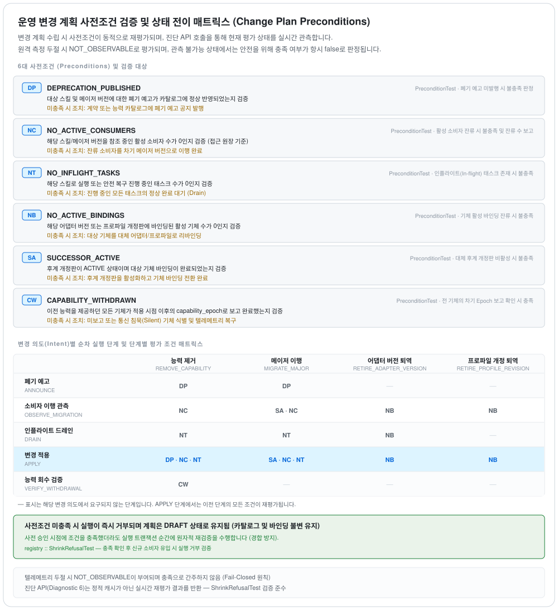
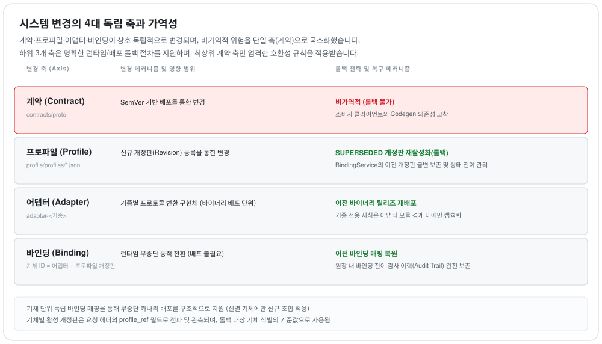

# 현장 배포 및 시운전(Commissioning) 운영 가이드

본 문서는 `picasso` 미들웨어를 공장 현장에 최초 구축할 때 수행하는 **초기 시운전(Commissioning, Day-1)** 절차와 시스템 가동 중 발생하는 **동적 변경 관리(Day-2 Operations)**에 관한 운영 엔지니어링 가이드입니다.

- 컴포넌트 교체 지점 명세: [`seams.md`](seams.md)
- 인터페이스 계약 보증 규격: [`contract.md`](contract.md)

---

## 1. 데이터 관리 기준: 마스터 데이터와 런타임 데이터의 분리

ISA-95 제조 통합 표준의 핵심 원칙에 따라 시스템 엔티티를 **정의(마스터 데이터)**와 **실행 인스턴스(런타임 데이터)**로 엄격히 분리하여 관리합니다.

| 분류 | 마스터 데이터 (초기 설정 후 준불변) | 런타임 데이터 (운영 중 수시 갱신) |
|---|---|---|
| **대상 엔티티** | 계약 SemVer, 스킬 카탈로그, 어댑터 제품 및 빌드 정의, 기종 프로파일, 설비 신호 포트 매핑, 시간창 δ, 현장 환경 전제조건 | 어댑터 런타임 인스턴스, 로봇 기체 등록 및 퇴역(Retirement) 상태, 사이트 명칭 등록 기록, 프로파일 개정판, 소비자 요구 집합 |
| **변경 시 파급도** | **능력 협상 및 계약 판정 로직 변경** (상위 시스템 영향도 발생) | 엔티티 목록 변경 (판정 로직 불변) |
| **관리 주체** | 현장 인프라 및 시스템 설계 엔지니어 | 현장 운영자 및 로봇 어댑터 에이전트 |

> **시스템 외부 보존 엔티티 (Out-of-Registry):**
> 공장 현장 지도(SLAM Map) 및 공간 세계 모델(ADR 34·35: 로봇 기체 내 보존), 기체의 실시간 센서 관측치, 플릿 관리자가 관리하는 기체 목록, 접속 자격증명 등은 레지스트리에 보관하지 않습니다. 동일한 데이터를 복수 위치에 복제할 경우 데이터 동기화 불일치 문제가 발생하므로 단일 원천 원칙을 고수합니다.

---

## 2. 10단계 초기 시운전(Commissioning) 절차

각 단계는 엄격한 선행 의존성을 가지며, 선행 단계가 완료되지 않으면 후속 단계는 명시적으로 실패합니다.

| 단계 | 작업 내용 | 실행 위치 / API | 미완료 시 장애 영향 |
|---|---|---|---|
| **Step 0** | 인터페이스 계약 SemVer 버전 고정 | 빌드 설정 | 어댑터와 소비자 간 계약 버전 불일치 발생 |
| **Step 1** | 사이트 및 스킬 카탈로그 초기화 | `GET /catalog` 로 조회 검증 | 로봇 능력을 선언할 계약 어휘 부재 |
| **Step 2** | 어댑터 제품 및 릴리스 빌드 등록 | 운영 레지스트리 | 어댑터 인스턴스 등록 시 유효 빌드 참조 불가로 거절 |
| **Step 3** | **로봇 기체 내부 사이트(웨이포인트) 명칭 등록** | **현장 기체 직접 설정 작업** (Spot: Autowalk 웨이포인트 명명, Digit: add-object) | 계약이 전달하는 장소명을 로봇이 인식하지 못해 작업 요청이 `PARAMETER_INVALID` 로 거절됨 |
| **Step 4** | 어댑터 런타임 인스턴스 등록 | `POST /operations/adapter-instances` | 기체 자동 발견 시 미승인 인스턴스 오류로 등록 차단 |
| **Step 5** | 어댑터 인스턴스 프로세스 기동 | 배치 런처 / 컨테이너 | — |
| **Step 6** | 로봇 기체 등록 승인 | 플릿 자동 발견: `POST /ingest/robots` 단일 직결 기체: `POST /operations/robots` | 레지스트리에 기체가 식별되지 않아 작업 배정 불가 |
| **Step 7** | 사이트 명칭 등록 기록 대조 | `POST /operations/site-names` 등록 후 검증 질의 | 기체 상태가 `CLAIMED` 에 머물며 명칭 오타 시 작업 실패 |
| **Step 8** | 설비 센서 신호 연동 및 시간창 δ 설정 | `CellSignals` 인터페이스 구현 | 작업 완료 증명이 `E1` 등급으로 제한됨 |
| **Step 9** | 소비자 요구조건 집합 등록 | `POST /requirements` | 기능 축소/변경 시 영향도 사전 계산 불가 (ADR 9) |

> **주의 (Step 3의 중요성):** 3단계는 소프트웨어 배포가 아니라 현장에서 로봇 기체를 운용하며 환경 지도를 학습시키는 물리적 티칭 작업입니다. 계약은 표준 시맨틱 명칭을 전달하지만, 해당 명칭의 좌표 해석 권한은 기체 자체에 귀속됩니다 (ADR 35).
> 
> 시운전 완료 검증은 `GET /diag/robots` 및 `GET /diag/adapter-instances` 엔드포인트를 호출하여 모든 기체 상태가 `CONFIRMED` 로 전환되었는지 확인합니다.

---

## 3. 운영 중 동적 변경 관리 (Day-2 Operations)

<picture>
  <source media="(prefers-color-scheme: dark)" srcset="diagrams/change-plan.dark.svg">
  
</picture>

| 변경 대상 작업 | 호출 API 엔드포인트 | 라인 정지(Downtime) 수반 여부 |
|---|---|---|
| 어댑터 인스턴스 추가 및 재배포 | `POST /operations/adapter-instances` | 불필요 (동일 식별자로 호출 시 무중단 갱신) |
| 기체 자동 발견 등록 | `POST /ingest/robots` (어댑터 발신) | 불필요 |
| 기체 수동 선언 등록 | `POST /operations/robots` (운영자 발신) | 불필요 |
| **기체 퇴역(Retirement) 처리** | `POST /operations/robots/{robotId}/retirement` | 불필요 |
| **기체 퇴역 취소(복귀)** | `DELETE /operations/robots/{robotId}/retirement` | 불필요 |
| 사이트 명칭 등록 기록 갱신 | `POST /operations/site-names` | 불필요 |
| 기종 능력 프로파일 개정 | 레지스트리 개정 파이프라인 | 축소 개정 시 잔여 소비자 요구조건에 따라 사전 승인 검증 수반 |

### 기체 퇴역 관리 정책
- **운영자 명시적 조작 원칙**: 어댑터 관측 시 일시적으로 기체가 검색되지 않는다고 해서 자동으로 퇴역 처리하지 않습니다. 통신 일시 단절은 관측 상태의 문제이며, 퇴역은 비즈니스적 판단입니다 (ADR 37).
- **이력 데이터 영구 보존**: 퇴역된 기체 레코드는 DB에서 물리 삭제되지 않으며, 감사 로그 및 작업 이력과의 연결성을 유지합니다.
- **퇴역 기체의 비정상 통보 탐지**: 퇴역 처리된 기체가 지속적으로 상태를 발행할 경우 `reportingAfterRetirement` 플래그로 이상 상태를 가시화합니다.

---

## 4. 운영 및 적재 REST API 표면 명세

| API 엔드포인트 | 호출 성격 | 제어 및 관리 목적 |
|---|---|---|
| `POST /operations/adapter-instances` | 조작 (Operations) | 어댑터 빌드 버전, 호스트 주소, 플릿 엔드포인트 등록 |
| `POST /operations/robots` | 조작 (Operations) | 운영자가 신규 기체를 수동으로 선언 등록 |
| `POST /operations/robots/{robotId}/retirement` | 조작 (Operations) | 대상 기체를 가용 자원 목록에서 퇴역 처리 |
| `DELETE /operations/robots/{robotId}/retirement` | 조작 (Operations) | 퇴역 처리된 기체의 가용 상태 복원 |
| `POST /operations/site-names` | 조작 (Operations) | 대상 기체에 사이트 명칭 세트가 등록되었음을 기록 |
| `GET /operations/site-names` | 조작 (Operations) | 등록 기록과 기체 실제 응답 간의 대조 결과 조회 |
| `POST /ingest/robots` | 적재 (Ingest) | 어댑터가 플릿 관리자에서 자동 발견한 기체 정보 전송 |
| `POST /ingest/handshake` | 적재 (Ingest) | 기동 시 어댑터 빌드 및 바인딩된 프로파일 정보 보고 |
| `POST /ingest/liveness` | 적재 (Ingest) | 기체 주기적 하트비트(Liveness) 보고 |
| `POST /ingest/task` | 적재 (Ingest) | 기체의 원자적 태스크 실행 관측치 수집 |
| `POST /requirements` | 적재 (Ingest) | 상위 시스템/소비자가 요구하는 스킬 규격 집합 등록 (ADR 9) |
| `GET /catalog` | 열람 (Catalog) | 시스템에 등록된 표준 스킬 카탈로그 조회 |
| `GET /diag/robots` | 열람 (Diagnostic) | 기체 상태 목록 및 퇴역 이력(`retired=true`) 진단 조회 |
| `GET /diag/adapter-instances` | 열람 (Diagnostic) | 실행 중인 어댑터 인스턴스 토폴로지 진단 조회 |

> **보안 분리 원칙 (토큰 이원화):** 조작(Operations) 토큰과 적재(Ingest) 토큰은 엄격히 분리됩니다. 현장 기체 및 어댑터에 배포되는 적재 토큰으로 시스템 설정을 변경하는 조작 API를 호출할 수 없습니다.

---

## 5. 시스템 미결 과제 및 경계

- **자격증명 관리의 외부 위임**: 현시점에서 레지스트리는 보안 자격증명(인증서, 비밀번호)을 저장하지 않으며 연결 주소 정보만을 취급합니다 (§6.3).
- **기체 동적 폴링 발견 미지원**: 어댑터 기동 시점에 초기 검색을 수행하며, 가동 중 플릿에 추가된 기체는 어댑터 인스턴스 재배포를 통해 갱신합니다.
- **퇴역과 제어 명령의 분리**: 퇴역 처리는 레지스트리 목록 비활성화만을 의미하며, 현재 실행 중인 물리적 동작을 강제 중단시키지 않습니다.
- 상세 미결 과제는 [`limits.md`](limits.md)를 참조하십시오.

## 변경 4대 축 및 가역성(Reversibility) 분석

<picture>
  <source media="(prefers-color-scheme: dark)" srcset="diagrams/four-axes.dark.svg">
  
</picture>

- **비가역 축 (계약)**: 인터페이스 계약(Contracts)의 변경은 소비자가 이미 생성된 stub 코드를 탑재하고 있으므로 즉각적인 롤백이 불가능합니다.
- **가역 축 (프로파일·어댑터·바인딩)**: 프로파일 재활성화, 이전 어댑터 재배포, 이전 바인딩 롤백을 통해 운영 중 안전하게 복구 가능합니다.

> 마지막 대조: 2026-09-15 · sha256:e184a17fc828 · 열림: §15.123, §15.106 · CLI, §15.128, §15.129
