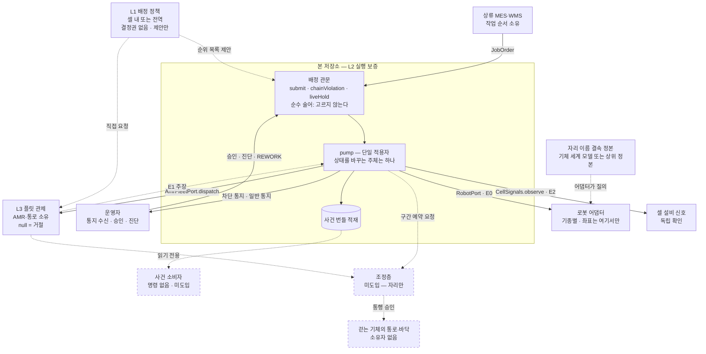

# 오케스트레이션 — 세 층과 자원 소유

이 문서는 **무엇을 누가 승인하는가**를 적습니다. 자원마다 소유자가 하나 있고, 그 자원으로 향하는 명령은 소유자의 관문을 통과합니다. 대장의 빈 칸은 곧 무승인 경로이며, 그 자리가 사고가 발생하는 지점입니다.

관련 결정: [ADR 38](adr/0038-mission-layer-schema-is-ours.md) 미션 계층 내재화 · [ADR 34](adr/0034-semantic-binding-unowned.md) 결속의 어댑터 외 격리 · [ADR 35](adr/0035-site-names-live-in-the-robot.md) 사이트 명칭의 기체 내부 저장 · [ADR 9](adr/0009-no-declaration-without-consumer.md) 소비자 존재 원칙.

---

## 1. 오케스트레이션은 한 덩어리가 아니라 세 층이다

| 층 | 무엇을 정하는가 | 실패 시 결과 | 소유자 |
|---|---|---|---|
| **L1 작업 배정** | 무엇을, 언제, 누구에게 — 재할당 및 우선순위 | 느리거나 나쁜 답 (처리량 손실, 특정 셀 기아) | 정책 계산 주체. 안이든 밖이든 **결정권은 없음** |
| **L2 실행 보증** | 그것이 실제로 수행되었는가, 아니라면 무엇을 아는가 | **거짓을 참으로 단정** | **본 저장소** (ADR 38) |
| **L3 경로·교통** | 물리적으로 어떻게 이동하는가, 누가 바닥을 사용하는가 | 충돌 및 교착 | 자원 소유자 — 플릿 또는 조정층 |

두 방향의 의존이 있습니다.

- **L1 은 L2 없이 성립하지 않습니다.** 상태 기반 배정의 전제는 상태가 참이라는 것입니다. 상태를 신뢰할 수 없으면 L1 은 쓰레기를 최적화합니다.
- **L3 을 L2 가 대신할 수 없습니다.** 바닥을 소유하지 않으므로, 사본을 가져와도 그 값을 참으로 유지할 권한은 따라오지 않습니다.

ADR 38 은 L2 를 내재화한 결정이며, 밖에 남긴 것은 L3 입니다. **L1 이 배제된 적은 없습니다** — 셀 내부의 L1 은 범위 안이고 아직 구현되지 않았습니다(§15.153).

---

## 2. 자원 소유 대장

**한 자원에 소유자는 하나입니다.** 소유가 겹치면 우선순위 규칙을 추가하지 않고 소유 경계를 다시 긋습니다. 그리고 **소유자가 없는 자원에는 명령을 내지 않습니다** — 자격은 선언으로만 발생합니다.

| 자원 | 소유자 | 관문 (승인 지점) | 현재 |
|---|---|---|---|
| 셀 내 기체의 작업 배정 | 본 저장소 | `Middleware.admits` — 순수 술어. 고르지 않고 상태를 바꾸지 않는다. 재할당은 `reassign` 이 진동 방지를 걸어 판정 | 있음 (ADR 41) |
| 셀 내 슬롯·지그·버퍼 점유 | 본 저장소 | `Middleware.submit` → `occupancyViolation` — 자리 경쟁과 출발 결품 | 있음 |
| 셀 내 작업 공간(반경 겹침) | 본 저장소 | — | **없음** (§15.153 — 기하가 없어 구역 이름으로 가야 함) |
| AMR 개체 및 이송 | 플릿 | `AmrFleetPort.dispatch` — `null` 이 거절 | 있음 |
| 통로·층 점유 (AMR) | 플릿 | 플릿 내부 | 있음 (플릿 소관) |
| 통로·층 점유 (걷는 기체) | **미정** | **없음** | **구멍** (§15.154) |
| 상류 작업 순서 | MES | MES 측 | 있음 (계약 밖) |
| 셀 설비의 상태 관측 | 셀 설비 | `CellSignals.observe` — `null` 은 빈 자리가 아니라 **말이 없음** | 있음 |
| 자리 이름 ↔ 좌표 결속 | 기체 세계 모델 또는 상위 사이트 정본 (ADR 34 §4) | 기체 질의 (ADR 35) 앞에 `SiteBindingCheck` — 지도 판과 개체 캘리브레이션 판 두 축을 대조 | 있음 (§15.156 — 정본 구현체는 배치가 붙인다) |

**관문 칸이 대는 기호는 코드와 대조됩니다** — `DocumentClaimsTest` 의 «자원 소유 대장이 대는 관문이 코드에 실재한다». 이름이 바뀌거나 사라지면 이 표가 아니라 그 시험이 먼저 빨개집니다.

### 이 대장을 읽는 법

- **「없음」과 「구멍」은 다릅니다.** 「없음」은 소유자가 정해져 있고 관문만 아직 안 만든 것이고, 「구멍」은 **소유자 자체가 없는 것**입니다. 앞은 만들면 닫히고 뒤는 먼저 소유를 정해야 합니다.
- **구멍이 있는 동안의 올바른 상태는 그 자원을 쓰지 않는 것입니다.** 무승인 통행을 허용하는 선택지는 없습니다.
- 대장에 없는 자원이 나타나면 그것을 먼저 이 표에 올립니다. 표에 없는 자원으로 나가는 명령은 아무 관문도 통과하지 않은 명령입니다.

---

## 3. 배선도

점선은 **아직 없는 것**입니다. 자리와 방향만 확정해 둡니다.

**읽는 법 셋.**

- **관문을 지나지 않는 화살표가 있어서는 안 됩니다.** `DISP → ROB` 같은 선이 그려질 수 있다면 그것이 미들웨어 우회입니다.
- **본 저장소는 사건 소비자를 호출하지 않습니다.** 적재하고 끝냅니다 — 소비자에게 의존하면 소비자가 정지할 때 사건 처리가 함께 멈춥니다.
- **좌표와 프레임은 어댑터에서만 나타납니다.** 공통 계층은 이름만 압니다. 계약의 `location` 은 문자열이며 좌표가 아닙니다(설계 §4.3).

---

## 4. 지금 없는 것

정직하게 세 갈래로 나눕니다.

| 갈래 | 항목 |
|---|---|
| **선언만 있고 구현은 없음** | 정량 사전 조건(적재 질량·무게중심 — 관측하는 어댑터가 없음, §15.143) |
| **범위 안이고 미구현** | 셀 내 자원 점유 축(§15.153), 배정 제안 포트, 비용 함수, 진동 방지 |
| **범위 밖 — 소유자가 다름** | 전역 배차·라우팅, 통로 교통 조정, 기능안전 기능(안전 경계는 [ADR 32](adr/0032-safety-boundary.md)) |
| **구멍 — 소유자 미정** | 걷는 기체의 통로·바닥(§15.154) |

**구멍을 메우는 방법은 넷이며 권고 순서가 있습니다.** 물리로 분리 → 구간을 잘라 기존 소유자에게 배정 → 상위 조정층 도입 → 플릿 벤더가 흡수. 앞의 둘은 시스템을 늘리지 않고 소유자를 만듭니다 — **소유자를 정하는 일의 정체는 «누가 그 자원의 값을 참으로 유지할 수 있는가» 를 정하는 것**이지 시스템을 신설하는 것이 아니기 때문입니다. 선택 절차와 승격 조건은 아직 이 문서에 없습니다(§15.154).

> 마지막 대조: 2026-09-18 · sha256:bdeb339b1ac7 · 열림: §15.143, §15.153, §15.154
