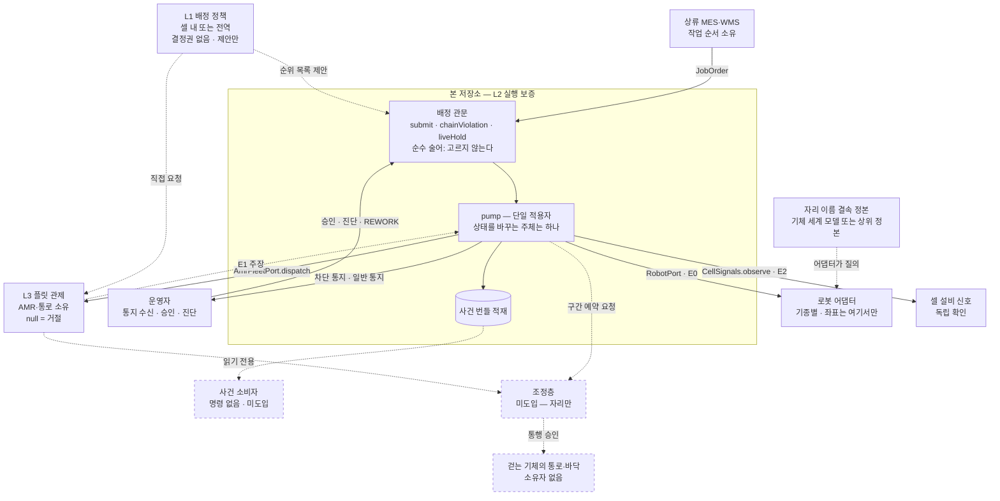

# 오케스트레이션 — 세 층과 자원 소유

이 문서는 **무엇을 누가 승인하는가**를 적습니다. 자원마다 소유자가 하나 있고, 그 자원으로 향하는 명령은 소유자의 관문을 통과합니다. 대장의 빈 칸은 곧 무승인 경로이며, 그 자리가 사고가 발생하는 지점입니다.

관련 결정: [ADR 43](adr/0043-entitlement-declared-outside-judged-inside.md) 자격의 외부 선언과 내부 판정 · [ADR 38](adr/0038-mission-layer-schema-is-ours.md) 미션 계층 내재화 · [ADR 34](adr/0034-semantic-binding-unowned.md) 결속의 어댑터 외 격리 · [ADR 35](adr/0035-site-names-live-in-the-robot.md) 사이트 명칭의 기체 내부 저장 · [ADR 9](adr/0009-no-declaration-without-consumer.md) 소비자 존재 원칙.

---

## 1. 오케스트레이션은 한 덩어리가 아니라 세 층이다

| 층 | 무엇을 정하는가 | 실패 시 결과 | 소유자 |
|---|---|---|---|
| **L1 작업 배정** | 무엇을, 언제, 누구에게 — 재할당 및 우선순위 | 느리거나 나쁜 답 (처리량 손실, 특정 셀 기아) | 정책 계산 주체. 안이든 밖이든 **결정권은 없음** |
| **L2 실행 보증** | 그것이 실제로 수행되었는가, 아니라면 무엇을 아는가 | **거짓을 참으로 단정** | **본 저장소** (ADR 38) |
| **L3 경로·교통** | 물리적으로 어떻게 이동하는가, 누가 바닥을 사용하는가 | 충돌 및 교착 | 자원 소유자 — 플릿 또는 조정층 |

두 방향의 의존이 있습니다.

- **L1 은 L2 없이 성립하지 않습니다.** 상태 기반 배정의 전제는 상태가 참이라는 것입니다. 상태를 신뢰할 수 없으면 L1 은 쓰레기를 최적화합니다.
- **L3 을 L2 가 대신할 수 없습니다.** 바닥을 소유하지 않으므로, 사본을 가져와도 그 값을 참으로 유지할 권한은 따라오지 않습니다.

ADR 38 은 L2 를 내재화한 결정이며, 밖에 남긴 것은 L3 입니다. **L1 이 배제된 적은 없습니다** — 셀 내부의 L1 은 범위 안이고 아직 구현되지 않았습니다(§15.153).

---

## 2. 자원 소유 대장

**한 자원에 소유자는 하나입니다.** 소유가 겹치면 우선순위 규칙을 추가하지 않고 소유 경계를 다시 긋습니다. 그리고 **소유자가 없는 자원에는 명령을 내지 않습니다** — 자격은 선언으로만 발생합니다.

| 자원 | 소유자 | 관문 (승인 지점) | 현재 |
|---|---|---|---|
| 셀 내 기체의 작업 배정 | 본 저장소 | `Middleware.admits` — 순수 술어. 고르지 않고 상태를 바꾸지 않는다. 재할당은 `reassign` 이 진동 방지를 걸어 판정 | 있음 (ADR 41) |
| 셀 내 슬롯·지그·버퍼 점유 | 본 저장소 | `Middleware.submit` → `occupancyViolation` — 자리 경쟁과 출발 결품 | 있음 |
| 셀 내 작업 공간(구역 겹침) | 본 저장소 | `Middleware.admits` → `workspaceViolation` — 같은 구역의 두 기체를 동시에 안 보냄 | 있음 (§15.163 — 구역 단위라 성김) |
| AMR 개체 및 이송 | 플릿 | `AmrFleetPort.dispatch` — `null` 이 거절 | 있음 |
| 통로·층 점유 (AMR) | 플릿 | 플릿 내부 | 있음 (플릿 소관) |
| 통로·층 점유 (걷는 기체) | **미정** | `Middleware.admits` → `unownedFloor` — 소유자 없는 자리로는 보내지 않음 | **구멍** (§15.154). 절차는 §5 |
| 조치의 자동 승인 권한 | 현장 — 선언하는 사람 (ADR 43·44) | `Middleware.attemptApproval` → `scopeRefusal` — 선언 없는 승인 시도를 거절하고, 값도 선언과 관측에서만 채운다. 사람의 문(`Middleware.approveRemedy`)은 값을 들고 오므로 선언을 안 본다 | 있음 (§15.3 — 신원은 위조 가능하며 부인방지가 아니라 조사 단서다) |
| 상류 작업 순서 | MES | MES 측 | 있음 (계약 밖) |
| 셀 설비의 상태 관측 | 셀 설비 | `CellSignals.observe` — `null` 은 빈 자리가 아니라 **말이 없음** | 있음 |
| 자리 이름 ↔ 좌표 결속 | 기체 세계 모델 또는 상위 사이트 정본 (ADR 34 §4) | 기체 질의 (ADR 35) 앞에 `SiteBindingCheck` — 지도 판과 개체 캘리브레이션 판 두 축을 대조 | 있음 (§15.156 — 정본 구현체는 배치가 붙인다) |

**관문 칸이 대는 기호는 코드와 대조됩니다** — `DocumentClaimsTest` 의 «자원 소유 대장이 대는 관문이 코드에 실재한다». 이름이 바뀌거나 사라지면 이 표가 아니라 그 시험이 먼저 빨개집니다.

### 이 대장을 읽는 법

- **「없음」과 「구멍」은 다릅니다.** 「없음」은 소유자가 정해져 있고 관문만 아직 안 만든 것이고, 「구멍」은 **소유자 자체가 없는 것**입니다. 앞은 만들면 닫히고 뒤는 먼저 소유를 정해야 합니다.
- **구멍이 있는 동안의 올바른 상태는 그 자원을 쓰지 않는 것입니다.** 무승인 통행을 허용하는 선택지는 없습니다.
- 대장에 없는 자원이 나타나면 그것을 먼저 이 표에 올립니다. 표에 없는 자원으로 나가는 명령은 아무 관문도 통과하지 않은 명령입니다.

---

## 3. 배선도

점선은 **아직 없는 것**입니다. 자리와 방향만 확정해 둡니다.



**읽는 법 셋.**

- **관문을 지나지 않는 화살표가 있어서는 안 됩니다.** `DISP → ROB` 같은 선이 그려질 수 있다면 그것이 미들웨어 우회입니다.
- **본 저장소는 사건 소비자를 호출하지 않습니다.** 적재하고 끝냅니다 — 소비자에게 의존하면 소비자가 정지할 때 사건 처리가 함께 멈춥니다.
- **좌표와 프레임은 어댑터에서만 나타납니다.** 공통 계층은 이름만 압니다. 계약의 `location` 은 문자열이며 좌표가 아닙니다(설계 §4.3).

---

## 4. 지금 없는 것

정직하게 세 갈래로 나눕니다.

| 갈래 | 항목 |
|---|---|
| **선언만 있고 구현은 없음** | 정량 사전 조건(적재 질량·무게중심 — 관측하는 어댑터가 없음, §15.143) |
| **범위 안이고 미구현** | 없음 — 대장의 여덟 자원에 모두 관문이 있다 |
| **범위 밖 — 소유자가 다름** | 전역 배차·라우팅, 통로 교통 조정, 기능안전 기능(안전 경계는 [ADR 32](adr/0032-safety-boundary.md)) |
| **구멍 — 소유자 미정** | 걷는 기체의 통로·바닥(§15.154) |

소유자가 없는 동안의 올바른 상태는 **그 자원을 쓰지 않는 것**입니다. `Middleware.admits` 가 소유자 없는 자리로 향하는 주문을 접수 시점에 거절합니다. 무승인 통행을 허용하는 선택지는 없습니다.

---

## 5. 통로 소유자를 정하는 절차

**소유자 신설은 시스템 신설이 아닙니다.** 소유자를 정하는 일의 정체는 «누가 그 자원의 값을 참으로 유지할 수 있는가» 를 정하는 것이며, 구간을 잘라 기존 소유자에게 주면 시스템이 하나도 늘지 않고 소유자가 생깁니다. 그래서 권고 순서가 아래와 같습니다.

| | 방법 | 얻는 것 | 대가 |
|---|---|---|---|
| **D** | 물리로 분리 — 통로를 겹치지 않게 배치 | 문제가 발생하지 않음. 소프트웨어 0 | 공간 및 레이아웃 제약 |
| **C** | 구역을 잘라 기존 소유자에게 배정 | 새 시스템 없음. 기존 관문 재사용 | 구간 경계가 또 하나의 인계 지점 |
| **B** | 상위 조정층 도입 | 다벤더 전제의 표준적 해법. 기종 간 계산 가능 | 시스템 하나 증가. 새 단일 장애점 |
| **A** | 플릿 벤더가 걷는 기체까지 수용 | 교통 로직과 지도가 이미 존재 | 벤더 종속. 타사 기체 수용 유인이 벤더에 없음 |

**승격 트리거를 미리 적어 둡니다.** 겹치는 구간이 셋을 넘거나 바닥을 공유하는 벤더가 셋 이상이 되면 C 에서 B 로 올립니다. 조건을 먼저 적어 두면 나중에 즉흥적으로 결정되지 않습니다.

**본 저장소가 구간 소유자가 되는 경우**(C)에는 그 구간의 예약 관문을 내놓습니다. 무한 책임 프록시와 다른 점은 하나입니다 — **소유한 것만 승인합니다.** 소유하지 않은 옆 구간의 요청을 대신 받으면 그때 프록시가 됩니다.

### 구간 예약 포트의 모양

**아직 짓지 않습니다.** 구현체도 소비자도 없으므로 계약에 넣지 않고(ADR 9), 코드로도 두지 않습니다. 자리와 방향만 확정합니다.

| 항목 | 규약 |
|---|---|
| 요청 | 구간과 기간을 지정. 소유자가 판정 |
| 거절 | **정상 경로**. 거절되면 그 구간을 쓰지 않음 |
| 유효 기간 | 빌린 권한은 만료됨. 만료되면 다시 요청하거나 손을 놓음 |
| 무응답 | **성공도 실패도 아님**(`IN_DOUBT`). 재전송은 조회 가능한 하류에만, 아니면 운영자 |
| 거부 이유 | 이미 있는 어휘로만. 새 이유 코드를 늘리면 내부 판정 규칙이 계약으로 유출 |

---

## 6. 사건 조회면의 모양

**아직 짓지 않습니다.** 소비자가 붙는 시점에 그 PR 안으로 들어옵니다(ADR 9). 여기서는 자리와 규약만 확정하며, 규약을 먼저 적어 두는 이유는 읽는 쪽이 추측으로 수신기를 만들지 않게 하기 위함입니다.

**프로세스 밖 경로는 본 계층의 것이 아닙니다.** `picasso` 는 라이브러리이며 진입점도 HTTP 표면도 영속화도 없습니다. 이는 결핍이 아니라 경계입니다 — 본 계층이 프로세스를 소유하면 그 프로세스의 가용성이 곧 실행 보증의 가용성이 됩니다. 조회면을 밖으로 내는 일은 본 계층을 담는 쪽의 몫이며, 저장소 안에서 프로세스와 영속화와 감사 기록을 이미 보유한 것은 `registry` 하나입니다. 어느 쪽이 담을지는 ADR 43 의 자격 선언과 같은 성질의 배치 결정입니다.

**본 계층이 보증하는 것은 순서와 식별자입니다.** 적재는 덧붙이기만 하고 지우지 않으며, 식별자는 불투명한 값입니다.

| 항목 | 규약 |
|---|---|
| 전송 | 본 계층이 정하지 않음. 담는 쪽이 HTTP·파일·DB 중 무엇으로 내든 본 계층의 코드는 동일 |
| 열거 | 열린 순서대로. 덧붙이기만 하고 지우지 않음 |
| 커서 | **마지막으로 읽은 식별자.** `incident-N` · `search-N` 의 형식을 분해해 번호를 추출하지 않음 — 그 형식을 대조하는 시험이 없으므로 묶이는 즉시 깨짐 |
| 증분 조회 | 현재는 전량 조회뿐(`incidents()` · `remedySearches()`). `after` 인자는 소비자와 함께 들어옴 |
| 처리 표시 | 읽는 쪽의 상태. 본 계층은 누가 어디까지 읽었는지 모르며, 알면 소비자마다 상태가 생김 |
| 영속화·상한 | 담는 쪽의 몫. 본 계층의 적재는 프로세스 수명과 같고 상한이 없음(§15.166) |

**거절과 사건은 다른 적재입니다.** 거절은 실행을 만들지 않으므로 사건 번들이 되지 못하며(§15.164 의 일지), 탐색 결과는 (기체, 주문)을 열쇠로 하는 별도 대장에 남습니다. 읽는 쪽은 둘을 각각 열거합니다.

### v1 에서 담는 쪽 — 파일 내보내기

§5 의 통로 소유자와 같은 모양입니다. 지금은 가장 싼 것을 쓰고 승격 조건을 미리 적습니다.

| | 방법 | 얻는 것 | 대가 |
|---|---|---|---|
| **C** | 시나리오 구동기가 두 대장을 파일로 내보내고, 읽는 쪽이 그 디렉터리를 주기 스캔 | 프로세스도 모듈도 늘지 않습니다. 인코딩이 순수 함수이므로 **인프라 없이 시험이 물립니다** | 실시간이 아닙니다. §15.166 의 주인이 생기지 않습니다 |
| **B** | 얇은 호스트 모듈 하나가 미들웨어를 세우고 두 대장만 조회로 노출 | 경계가 깨끗합니다. 양쪽 모듈의 성격이 변하지 않습니다 | **호스트할 대상이 아직 없습니다.** 포트 여섯 중 실물 구현체를 가진 것은 `ClientRobotPort` 하나이며 나머지는 `None` 입니다 |
| **A** | `registry` 가 담습니다. 미들웨어를 그 프로세스 안에 세우고 조회 엔드포인트로 노출 | 프로세스·영속화·감사 기록이 이미 존재합니다. §15.166 의 주인이 생깁니다 | **레지스트리 정지가 사건 조회 정지가 됩니다.** 설정 평면이 실행 평면의 적재를 들게 됩니다 |

**결정 근거는 하나입니다 — 아직 호스트할 것이 없습니다.** `src/main` 어디에서도 미들웨어를 생성하지 않으며, 생성하는 곳은 시험 스물둘뿐입니다. 실행 계층을 실제로 구동하는 유일한 주체가 시나리오 구동기이므로, v1 에서 대장을 밖으로 내보내는 주체도 그것입니다. **존재하지 않는 배치를 위해 호스트를 먼저 짓지 않습니다**(ADR 9 와 같은 규율).

**승격 조건을 미리 적습니다.** 아래 중 하나가 성립하면 A 로 올립니다.

- 조회가 **실시간**이어야 합니다 — 스캔 주기가 요건을 충족하지 못하는 경우
- 적재가 **프로세스 수명을 넘어** 남아야 합니다 — §15.166 의 주인이 필요해지는 시점
- 읽는 쪽이 **둘 이상**이 됩니다 — 한 디렉터리를 여럿이 스캔하면 처리 표시가 소비자마다 흩어지고, 그 상태의 주인이 필요해집니다

**B 는 중간 계단이 아닙니다.** 실제 배치가 생기면 그 호스트는 포트 여섯을 모두 들어야 하며, 그것은 본 결정의 대상이 아니라 배치 프로젝트입니다. 두 대장만 내는 프로세스를 따로 세우면 그 프로세스는 존재 이유가 하나뿐이고, 진짜 호스트가 생기는 날 폐기됩니다.

### v1 의 적재 규약

읽는 쪽의 골격이 서서 ADR 9 의 조건이 충족되었으므로 인코딩이 들어왔습니다. **인코딩과 전송을 가릅니다** — `LedgerExport` 는 문자열만 만들며 파일도 소켓도 자기 시계도 건드리지 않습니다. 순수 함수이므로 인프라 없이 시험이 물리며, 담는 쪽이 C 에서 A 로 올라가도 이 인코딩은 그대로입니다.

**다른 저장소로 넘길 때는 `handoff/<받는 쪽>/` 에 둡니다.** 내는 쪽이 받는 쪽의 저장소에 직접 쓰면, 두 계층이 서로 다른 저장소에 있고 상호 참조하지 않는다는 증명이 그 자리에서 소멸합니다. 넘기는 쪽은 자기 저장소만 건드리고 경로만 알리며, 무엇을 반입할지는 받는 쪽이 결정합니다. 인계본은 스냅샷이므로 `HandoffFixtureTest` 가 지금의 인코더와 같은 칸을 쓰는지 대조합니다.

**파일로 쓰는 쪽은 시나리오 구동기입니다.** v1 에서 그것은 시험이며, 한 벌은 `picasso/build/export/run-1` 과 `run-2` 에 나옵니다. **같은 시나리오를 두 번 돌립니다** — 두 벌의 해시가 같고 `runId` 만 다른 것이 그 값이 존재하는 이유이고, 읽는 쪽은 그 두 벌로 «둘째 구동이 새 사건으로 들어온다» 를 회귀로 박습니다. 따라서 **시험을 돌려야 한 벌이 갱신됩니다** — C 를 고른 대가이고, 승격하면 그 제약이 사라집니다.

| 항목 | 규약 |
|---|---|
| 파일 | `incidents.jsonl` · `remedy-searches.jsonl` **둘로 나눕니다.** 합치면 읽는 쪽이 갈래를 다시 나눠야 하고, 그 분류 규칙이 두 곳에 생깁니다 |
| 줄 | 한 줄에 한 기록. 배열이 아니라 줄인 이유는 **덧붙이기가 줄 추가로 그대로 옮겨지기** 때문입니다 |
| 순서 | 열린 순서. `incidentId` · `searchId` 는 **불투명한 값**이며 분해하지 않습니다 |
| 완료 신호 | 임시 파일에 쓰고 **이름만 바꿉니다**(동일 파일 시스템). 마지막에 `manifest.json` 이 나타나는 것이 한 벌이 모두 나왔다는 신호입니다 |
| 필드 이름 | 코틀린 속성 이름 그대로(lowerCamelCase). 계약 메시지와 열거는 **protobuf JSON 규약**을 따릅니다 — 기존 적재 표면이 이미 그 규약이므로 다르게 쓰면 갈립니다 |
| 없음 | **키를 빼지 않고 `null` 을 적습니다.** 빼면 값이 없다는 것과 이 판이 아직 그 필드를 내지 않는다는 것이 같은 모양이 됩니다. 빈 목록도 `[]` 로 적습니다 |
| 시각 | `at` 은 가상 시계, `wallClockAt` 은 실 시계. 둘 다 ISO-8601 |
| 탐색 결과 | 한 줄에 **평평하게** 적습니다. `outcome` 이 `FOUND` · `NONE` · `WITHHELD` 중 하나입니다 |
| 가림 | **`outcome` 이 `WITHHELD` 인 줄에는 `steps` 키가 없습니다.** 적재면의 방벽이며 코드의 방벽과 같은 성질입니다 — 내보내는 쪽이 편의로 제안 표에서 조치 열을 꺼내 실으면 조회 한 번으로 가림이 해제됩니다. 구현 PR 이 이 줄을 결함 주입으로 확인합니다 |
| 사건이 드는 것 | 어느 기체(`robotId`) · 근거의 세기(`requiredEvidence`·`reachedEvidence`·`verification`) · 분류의 근거(`fault`) · 걸음 위치(`step`)를 함께 적습니다. **읽는 쪽이 되짚지 않도록 하는 것이 기준입니다**(§15.177) |
| 결함 | `fault` 는 이 단위의 분류가 그 값이 된 근거이고, `blockedBy` 는 **다음 단위를 막는** 결함입니다. 다음 단위가 없으면 후자는 빈 목록이므로 둘은 다른 축입니다. 정준 분류와 벤더 원문을 함께 실으며, 분류 이름만으로 접지 않습니다 |
| 걸음 위치 | `step` 은 `at`(1부터) · `plan`(순서대로) · `completed` 입니다. **총수는 `plan` 의 길이이며 따로 싣지 않습니다** — 같은 사실을 두 칸에 두면 갈릴 자리가 생깁니다 |
| 판 | `schemaVersion` 이 `2` 입니다. `blockedBy` 가 분류 이름의 배열에서 결함 객체의 배열로 **모양이 바뀌었으므로**, 칸이 는 것과 달리 읽는 쪽이 판을 보아야 합니다 |
| 번들의 해시 | `digest` 를 함께 적습니다. 이미 계산되는 값이며, 읽는 쪽이 같은 사건을 두 번 받았는지 가르는 유일한 결정적 열쇠입니다 |
| 한 벌의 명세 | `manifest.json` 이 `schemaVersion` · `runId` · `writtenAt` · `virtualNow` · `contractSemver` · `counts` 를 싣습니다 |
| 구동 식별자 | `runId` 는 **이 내보내기에서 유일하게 결정적이지 않은 값**입니다. 나머지는 같은 시드면 같은 값이고 그것이 재현의 근거인데, 읽는 쪽이 멱등 열쇠를 그 값들로 들면 같은 시드의 두 번째 구동이 전부 이미 본 것으로 접혀 **아무 신호 없이** 처리가 사라집니다. 실 시계에서 나오며 같은 순간에도 겹치지 않습니다. **결정적으로 바꾸면 그 고장이 조용히 돌아옵니다** |

---

## 7. 승인면의 모양 (ADR 44)

§6 이 정한 것은 **읽기**입니다. 승인은 쓰기이며, 파일 왕복으로는 시도한 자리에서 허락과 거절을 받을 수 없으므로 규약이 다릅니다.

**본 계층은 여전히 소켓을 인지하지 않습니다.** `ApprovalWire` 는 문자열만 생성하고 해석하며, 전송은 담는 측의 몫입니다. §6 의 인코딩과 동일한 성질입니다.

### 7.1 부르는 측이 할 수 있는 말은 하나입니다

승인 시도는 **조치를 기술하지 않습니다.** 이미 본 계층이 계산하여 거절한 제안 하나를 가리킬 뿐이며, 주문도 걸음도 값도 실을 칸이 존재하지 않습니다. 호출자의 권한이 "승인 시도 한 번" 을 넘지 않는 것은 규율이 아니라 표면의 형상에 기인합니다.

| 요청 필드 | 규약 |
|---|---|
| `approverId` | 누가 누르는가. **위조 가능하며 부인방지가 아닙니다**(§15.3). 판정은 본 계층에서 수행하므로 부르는 측이 위조할 수 없는 것은 판정입니다 |
| `approverKind` | `PERSON` 또는 `AGENT`. 감사에 남고 이의율을 가르는 축입니다(ADR 43) |
| `robotId` · `jobOrderId` | 가리킬 제안의 열쇠. 주문 본문이 아니라 식별자입니다 |
| `sawSkillTypes` | 부르는 측이 읽은 조치 열. 지금 제안과 다르면 거절합니다. **비워 두는 경로를 두지 않습니다** |
| 그 밖의 필드 | 읽지 않습니다. 자격 주장을 기재해도 판정에 도달하는 경로가 없습니다 |

**해독 불가능한 요청은 거절이 아니라 오류입니다.** 둘을 동일한 형태로 전달하면 읽는 측이 자기 오타와 자격 부재를 구별하지 못합니다.

### 7.2 값은 선언과 관측에서만 옵니다

| 파라미터 | 출처 |
|---|---|
| 계약이 `is_object_reference` 로 표기한 칸 | **관측** (`HoldState.objectRef`) |
| 그 밖의 필수 칸 | **선언** (`Entitlement` 의 `DeclaredAction.parameters`) |

- 생성하는 경로는 존재하지 않습니다. 어느 쪽도 충족하지 못하면 거절이며 사람에게 위임됩니다
- 선언이 대상을 기재한 경우 관측과 일치해야 하며, 관측을 덮어쓰지 못합니다
- 관측은 **승인 시점에 다시 확인합니다.** 제안 수립 시점의 값을 보관하면 낡은 사실로 승인이 성립합니다
- 걸음마다 효과로 파지를 전진시키므로, 둘째 걸음이 파지할 대상의 명칭은 존재하지 않으며 거절합니다(§15.174)

### 7.3 거절은 값이며 오류가 아닙니다

거절 종류를 열거형으로 제공합니다. 사유 산문만 제공하면 읽는 측이 문자열 대조에 의존하게 되며, 그 검증은 거절의 발생만 확인하므로 자격 부재와 제안 부재를 구별하지 못합니다. 종류를 구분하는 기준은 **후속 조치의 상이 여부**입니다.

| 종류 | 후속 조치 |
|---|---|
| `WITHHELD` | 사람이 먼저 진단합니다. 자격으로 관통되지 않으며, **가림이 자격보다 먼저 판정됩니다** |
| `NO_PROPOSAL` · `PROPOSAL_CHANGED` | 다시 읽고 다시 시도합니다 |
| `NOT_DECLARED` · `EXPIRED` | 선언을 등록하거나 갱신합니다 |
| `ROBOT_OUT_OF_SCOPE` · `SKILL_OUT_OF_SCOPE` | 범위를 확대하거나 사람이 승인합니다 |
| `VALUE_NOT_DECLARED` | 선언에 값을 기재합니다 |
| `OBJECT_NOT_OBSERVED` · `DECLARED_CONTRADICTS_OBSERVED` | 사람이 확인합니다. 관측이 없거나 선언과 어긋나면 자동으로 누르지 않습니다 |
| `CAPABILITY_UNKNOWN` | 기체와의 연결을 복구합니다 |
| `VALUES_NOT_ACCEPTED` | 값을 빼고 다시 시도합니다 |
| `REFUSED_BY_GATE` | 자격의 문제가 아닙니다. 조건이 해소되면 같은 제안이 그대로 섭니다 |
| `REMEDY_NOT_APPLIED` | 조치 열이 나가지 않았습니다. 승인으로 집계되지 않습니다(§15.175) |

**관문 거절은 제안을 소모하지 않습니다.** 소모할 경우 조건 해소 후 사람이 승인할 대상까지 소멸합니다.

**승인의 응답이 실제 전달된 값을 반환합니다.** 호출자가 값을 선택하지 않았으므로, 자기 명의로 전달된 내용을 확인하는 경로가 이것뿐입니다.

### 7.4 v1 에서 담는 측

§6 의 사다리와 동일한 판단을 적용하되 결론이 다릅니다. **읽기는 파일로 충분했으나 쓰기는 그렇지 않습니다.** 시도한 자리에서 허락과 거절을 받아야 하므로 왕복이 동기여야 하며, 이것이 §6 이 기재하지 않은 네 번째 승격 조건입니다.

| 조건 | 상태 |
|---|---|
| 조회가 실시간이어야 함 | 미충족 |
| 적재가 프로세스 수명을 넘어 남아야 함 | 미충족 (§15.166) |
| 읽는 측이 둘 이상 | 미충족 |
| **밖에서 들어오는 쓰기가 발생** | **충족** |

`registry` 가 담는 선택지(A)는 승인에 대해서는 부적합합니다. 설정 평면이 실행 평면의 적재를 드는 것이 읽기의 대가였다면, 쓰기에서는 설정 평면이 기체 연결까지 보유해야 합니다. **본 계층을 세우는 측이 승인면을 함께 냅니다.** v1 에서 실행 계층을 실제로 구동하는 주체는 시나리오 구동기이며, 그것이 담는 측입니다.

**인코딩과 전송을 가르므로 담는 측이 바뀌어도 본 규약은 유지됩니다.** `ApprovalWire` 는 순수 함수이며, 인프라 없이 시험이 물립니다.

### 7.5 v1 에서 실제로 여는 자리

```bash
./gradlew :picasso:runApprovalHost
./gradlew :picasso:runApprovalHost --args="--port 8770 --seconds 1800"
```

구동기가 실행 계층을 세우고 **루프백에만** `POST /approvals` 를 엽니다. 본 표면은 신원을 인증하지 않으므로(§15.3) 외부로 공개하지 않습니다. 두 대장은 §6 의 규약대로 파일로 계속 나가며, 읽기 경로는 변경되지 않습니다.

구동기는 제안을 **넷** 세웁니다. 거절 종류마다 후속 조치가 상이하다는 것은 값으로 확인해야 하며, 하나만 세우면 그 차이가 관측되지 않습니다.

| 기체 | 시도하면 |
|---|---|
| `hum-02` | 승인됩니다. 목적지는 선언에서, 대상은 관측에서 취득합니다 |
| `hum-04` | `WITHHELD`. 자격이 있어도 통과하지 않습니다 |
| `hum-05` | `ROBOT_OUT_OF_SCOPE` |
| `hum-03` | `NO_PROPOSAL`. 탐색이 `NONE` 을 산출했습니다 |

선언 목록은 `handoff/narrator/entitlements.json` 이며 ADR 43 이 「배치의 결정」이라 한 자리의 첫 구현체입니다(`FileEntitlements`). **해독 불가 시 빈 목록으로 접지 않고 기동에 실패합니다.** 접을 경우 오타가 있는 선언 파일이 "아무것도 선언하지 않음" 과 동일한 형태가 되며, 그 배치는 자동 승인 전건 거절을 정상으로 인식합니다.

**첫 승인이 성립할 때까지 가상 시계를 정지합니다.** 성공하는 승인은 파지 중인 대상의 명칭을 관측에서 취득하므로, 호출 이전에 기체가 적재물을 놓으면 그 출처가 소멸합니다. 거절 세 갈래는 값 충족 이전에 판정되므로 시계와 무관합니다.

**구동기는 시험 소스에 위치합니다**(§15.176). 본 계층이 라이브러리라는 성질을 유지하기 위한 배치이며, 배포 가능한 프로세스가 아닙니다.

**해시에 드는 것과 아닌 것.** 봉인 시점에 확정되고 같은 시드면 같은 값인 것은 전부 듭니다. 새로 들어온 기체·근거 등급·대조 결과·걸음 위치·결함 원문이 모두 그러하며, 그중 하나가 다른 사건은 다른 사건입니다. 실 시계(`wallClockAt`)와 나중의 판정(`review`)만 빠집니다.

> 마지막 대조: 2026-09-18 · sha256:527660a4918a · 열림: §15.143, §15.154, §15.162, §15.163, §15.3, §15.166, §15.173, §15.174, §15.175, §15.176, §15.177
