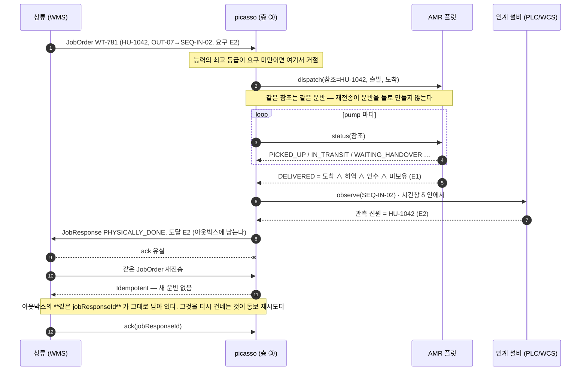
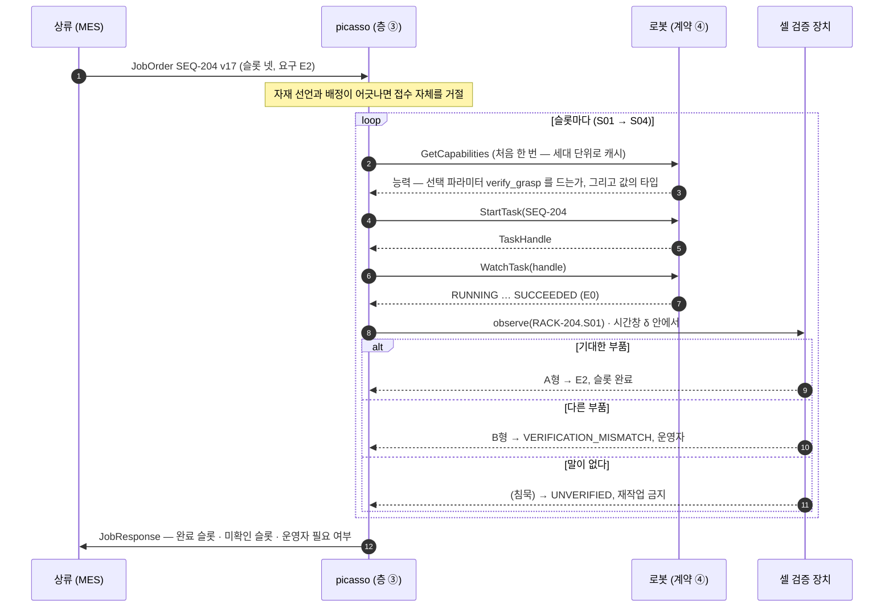
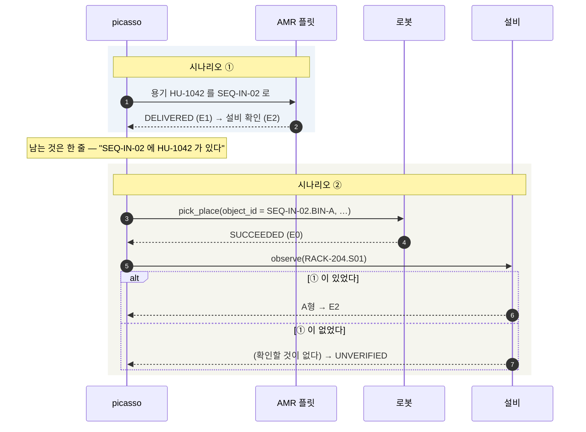
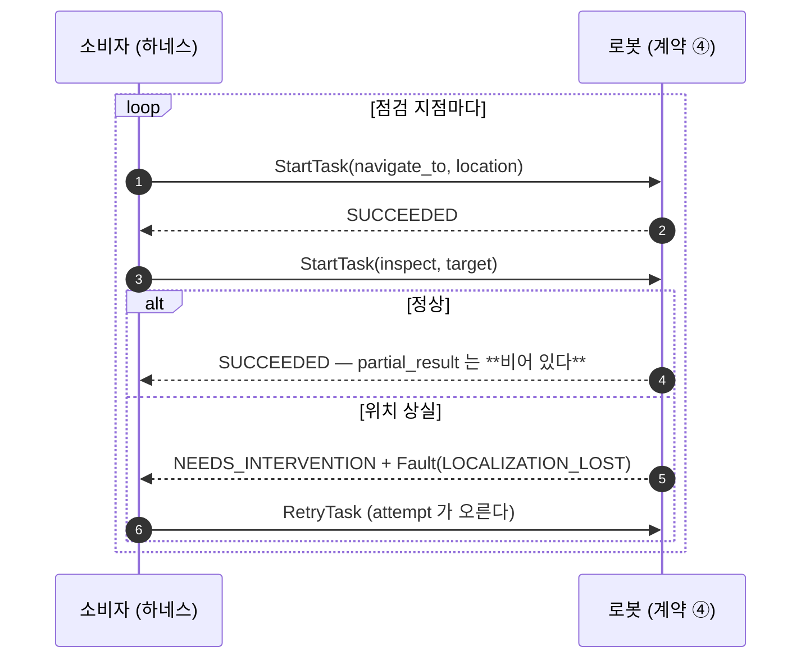

# 운영 시나리오 — 시퀀싱 셀의 일감 셋과 그 경계

**이 문서는 설계 입력이다.** 계약이 놓일 자리를 실제 일감 셋으로 그려 두고, 각 참여자가 ADR 36 의 어느 층에 서는지, 그리고 **picasso 가 무엇을 맡지 않는지**를 먼저 긋는다. 시나리오의 뼈대는 저장소 밖에서 별도로 작성된 설계 문서 셋과 대조해 들여왔고, 여기 적힌 근거는 **표준 어휘(OPC UA ISA-95 Job Control 10031-4)와 벤더 1차 자료**(심볼은 `adapter-*/src/test/resources/vendor-manifest.txt` 와 대조된다)뿐이다.

셋을 다룬다.

| # | 일감 | 직접 요청하는 상류 | 주 실행기 | picasso 계약이 닿는가 |
|---|---|---|---|---|
| ① | 부품 용기를 창고 출고 버퍼에서 시퀀싱 셀 입고 위치로 공급 | WMS | **AMR 플릿**(D 수준 위임) | **아니다** — 미들웨어의 플릿 포트가 닿는다. 결과가 ② 의 환경 전제가 된다 |
| ② | 생산 순서에 맞춰 시퀀싱 랙의 슬롯에 부품을 배치 | MES | 휴머노이드 | **그렇다.** `pick_place` |
| ③ | 설비 점검 순회 | 보전 시스템 | 4족 | **그렇다.** `inspect` |

①이 들어 있는 이유를 먼저 적는다. **AMR 은 이 저장소의 주력이 아니다.** 그러나 시퀀싱 셀에 부품이 도착하는 경로를 빼면 ② 는 허공에 뜬다 — 현실적인 시나리오에서 빠질 수 없으면 넣되, **경계를 긋는다.** 그 경계가 §1 이다.

---

## 1. 경계 — 누가 어느 층에 서는가

ADR 36 의 층 넷에 참여자를 놓는다.

| 참여자 | 층 | picasso 안인가 | 무엇을 하는가 |
|---|---|---|---|
| MES · WMS · 보전 시스템 | ① 사이트 일감 | 밖 (상류) | 일감을 내고 결과를 업무 상태에 반영한다 |
| 조합 · 실행 상태 · 완료 판정 | ② 어휘 · ③ 배정과 결정 | **안**(ADR 38 — 스키마와 PoC 엔진은 우리 것, 배차·라우팅만 밖) | 일감을 실행 단위로 나누고, 실행 상태를 들고, 근거를 결합해 완료를 판정하고, 결과를 상류에 통보한다 |
| 계약 (`contracts/`) | ④ 표면 | 안 | 실행 단위 하나의 시작·관측·취소·결과 |
| 휴머노이드 · 4족 어댑터 | ④ 실행 | 안 | 계약을 벤더 표면으로 번역한다 (ADR 31·33) |
| **AMR 플릿** | ④ 의 **이웃 실행기** | **밖** | 용기를 나른다. 자기 표준(VDA 5050)과 자기 관제를 이미 갖고 있다 |
| 인계 설비 · 셀 검증 장치 (PLC/WCS) | ③ 이 읽는 **독립 근거** | 밖 | 재석·식별·안착을 로봇과 무관하게 말한다 |

### AMR 경계 규칙 셋

1. **picasso 는 벤더 AMR API 나 VDA 5050 을 구현하지 않는다.** 그 자리에는 이미 표준과 관제가 있다. ADR 36 의 등재 기준(발명 금지)은 반대 방향으로도 읽힌다 — **이미 있는 것을 다시 만들지 않는다.** ~~picasso 는 AMR 을 어댑터로 감싸지 않는다~~ **2026-09-09 좁힘([ADR 38](adr/0038-mission-layer-schema-is-ours.md)): 미들웨어는 시나리오 ①에서 AMR 플릿(Mock, 프로젝트용 계약)에 운반을 D 수준으로 위임하고 결과를 받는다.** 감싸지 않는 것은 벤더 AMR 의 명령 표면이지, 플릿에 일을 맡기는 것 자체가 아니다.
2. **AMR 구간의 결과가 picasso 에 들어오는 문은 둘뿐이다.** (a) ② 일감의 **환경 전제**로 — *"용기 HU-1042 가 SEQ-IN-02 에 있다"* 는 휴머노이드 일감이 시작될 조건이지 휴머노이드가 확인할 일이 아니다(§15.81, [`environment-preconditions.md`](environment-preconditions.md) 의 인계점 절). (b) **인계 설비 신호**로 — 층 ③ 이 읽는 독립 근거이고 계약은 그것을 나르지 않는다.
3. **휴머노이드 일감의 파라미터에 AMR 식별자가 오지 않는다.** `pick_place(object_id, destination)` 의 두 인자는 대상의 이름과 장소의 이름이다(`is_object_reference`·`is_site_reference`, §15.78). 어느 AMR 이 놓고 갔는지는 상류와 층 ③ 의 관심사다.

이 셋을 지키면 AMR 이 시나리오에 있어도 계약과 어댑터에는 AMR 이라는 낱말이 없다. 지금 저장소가 그 상태이고, 그 상태를 유지한다.

---

## 2. 완료의 세 계층과 근거 등급 — picasso 가 어디까지 말하는가

외부 문서가 완료를 셋으로 가른 것을 그대로 받는다. 이 구분이 없으면 *"AMR 이 도착했다"* 와 *"용기가 인계됐다"* 와 *"재고 위치가 옮겨졌다"* 가 한 낱말이 된다.

| 계층 | 주체 | 뜻 | picasso 의 자리 |
|---|---|---|---|
| **명령 완료** | 로봇 / 플릿 | 자기가 받은 명령의 실행이 끝났다 | 계약의 `TaskState` 종착 넷 (`SUCCEEDED`·`FAILED`·`CANCELLED`·`CANCELLED_RECOVERY_FAILED`) |
| **일감의 논리적 완료** | 층 ③ | 계약된 사후조건이 충족됐다 | **계약 밖.** 층 ③ 이 명령 완료와 독립 근거를 결합해 판정한다 |
| **상류 반영 완료** | MES / WMS | 업무 상태 전이가 확정됐다 | 계약 밖 |

그리고 **완료의 근거에 등급이 있다.** 이것도 그대로 받되, 등급이 **어댑터가 어디에 붙었는가(ADR 37)** 와 정확히 맞물린다는 것을 적어 둔다.

| 등급 | 근거 원천 | picasso 에서 그것이 나오는 자리 |
|---|---|---|
| **E0** 로봇 자체 보고 | 로봇 상태 메시지 | 어댑터가 로봇에 **직결**된 경우(ADR 37 선언). Spot `MANIP_STATE_GRASP_SUCCEEDED`, Digit `get-execution-state`, G1 `SportModeState_` |
| **E1** 플릿 확인 | 플릿이 자체 검증 후 발행하는 완료 | 어댑터가 **플릿에** 붙은 경우(ADR 37 발견). Orbit `Run.missionStatus`, Digit Arc |
| **E2** 독립 설비 확인 | 인계 설비의 PLC 신호(재석 센서, 게이트 리더, 계량) | **계약 밖.** 층 ③ 이 로봇 보고와 **시간창 안에서 결합**한다 |
| **E3** 업무 확인 | 상류의 스캔 트랜잭션, 작업자 확인 | 계약 밖 |

**계약이 지금 말하는 것은 E0 또는 E1 까지다** — 그리고 둘 중 어느 것인지를 계약이 구분해 말하지 않는다. 어댑터가 어느 문으로 들어왔는지(ADR 37)가 그 사실을 나르지만, `TaskResult` 에는 그 자리가 없다. 상류가 *"재고 위치 확정은 E2 이상"* 을 요구하려면 층 ③ 이 계약 밖에서 결합해야 하고, 그 결합이 실패했을 때의 상태(*완료는 됐는데 근거가 모자란다*)를 계약은 표현하지 않는다. **§7 의 후보 ①이 이것이다.**

---

## 3. 시나리오 ① — 용기 공급 (AMR 플릿에 위임)

> **①과 ②는 코드에서도 이어진다** — `picasso/src/test/kotlin/dev/picasso/middleware/ScenarioChainTest.kt`(§15.117). ① 을 돌려 용기를 셀에 넣고 **② 의 출발 자리를 ① 의 목적지에서 유도해** 이어 돌린다. ① 없이 ② 를 돌리면 설비가 확인할 것이 없어 `UNVERIFIED` 다 — 그 차이가 아래 *남기는 한 줄* 의 값이다.
>
> **이 시나리오는 미들웨어 층에서 돈다** — `picasso/src/test/kotlin/dev/picasso/middleware/DeliverContainerTest.kt`(§15.89). 운반 전체를 플릿(`AmrFleetMimic`, 프로젝트용 계약)에 D 수준으로 위임하고, 플릿의 완료(E1)를 인계 설비 신호와 결합해 E2 를 낸다. 아래 상황표 셋 전부와 WMS 응답 유실을 단언한다. 로봇 계약(④)은 여기 닿지 않는다 — 그것이 §1 의 경계다.

**배경.** 시퀀싱 셀에 엔진 커버 A형이 필요하다. MES 가 자재 공급을 요청했고, WMS 가 재고와 용기를 할당했다. 창고 내부 피킹이 끝나 용기 `HU-1042` 가 출고 버퍼 `OUT-07` 에 있다. **여기서부터 ② 의 전제가 만들어지기 시작한다.**

**상류가 원하는 결과.** *"창고 작업 WT-781 에 할당된 용기 HU-1042 를 OUT-07 에서 시퀀싱 셀 입고 위치 SEQ-IN-02 로 공급하고, 인계 결과를 보고하라."*

| 정보 | 예 | 뜻 |
|---|---|---|
| 요청 식별자 | `REQ-781-1` | 재전송을 구분하는 키. **picasso 는 안 든다** — 그 일을 `(jobOrderId, version)` 이 이미 하고, 두 키로 같은 질문에 답하면 어긋나는 날이 온다(§15.117) |
| 창고 작업 식별자 | `WT-781` | 업무와 실행 결과를 잇는다 |
| 운반 대상 | `HU-1042` | WMS 가 할당한 특정 용기 |
| 출발·도착 | `OUT-07` → `SEQ-IN-02` | 업무상 인계 지점 — **이름**이다 |
| 요구 완료 근거 | E2 | 재고 위치를 확정하려면 독립 설비 확인이 필요하다 |

**완료는 "도착했다" 보다 엄격하다.** 지정 목적지 도착 ∧ 요청 용기와 인계 용기의 ID 일치 ∧ 하역 완료 ∧ 목적지 설비가 인수 ∧ **AMR 이 용기를 계속 보유하고 있지 않음.** 마지막 항이 없으면 *"도착했는데 아직 싣고 있다"* 가 완료로 보인다.

| 상황 | 층 ③ 의 처리 | 상류가 정할 것 |
|---|---|---|
| 목적지에 이전 용기가 남아 있음 | 인계 대기와 지연 보고. 임의의 다른 자리에 내려놓지 않음 | 대기 유지 또는 대체 목적지 승인 |
| 출발 위치의 용기 ID 가 요청과 다름 | 인수하지 않고 불일치 보고 | WMS 가 할당·현장 재고 확인 |
| 물리적 인계 후 WMS 응답 유실 | **같은 완료 이벤트를 재전송**하고 반영 상태 조회. 운반 자체를 다시 실행하지 않음 | WMS 가 중복 없이 확정 |

### 3.1 시퀀스 — 누가 언제 말하나



**갈리는 자리 셋.** 플릿이 `WAITING_HANDOVER` 면 인계를 기다리고 지연을 보고한다(다른 자리에 안 내려놓는다).
`REJECTED_AT_SOURCE` 면 출발지의 용기가 요청과 달라 **인수하지 않은** 것이다. 설비가 시간창 안에 아무 말이 없으면
`UNVERIFIED` — 플릿의 E1 까지만 도달했고 재작업이 아니라 운영자 확인이다.

**picasso 에서 이 시나리오가 남기는 것은 한 줄이다.** *"`SEQ-IN-02` 에 `HU-1042` 가 있다"* — ② 의 환경 전제. 그것을 누가 확인하는가는 §2 의 E2 이고 계약 밖이다.

---

## 4. 시나리오 ② — 부품 시퀀싱 (휴머노이드, `pick_place`)

> **이 시나리오는 두 층에서 돌린다** — 계약 층은 `harness/src/test/kotlin/dev/picasso/harness/SequencingCellTest.kt`, **미들웨어 층은 `picasso/src/test/kotlin/dev/picasso/middleware/SequencingRackTest.kt`**(§15.88 — JobOrder 접수 → 조합 → 근거 결합 → JobResponse 까지, 상황표 넷 전부). 계약 층 시험은 슬롯 넷을 차례로 완주시키고, 아래 §4.4 상황표에서 *계약이 답하는 것*을 전부 단언한다(완료 슬롯 보존 · 버전 18 세 갈래 · S03 파지 중 취소와 새 정체성의 재작업 · 든 채 단절). 답하지 않는 것(E2)은 시험에도 없다. 생산 순서 버전이 곧 태스크의 `revision` 이다(17 → 18).

**배경.** ① 로 부품 용기가 셀에 있다. MES 가 투입 순서를 확정하고 그 순서에 맞는 시퀀싱 랙을 준비하라고 한다. 셀에 있는 부품의 작업별 할당은 MES 가 관리한다. **첫 구현은 용기와 랙 위치가 고정**이며, 그것이 환경 전제 C(종류별 제시) 다.

| 랙 슬롯 | 생산 순번 | 필요한 부품 |
|---|---|---|
| S01 | 1201 | 엔진 커버 A형 |
| S02 | 1202 | 엔진 커버 B형 |
| S03 | 1203 | 엔진 커버 A형 |
| S04 | 1204 | 엔진 커버 C형 |

**상류가 원하는 결과.** *"작업 SEQ-204, 생산 순서 버전 17 에 따라 랙 RACK-204 의 각 슬롯에 지정 부품을 배치하고, 슬롯별 검증 결과를 제출하라."*

### 4.1 상류 → 층 ③ — ISA-95 Job Order 의 모양

층 ② 의 어휘는 아직 정하지 않았으므로(ADR 36 — 발명하지 않는다) 상류 메시지는 **표준 타입의 모양**으로만 적는다. 값 중 우리가 지어낸 것은 표시한다.

```json
{
  "JobOrderID": "SEQ-204",
  "WorkMasterID": "WM-SEQUENCE-RACK",
  "JobOrderParameters": [
    { "ID": "sequence_version", "Value": 17 },
    { "ID": "due_by", "Value": "…" }
  ],
  "MaterialRequirements": [
    { "MaterialDefinitionID": "ENGINE-COVER-A", "Quantity": "2", "MaterialUse": "consumable" },
    { "MaterialDefinitionID": "ENGINE-COVER-B", "Quantity": "1", "MaterialUse": "consumable" },
    { "MaterialDefinitionID": "ENGINE-COVER-C", "Quantity": "1", "MaterialUse": "consumable" }
  ],
  "EquipmentRequirements": [
    { "ID": "RACK-204.S01", "EquipmentUse": "destination", "Properties": [{ "ID": "material", "Value": "ENGINE-COVER-A" }] },
    { "ID": "RACK-204.S02", "EquipmentUse": "destination", "Properties": [{ "ID": "material", "Value": "ENGINE-COVER-B" }] },
    { "ID": "RACK-204.S03", "EquipmentUse": "destination", "Properties": [{ "ID": "material", "Value": "ENGINE-COVER-A" }] },
    { "ID": "RACK-204.S04", "EquipmentUse": "destination", "Properties": [{ "ID": "material", "Value": "ENGINE-COVER-C" }] },
    { "ID": "SEQ-IN-02",    "EquipmentUse": "source",      "Properties": [{ "ID": "container", "Value": "HU-1042" }] }
  ]
}
```

- **부품은 타입으로 온다** (`MaterialDefinitionID`). 인스턴스 id 는 이력 키이지 조작 파라미터가 아니다(§15.80).
- **슬롯은 이름으로 온다.** 좌표가 없다. 그 이름이 로봇 안에 등록돼 있어야 한다(ADR 35, 전제 B).
- `EquipmentUse` 의 `destination`·`source` 는 **우리가 지은 말**이다. 표준이 *"does not define any standardized entries for EquipmentRequirements"* 라고 명시했고, 그 빈 자리가 ADR 36 층 ② 다.
- 슬롯 순서는 업무 요구이지 로봇의 동작 순서가 아니다. 층 ③ 이 허용하면 가까운 것부터 집어도 된다.

### 4.1b 시퀀스 — 슬롯 하나가 지나는 길



**버전이 바뀌면**(v17 → v18) 종착한 슬롯은 종착에 머물고(래치), 미시작 슬롯은 파라미터만 갈리며, 도는 슬롯은
`Halt → Reset → Start` 로 다시 선다. 옛 버전의 뒤늦은 종착은 **폐기하지 않고 보존**하고 새 버전의 기대에 대고 다시 본다.

### 4.2 층 ③ → 계약 — 슬롯마다 `StartTask` 하나

**분류는 원자가 아니다**(§15.80). 슬롯 넷을 한 태스크로 주면 *"어느 슬롯까지 됐는가"* 를 계약이 표현할 수 없고, 기종에 따라 조건·분기가 있거나(Spot 미션) 없다(Digit). **둘 다 되는 유일한 배치가 "관제가 판단"** 이고, 그것은 슬롯마다 실행 단위 하나다.

```json
{
  "task_id": "SEQ-204#S01",
  "revision": 17,
  "robot_id": "hum-02",
  "skill_type": "pick_place",
  "parameters": [
    { "key": "object_id",    "string_value": "SEQ-IN-02.BIN-A" },
    { "key": "destination",  "string_value": "RACK-204.S01" },
    { "key": "verify_grasp", "bool_value": true }
  ]
}
```

- `object_id` 가 **부품 타입이 아니라 제시 자리의 이름**인 것에 주의한다. 로봇은 제품 타입 개념이 없다 — Spot `PickObject` 는 3D 점이나 픽셀만 받고, Digit `action-pick` 은 `ObjectSelector{name, april_tag_id, …}` 를 받는다(§15.80). *"이 자리에는 A형만 있다"* 가 환경 전제 C 이고, 그 전제를 세우는 것은 공정이다.
- 없는 것: 부품 타입, 수량, 생산 순번, 버전. 배정에 쓰였고 실행에는 안 간다.
- `verify_grasp` 는 **선택** 파라미터라 *드는 기종에만* 간다(§15.116). 능력이 원한다고 선언하고 미들웨어가 `GetCapabilities` 로 걸러 붙이며, **안 붙였다는 사실을 자취에 한 번 남긴다** — 조사한 실물 중에 이 필드를 선언하지 않는 기종이 있다.

### 4.3 완료 — 로봇 동작 종료가 아니라 "요청한 랙 상태가 검증됨"

> **결합에는 시간창이 있다** — `picasso/src/test/kotlin/dev/picasso/middleware/EvidenceWindowTest.kt`(§15.90). 로봇 보고 시각 `t_r` 과 설비 신호 시각 `t_p` 가 `[t_r − δ_before, t_r + δ_after]` 안에서 만나야 E2 다. 늦게 읽힌 신호는 창이 닫힐 때까지 기다리고, 옛 신호는 세지 않으며, 짧은 펄스는 PLC 쪽 래치가 있어야 잡힌다. 로봇은 실패라는데 설비에는 있으면 실패로 적지 않고 운영자에게 세운다.

| 계층 | 이 시나리오에서 | 누가 |
|---|---|---|
| 명령 완료 | `SEQ-204#S01` 이 `SUCCEEDED` | 로봇 → 계약 (E0/E1) |
| 논리적 완료 | S01 에 A형이 안착했음이 **확인**됨 | 층 ③ — 셀 검증 장치(E2)와 결합 |
| 상류 반영 | 시퀀싱 작업 완료, 후속 랙 운반 판단 | MES |

로봇의 `SUCCEEDED` 만으로 S01 을 닫으면 *"B형 슬롯에 A형이 들어갔는데 로봇은 성공이라고 한다"* 를 막을 길이 없다. 로봇이 파지 여부를 말할 수는 있어도(Spot `ManipulatorState.is_gripper_holding_item`, G1 `HandState_.press_sensor_state`) **품번 일치는 로봇의 관측 밖**이다.

### 4.4 상황 넷 — 계약이 답하는 것과 못 답하는 것

| 상황 | 층 ③ 의 처리 | 계약이 지금 주는 것 | 못 주는 것 |
|---|---|---|---|
| B형 슬롯에 A형이 감지됨 | 해당 슬롯을 완료 처리하지 않고 불일치 보고 | 없음 — 로봇은 `SUCCEEDED` | 이 판정은 E2 이고 계약 밖이다. **정상이다** |
| S01·S02 완료 후 C형 부족 | 완료 슬롯을 보존하고 부족 보고 | 종착한 태스크는 종착에 머문다(래치, §4.4) — 보존이 저절로 된다 | — |
| 작업 중 생산 순서가 버전 18 로 변경 | 기존 실행을 몰래 덮어쓰지 않음. 중단 가능 지점과 현재 랙 상태를 보고 | 종착한 슬롯의 태스크는 갱신 거절(`INVALID_TRANSITION`) — *"완료 슬롯은 새 버전이 상속"* 이 저절로 성립. 미시작 슬롯은 새 `revision` 으로 파라미터만 교체(`ACCEPTED` 유지, 돌기 시작하면 새 대상을 든다). 셋 다 하네스가 단언한다 | **도는 슬롯(S03)** — §4.4 갱신 규칙이 `RUNNING` 에서 `Halt → Reset → Start` 인데, 부품을 든 채의 `Reset` 이 무엇인지 계약이 말하지 않는다. 하네스는 지금 거동(진행률 0 부터, `hold` 는 `HOLDING` 유지)을 **고정하지 않고 드러낸다** — 바뀌는 날 빨개지게. **§7 후보 ③** |
| 부품을 든 채 연결이 끊김 | 결과 미확정으로 관리하고 로봇 상태를 재조회 | 연결 스트림이 `OFFLINE`/`CONNECTION_BROKEN` 을 가른다(완료 기준 5). **같은 `(task_id, revision)` 재전송은 같은 핸들**이므로 *"접수됐는가"* 는 계약이 답한다 — 벤더가 클라이언트 참조 키를 안 받아도 어댑터가 그 매핑을 든다. **미들웨어 층은 그것을 13.2 의 순서로 집행한다**(`InDoubtTest`, §15.92): 같은 참조 재조회 → 설비 관측(잠정 완료) → 운영자, 자동 재실행 없음. 단절 자체는 스냅샷의 `connection_state` 로 읽어 도는 단위를 미확정으로 두고, 돌아오면 스냅샷으로 다시 세운다(`EventStreamTest`, §15.95) | **무엇을 들고 있는가**는 이제 `hold`가 나른다(§15.85). 남는 것은 어댑터가 재시작하면 그 매핑이 사라진다는 것(§1.3 B-1 비목표와 맞닿는다) |

### 4.5 버전과 지연 이벤트

외부 문서의 규칙을 받는다 — 결과 이벤트는 `(실행 ID, 작업 버전)` 으로 맞추고, 어긋나는 이벤트는 폐기가 아니라 **보존**한다. 버전 17 을 돌리다 18 로 바꿨는데 뒤늦게 도착한 17 의 완료로 18 을 닫으면 안 된다.

picasso 의 `(task_id, revision)` 이 그 짝이다. 요청 쪽 규칙은 §4.4 에 있다(낮으면 `OUTDATED_REVISION`). **이벤트 쪽 규칙 — 옛 revision 을 단 `TaskUpdate` 가 새 revision 뒤에 도착했을 때 — 는 계약이 아니라 실행 층에 산다**(§15.92, `LateEventTest`): 이벤트가 `revision` 을 싣고 있으므로 미들웨어가 버전으로 갈라 옛 것을 지연 이벤트로 **보존**하고, 옛 버전의 완료는 새 버전의 기대에 대고 설비가 다시 본다. ~~§7 후보 ④~~ — 계약에 더할 것이 없어 닫는다.

---

### 4.6 ① 과 ② 가 만나는 자리



★**로봇은 두 경우에 똑같이 성공이라 말한다.** 갈리는 것은 설비이고, 그것이 두 시나리오가 **근거로** 이어져
있다는 증거다(`ScenarioChainTest`, §15.117).

---

## 5. 시나리오 ③ — 설비 점검 순회 (4족, `inspect`)

> **이 시나리오는 하네스가 돌린다** — `harness/src/test/kotlin/dev/picasso/harness/InspectionPatrolTest.kt`(4족 픽스처). 지점마다 `navigate_to` + `inspect`, 일시정지·재개, 위치 상실 뒤 개입과 재시도, 취소, 그리고 **점검 결과를 실을 자리가 없다**는 사실을 고정한다. 첫 시험이 미믹의 결함 하나를 잡았다 — 점검은 대상을 참조할 뿐 쥐지 않는다(`grasps_object`, §15.87).



**이 시나리오가 고정하는 것은 *없다* 는 사실이다** — 점검 결과를 실을 자리가 `partial_result` 하나뿐이고
**이 경로에서는 아무도 그것을 안 채운다**(`InspectionPatrolTest` 가 비어 있음을 단언한다). 채우는 발신자는
따로 있다 — Spot 어댑터가 취득의 `DataIdentifier` 를 거기 싣는다(§15.97). 그 모양을 계약이 스키마로 정하면
그 순간 상류를 하나로 못박는다.
>
> **미들웨어 층에서도 돈다** — `picasso/src/test/kotlin/dev/picasso/middleware/InspectAssetTest.kt`(§15.93). 논리적 능력 `InspectAsset` 이 점검 대상 목록을 `navigate_to`+`inspect` 열로 나누고, 공통 엔진은 분기 없이 그대로 돈다(17장 10). 이동 중 취소는 하류가 거절하고 다음 경계에서 멈추며 그 거절이 `CancelReport.refusal` 에 드러난다. 점검 결과를 실을 자리(`JobResponse.results`)는 비어 있고 시험이 그것을 고정한다. 점검 중 위치를 잃으면 계약은 다음 태스크를 막지 않지만 **실행 층이 막는다**(§15.94) — 기체가 새 태스크를 못 받는다고 말하는 동안 다음 지점으로 보내지 않고 `JobResponse.blockedBy` 로 드러내며, 사람이 감수(`release`)해야 이어 간다.

**배경.** 보전 시스템이 점검 대상 목록과 항목을 내고, 결과로 항목별 수행 상태와 측정값 또는 증거 자료 참조를 받는다. 점검 결과를 부품 공급의 필수 단계로 억지로 잇지 않고, 안전 인터록으로도 쓰지 않는다(ADR 32).

**경로가 둘이고 둘 다 벤더 1차 자료로 확인된다.**

| 경로 | 실행 단위 | 완료 | 취소 | 등급 |
|---|---|---|---|---|
| ① 로봇 직결 — `MissionService` (`adapter-boston-dynamics-spot` 이 붙은 층) | 미션 트리(`Sequence`·`Retry`·`BosdynNavigateTo`·`DataAcquisition`·`RemoteGrpc`·`Prompt`) | `State.status STATUS_SUCCESS`; 노드별 `Result` | `PauseMission`·`StopMission`(완료 직후 Stop 은 `STATUS_SUCCESS` 로 남는다) | E0 |
| ① 로봇 직결 — `DataAcquisitionService` **(어댑터가 지금 든 경로, §15.97)** | 취득 하나 — `AcquireData{CaptureActionId{action_name=target, group_name=태스크}, image_captures=광고된 원천 전부}`; 대상은 `WorldObject.name` 에 묻는다 | `GetStatus STATUS_COMPLETE` + `data_saved[]`(`DataIdentifier` — 증거 자료 참조) | `CancelAcquisition`(답이 온다; `FAILED_TO_CANCEL` 이면 취득 계속). 일시정지 없음 | E0 |
| ③ 플릿 경유 — Orbit | `SiteWalk`(= Autowalk `Walk` 의 REST 전송, [`vendors/orbit.md`](vendors/orbit.md)) | `Run.missionStatus`(자유 문자열), 웹훅 `ACTION_COMPLETED` | **없다** — 스펙 35 경로에도, 벤더 클라이언트에도 | E1 |

- 취득 결과의 결속 자리는 `DataAcquisition` 의 `CaptureActionId{action_name, group_name}` 이다 — 우리가 잰 Spot 표면에서 클라이언트가 이름을 정해 넣을 수 있는 **유일한** 자리다(§15.75). **어댑터가 이제 거기에 `target` 을 넣는다**(§15.97) — 그래서 결과 참조가 대상의 이름을 달고 돌아온다. 어느 카메라가 대상을 보느냐는 환경 전제다(`environment-preconditions.md` B).
- Orbit 경유는 `RunEvent.error` 가 정수 하나라 ① 이 갖는 `ManipulationFeedbackState` 류 어휘를 잃는다. 어댑터가 어느 층에 붙었는지는 계약에 새지 않아야 하므로(§15.77), 이 차이는 **결과 어휘의 해상도 차이**로만 나타난다.

**어댑터 가용성이 곧 로봇 거동이다 — Spot 1 차 자료.** `KeepaliveService.Policy` 의 `ActionAfter` 가 `AutoReturn`·`ControlledMotorsOff`·`ImmediateRobotOff`·`LeaseStale` 을 두고, E-Stop 엔드포인트의 `timeout` 초과는 `SETTLE_THEN_CUT`, `cut_power_timeout` 초과는 CUT 이다. 팔에 든 것은 `CarryState` 가 가른다. **어댑터 프로세스가 죽으면 로봇이 앉고 전원이 끊기는 것이 벤더의 기본 거동**이다. ADR 32 는 계약이 안전 기능을 나르지 않는다고 정했고 그것은 유지되지만, 어댑터의 가동률이 물리적 결과를 갖는다는 사실은 배치의 전제로 적어 둔다.

---

### 5.1 이 그림들이 코드와 맞는지 어떻게 아나

**시험이 안 본다.** 문서의 숫자와 링크는 `DocumentClaimsTest` 가 코드에서 세어 대조하지만, **그림의 내용은
사람이 지킨다.** 그래서 2026-09-10 에 한 번 손으로 훑었고, **셋이 틀려 있었다**(§15.119).

| 무엇 | 그림이 적었던 것 | 코드 |
|---|---|---|
| ③ 점검 결과 | `SUCCEEDED + partial_result(결과 참조)` | **비어 있다.** `InspectionPatrolTest` 가 *아무도 안 채운다* 를 단언한다 — 이 시나리오가 고정하려던 사실 자체를 그림이 뒤집고 있었다 |
| ② 능력 질의 | 슬롯 루프 **앞에서** 한 번 | 첫 `StartTask` **안에서** 한다(그 뒤로는 세대 단위 캐시) |
| ① 통보 재시도 | 미들웨어가 다시 **민다** | 아웃박스에 **남아 있고** 상류가 `ack` 로 닫는다 |

★셋 중 첫째가 뼈아프다 — **그림이 제일 하고 싶었던 말을 그림이 배반하고 있었다.** 텍스트 다이어그램이라
낡지는 않지만, **처음부터 틀린 것은 낡음과 다른 문제**다.

---

## 6. 검증 시나리오 열 — picasso 가 이미 증명하는 것과 못 하는 것

외부 문서의 교체 가능성 시험 열 개를 §12.2 의 완료 기준에 대 본다.

> **2026-09-10 재대조.** 이 표를 처음 적었을 때(§15.84)는 *6 증명 · 3 의도적 밖 · 1 반* 이었다. 그 뒤로 미들웨어의 가운데(`picasso`)와 어댑터의 북쪽(`adapter-host`)이 서면서 **셋이 올라갔다** — 6 번은 반에서 온전으로(§15.92), 7·8 번은 계약 밖인 채로 **층 ③ 에서 증명됨**이 됐다. **계약이 안 나르는 것과 아무도 안 하는 것은 다르다**는 것이 이 재대조의 요점이다.

| # | 시나리오 | picasso | 근거 |
|---|---|---|---|
| 1 | 정상 완료, 하류 A↔B 교체 | **증명함** | 완료 기준 1 — 프로파일이 다른 두 기체를 같은 코드로 |
| 2 | 완료 후 응답 유실 | **증명함** | 완료 기준 4 — 같은 revision 재전송은 같은 핸들 |
| 3 | 접수 여부 불명 (요청 직후 단절) | **증명함 — 두 층에서** | 계약: 같은 `(task_id, revision)` 재전송 + 연결 스트림. 층 ③: `IN_DOUBT` 와 재조회 순서(§15.92, `InDoubtTest`). 벤더에 참조 조회가 없어도 어댑터가 매핑을 든다. 어댑터 재시작은 밖 |
| 4 | 부분 완료 후 취소 | **증명함** | `CANCELLING → CANCELLED / CANCELLED_RECOVERY_FAILED`(완료 기준 8b) + 종착 갱신의 `hold`(§15.85, `HoldOnCancelTest`). 중단점은 슬롯마다 태스크 하나라 태스크 자체다 |
| 5 | kill (즉시 정지, 파지 물체 잔존 허용) | **계약 밖 — 의도적** | ADR 32. 안전 정지는 이 계약이 나르지 않는다 |
| 6 | 버전 변경 중 지연 이벤트 | **증명함** | 계약이 재료를 주고(갱신마다 `revision`) **규칙은 실행 층에 산다**(§15.92, `LateEventTest`) — 옛 버전의 종착은 실패가 아니라 보존되고, 설비가 새 버전의 기대에 대고 본다(`VERIFICATION_MISMATCH` / `UNVERIFIED`) |
| 7 | 로봇 완료 · 설비 신호 없음 | **계약 밖 — 층 ③ 에서 증명함** | 계약은 여전히 안 나른다(정상). 근거 창이 닫힐 때까지 신호가 없으면 `UNVERIFIED` + 운영자, 재작업 금지(§15.90, `EvidenceWindowTest`) |
| 8 | 로봇 실패 · 설비 신호 있음 | **계약 밖 — 층 ③ 에서 증명함** | 같은 자리. 기대와 다른 신원을 보면 오인계 의심 — `VERIFICATION_MISMATCH` 로 무엇을 어디서 봤는지 남긴다 |
| 9 | 단절 후 재동기화 | **증명함 — 두 층에서** | 계약: 완료 기준 2·3(스냅샷 + 재생 버퍼 + 재정렬 창). 층 ③: 스냅샷 권위와 축출 뒤 재세움(§15.95). **축출이 못 보낸 구간을 버리면 세션이 바뀐다**(§15.107) |
| 10 | 능력군 추가에 공통 엔진 변경 없음 | **증명함** | 완료 기준 9·11 — 게이트 7번(기종 분기 금지)·8번(소스 변경 없는 기종 추가) |

**열 중 아홉이 증명된다** — 계약 층에서 일곱(1·2·3·4·6·9·10), 층 ③ 에서 둘(7·8). 하나(5, kill)만 **의도적으로 밖**이고 그것은 ADR 32 다. 시나리오 ② 자체는 `SequencingCellTest` 가 통째로 돌린다(§15.86).

**계약 밖이 셋에서 하나로 준 것이 아니다.** 7·8 은 여전히 계약이 안 나른다 — 달라진 것은 **그 일을 하는 층이 이 저장소에 생겼다**는 것이고, 그것이 ADR 38 이 한 일이다.

---

## 7. 이 시나리오들이 계약에 요구하는데 아직 없는 것 — 후보이지 결정이 아니다

| # | 요구 | 지금 | 어디로 가는가 |
|---|---|---|---|
| ① | **도달한 근거 등급** — 로봇 보고인가 플릿 확인인가 | `TaskResult` 에 자리 없음. ADR 37 의 문이 사실을 나르지만 결과에는 안 실린다 | **결과 어휘 정준화**와 같은 자리. `Fault.error_type` 자유 문자열 문제와 함께 다룬다 |
| ② | ~~**취소·실패 시 잔여 물리 상태** — 무엇을 들고 있는가, 어느 단위까지 끝났는가~~ **열렸다** | `WatchTaskResponse.hold`(`HoldState`, 0.4.0, §15.85) | 발신자 다섯 — Spot은 벤더 불리언, Digit은 실행 트리 추론, G1은 `NOT_OBSERVABLE`, mimic은 대상 스킬이 도는 동안, Orbit은 `NotObservable`("플릿 API 가 잔여 파지를 안 나른다"). "어느 단위까지"는 슬롯마다 태스크 하나라 태스크 자체가 답한다 |
| ③ | **`RUNNING` 갱신이 물리 상태를 만나면** — 부품을 든 채 `Halt → Reset → Start` | **갱신은 지어졌다**(§15.109, 넷 중 셋이 든다). 그러나 §4.4 는 여전히 든 채의 `Reset` 이 무엇인지 안 말한다 — 지금 계약은 든 채로 다시 센다(진행률 0, `hold` 는 `HOLDING` 그대로; `SequencingCellTest` 가 그 거동을 붙들고 있다) | **발신자가 갈린다는 것이 이제 보인다** — 지시값 층(G1·Spot 명령)은 멈춤이 따로 없어 든 것을 놓을 자리도 없고, 액션 층(Digit)은 지우기가 곧 멈춤이다. 규칙을 정하려면 그 차이를 계약에 담을지부터 정해야 한다 |
| ④ | ~~**이벤트 쪽 옛 revision 규칙**~~ **닫혔다** | 답은 계약이 아니라 **실행 층**이었다(§15.92) — 계약은 `revision` 을 싣는 데까지 하고, 옛 버전의 종착을 보존할지·새 기대에 대고 검증할지는 미들웨어가 정한다 | 계약 변경이 아니었다. 이 칸에 적어 뒀던 *소비자 규칙이지 계약 변경이 아닐 수 있다* 는 짐작이 맞았다 |
| ⑤ | **어댑터 재시작 후 `(task_id, revision)` ↔ 벤더 id 매핑** | 메모리에만 있다 | §1.3 B-1(무선 단절 대응의 집행) 비목표와 맞닿는다. 비목표를 유지할지가 먼저다 |

**이 표를 계약에 넣지 않은 이유.** ADR 9 — 소비 표면이 없는 선언은 두지 않는다. ①은 층 ③ 이 서야 소비자가 생기고, ②는 발신자가 있어 먼저 열었다(§15.85). ①은 결과 어휘 정준화의 일부로 다룬다.

> **다섯 중 둘이 닫혔다**(② §15.85 · ④ §15.92). ③은 갱신 자체가 지어져 **질문이 좁아졌고**, ①·⑤는 그대로다. ★그리고 이 규율이 한 번 **반대 방향으로** 작동했다 — B3 에서 거절 코드 하나(`UPDATE_UNSUPPORTED`)를 더한 것은 아무도 안 들어서가 아니라 **드는 기체가 생겨 못 드는 기체의 답이 구별돼야 했기 때문**이다(§15.109). 소비 표면이 없어 안 넣는 것과 소비자가 생겨 넣는 것은 같은 규칙의 두 면이다.

---

## 8. 이 문서에 없는 것

- 상류 시스템의 제품명, 사업장, 일정. 근거는 표준과 벤더 1 차 자료뿐이다.
- 층 ② 의 어휘(논리적 능력의 이름). 외부 문서는 이름을 붙였으나 *프로젝트 정의*라고 표시했고, 이 저장소는 ADR 36 에 따라 상류나 벤더가 이미 가진 것만 들인다. `WorkMasterID` 자리에 무엇이 오는지는 실제 상류를 만나야 안다.
- AMR 플릿의 계약. §1 의 경계 규칙 그대로다.

> 마지막 대조: 2026-09-11 · sha256:4fbff66b737e · 열림: ADR 32 · 시나리오 5, 시나리오 §8, §15.126, §15.87, §15.81, §15.8, C-3
