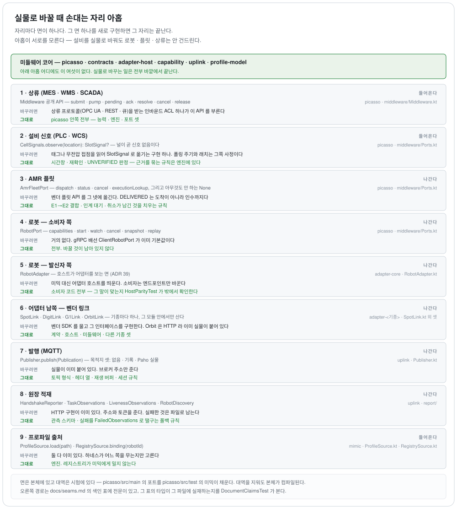

# 교체 지점 — 실물로 바꾸려면 어디를 고치나

이 저장소는 상대가 아직 없는 자리가 많다. 상류도 설비도 플릿도 로봇도 진짜가 아니다
([`verification.md`](verification.md)). **그래서 중요한 것은 "지금 진짜냐" 가 아니라 "진짜로 바꿀 때 어디를
고치고, 무엇을 안 고쳐도 되느냐" 다.** 이 문서가 그 자리를 하나씩 센다.

---

<picture>
  <source media="(prefers-color-scheme: dark)" srcset="diagrams/seams.dark.svg">
  
</picture>

## 이 자리들이 왜 진짜 교체 지점인가

**포트는 본체에 있고 대역은 시험에 있다.** `CellSignals`·`AmrFleetPort`·`RobotPort` 는
`picasso/src/main` 에 있고, 그것을 채우는 `CellMimic`·`AmrFleetMimic` 은 `picasso/src/test` 에 있다 —
**본체는 대역의 존재를 모른다.** 대역을 지워도 본체가 컴파일된다. 그것이 교체 가능성의 구조적 증거이고,
문서의 주장이 아니라 빌드의 사실이다.

**그리고 자리마다 독립이다.** 설비를 실물로 바꿔도 로봇·플릿·상류는 안 건드린다 — 아홉 자리가 서로를
모른다. 하나를 바꾸는 비용이 다른 여덟과 무관한 것이 이 배치의 값이다.

---

## 자리 아홉

### 1. 상류(MES·WMS·SCADA) → picasso

**★여기만 인터페이스가 아니다.** 상류의 교체 지점은 `Middleware` 의 **공개 API** 다 —
`submit(JobOrder, robotId)` · `pump()` · `pending()` · `ack(jobResponseId)` · `resolve(…)` · `cancel(…)` ·
`release(…)`.

**바꾸려면**: 상류 프로토콜(OPC UA · REST · 메시지 큐)을 받는 **인바운드 ACL** 을 짜서 그 API 를 부른다.
`JobOrder` 로 옮기는 것이 ACL 의 일이고, `JobResponse` 를 상류의 말로 되옮기는 것도 그쪽이다.

**안 고치는 것**: `picasso` 안쪽 전부. 능력·엔진·포트 셋.

**왜 포트가 없나**: 지금 상류의 소비자는 시험뿐이다. 인터페이스를 미리 뽑으면 **소비자 없는 선언**이 되고
그것은 ADR 9 가 막는 것이다. 실제 상류가 하나 생기는 날 그 모양을 보고 뽑는다.

### 2. 설비 신호(PLC/WCS)

**인터페이스**: `CellSignals.observe(location): SlotSignal?` — 널은 *신호 없음* 이다.

**바꾸려면**: OPC UA 태그나 무전압 접점을 읽어 `SlotSignal(identity, observedAt, latched)` 로 옮기는 구현
하나. **폴링 주기와 래치는 그쪽 사정**이고, 시간창 δ 는 능력 단위 설정이 정한다.

**안 고치는 것**: 근거 결합 규칙 전부 — 시간창·재확인·`UNVERIFIED`·`VERIFICATION_MISMATCH` 는 엔진에 있다.

### 3. AMR 플릿

**인터페이스**: `AmrFleetPort{executionLookup, dispatch(TransportOrder), status(handle), cancel(handle)}`
+ 아무것도 안 하는 `None`.

**바꾸려면**: 벤더 플릿 API 를 그 넷에 옮긴다. ★**`TransportState` 의 뜻을 그대로 지켜야 한다** —
`DELIVERED` 는 *도착 ∧ 하역 ∧ 인수 ∧ 미보유* 이고, 벤더의 "도착" 을 여기에 그냥 연결하면
*"도착했는데 아직 싣고 있다"* 가 완료로 보인다.

**안 고치는 것**: E1→E2 결합, 인계 대기, 취소의 정리 규칙.

### 4. 로봇 계약 — 소비자 쪽

**인터페이스**: `RobotPort{capabilities, start, watch, cancel, snapshot, replay, executionLookup}`.
실물 배선은 `ClientRobotPort`(gRPC).

**바꾸려면**: 거의 안 바꾼다. 이미 실물 배선이 기본값이고, 바꾸는 것은 **테스트 더블을 끼울 때**다
(`LossyRobotPort`·`ProgressPort` 가 그 예다).

**안 고치는 것**: 전부.

### 5. 로봇 계약 — 발신자 쪽

**교체 지점**: 계약 뒤에 무엇이 서는가. `MimicServer`(프로파일이 모는 에뮬레이터) ↔
`AdapterHost`(실물 어댑터). **소비자는 엔드포인트만 바꾼다.**

**인터페이스**: `RobotAdapter` — 호스트가 어댑터를 보는 면이다(ADR 39). **발신자를 바꾸는 것과 기종을
더하는 것은 다른 자리다** — 미믹은 이 면을 안 쓰고 프로파일이 곧 거동이다.

**바꾸려면**: 배치가 어느 프로세스를 띄우는지만 다르다. `OrbitLauncher` 가 그 조립의 예다.

**안 고치는 것**: 소비자 코드 전부. 그 주장을 `HostParityTest` 가 밖에서 확인한다.

### 6. 어댑터 남쪽 — 벤더 링크

**인터페이스**: `SpotLink` · `DigitLink` · `G1Link` · `OrbitLink`. 기종마다 하나이고 **그 모듈 안에서만
산다**(ADR 33).

**바꾸려면**: 벤더 SDK 를 물고 그 인터페이스를 구현한다. 지금 넷 중 **Orbit 만 실물 구현이 있다**
(`OrbitHttpLink` — HTTP 라 SDK 를 안 들여도 된다). 나머지 셋은 인터페이스뿐이고 구현은 시험의 가짜다 —
벤더 원문을 저장소에 안 들이는 규칙이 막는다.

**안 고치는 것**: 계약 · 호스트 · 미들웨어 · 다른 기종. **그리고 `@VendorSurface` 인용이 그대로 검사받는다**
— 새 구현이 원문에 없는 벤더 심볼을 짚으면 매니페스트 대조가 잡는다.

★**범위를 넘겨 읽지 말 것.** 검사에 드는 타입은 **시험이 손으로 적은 목록**이라 새 타입을 목록에 안 넣으면
안 본다. 그리고 *이름이 있다는 것* 만 보지 그 메시지를 보냈을 때 로봇이 무엇을 하는지는 안 본다(C-3).
한계 넷이 `VendorManifest` 의 KDoc 에 적혀 있다.

### 7. 발행(MQTT)

**인터페이스**: `Publisher.publish(Publication)`. **목적지가 셋이다** — `NONE`(아무 데도 안 보냄) ·
`RecordingPublisher`(시험) · **`MqttPublisher`(실물, Paho)**. 그 앞에 **감싸는 것이 둘 더 있다** —
`TransportFaults`(전송 결함 주입)와 `IngestBridge`(적재로 갈라 보냄). 둘 다 같은 면을 구현하므로
*구현이 셋* 이 아니라 **목적지가 셋**이다.

**바꾸려면**: 이미 실물이 있다. 브로커 주소만 준다.

**안 고치는 것**: 토픽 형식 · 헤더 열 · 재생 버퍼 · 세션 규칙.

### 8. 원장 적재

**인터페이스 넷**: `HandshakeReporter` · `TaskObservations` · `LivenessObservations` · `RobotDiscovery`.
실패한 것은 `FailedObservations` 로 **파일 폴백**에 남는다.

**바꾸려면**: HTTP 구현이 이미 있다(`Http*`). 주소와 적재 토큰을 준다.

★**아직 없는 것**: 발행을 **구독해서** 원장에 넣는 쪽. 지금 적재는 발신자가 in-process 로 민다.
브로커 구독기가 `ObservationService` 를 부르면 닫히고, **그 경계는 입력이 `MessageHeader` 라 이미 열려 있다**.

### 9. 프로파일 출처

**인터페이스**: `ProfileSource.load(path)` (파일) · `RegistrySource.binding(robotId)` (레지스트리에서 **당김**).

**바꾸려면**: 이미 둘 다 있다. 뒤엣것을 무는 것은 **하네스**다(`Harness.kt` 가 `registrySource` 를 받는다).

★**`mimic --registry <url>` 은 이 자리가 아니다.** 그것이 만드는 것은 `RegistryLink` — 핸드셰이크와
태스크를 원장으로 **미는** 쪽이고 방향이 반대다. 미믹 CLI 의 `RobotRegistry` 는 `RegistrySource.NONE` 에
머문다.

**안 고치는 것**: 엔진. **레지스트리가 미믹에게 밀지 않는다**(§3.2) — 밀면 원장이 런타임 의존이 되고
레지스트리가 죽는 날 로봇이 멈춘다.

---

## 색인 — 자리와 인터페이스

| 자리 | 인터페이스 | 어디 |
|---|---|---|
| 설비 | `CellSignals` | `picasso/src/main/kotlin/dev/picasso/middleware/Ports.kt` |
| 플릿 | `AmrFleetPort` | `picasso/src/main/kotlin/dev/picasso/middleware/Ports.kt` |
| 로봇(소비자) | `RobotPort` | `picasso/src/main/kotlin/dev/picasso/middleware/Ports.kt` |
| 벤더 — Spot | `SpotLink` | `adapter-boston-dynamics-spot/src/main/kotlin/dev/picasso/adapter/spot/SpotLink.kt` |
| 벤더 — Digit | `DigitLink` | `adapter-agility-digit/src/main/kotlin/dev/picasso/adapter/digit/DigitLink.kt` |
| 벤더 — G1 | `G1Link` | `adapter-unitree-g1/src/main/kotlin/dev/picasso/adapter/g1/G1Link.kt` |
| 벤더 — Orbit | `OrbitLink` | `adapter-boston-dynamics-orbit/src/main/kotlin/dev/picasso/adapter/orbit/OrbitLink.kt` |
| 어댑터 북쪽 | `RobotAdapter` | `adapter-core/src/main/kotlin/dev/picasso/adapter/core/RobotAdapter.kt` |
| 발행 | `Publisher` | `uplink/src/main/kotlin/dev/picasso/uplink/Publisher.kt` |
| 적재 — 핸드셰이크 | `HandshakeReporter` | `uplink/src/main/kotlin/dev/picasso/uplink/report/HandshakeReporter.kt` |
| 적재 — 태스크 | `TaskObservations` | `uplink/src/main/kotlin/dev/picasso/uplink/report/IngestBridge.kt` |
| 적재 — 생존 | `LivenessObservations` | `uplink/src/main/kotlin/dev/picasso/uplink/report/HttpLiveness.kt` |
| 적재 — 발견 | `RobotDiscovery` | `uplink/src/main/kotlin/dev/picasso/uplink/report/RobotDiscovery.kt` |
| 프로파일 — 파일 | `ProfileSource` | `mimic/src/main/kotlin/dev/picasso/mimic/profile/ProfileSource.kt` |
| 프로파일 — 원장 | `RegistrySource` | `mimic/src/main/kotlin/dev/picasso/mimic/RegistrySource.kt` |

**이 표는 시험이 지킨다** — `DocumentClaimsTest` 가 각 줄의 타입이 그 파일에 실재하는지 본다. 이름을 바꾸거나
파일을 옮기면 빌드가 빨개진다.

**상류는 이 표에 없다.** 인터페이스가 아니라 `Middleware` 의 공개 API 이기 때문이고, 그 이유는 위 1 번에 있다.

> 마지막 대조: 2026-09-11 · sha256:ab2fa4f5070d · 열림: §15.125, §15.34, C-3, §15.5
