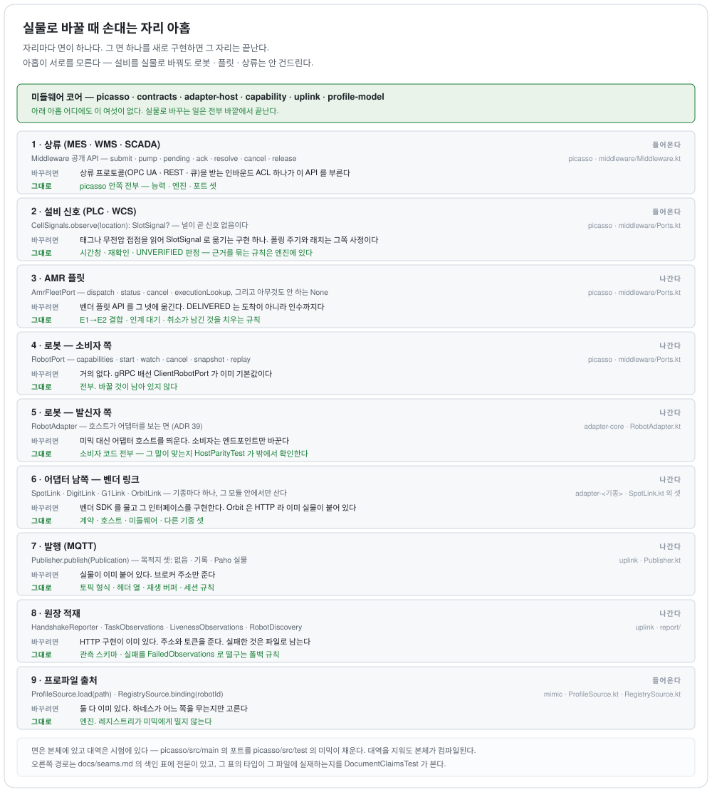

# 컴포넌트 접합부(Seams) 명세서 — 실제 하드웨어 전환 및 확장 가이드

본 문서는 `picasso` 미들웨어 아키텍처에서 모의 대역(Mock/Mimic)을 실제 공장 설비, 상위 시스템, 실제 하드웨어 로봇 기체 및 통신 인프라로 전환하기 위한 **9대 핵심 접합부(Seams)**의 인터페이스 규격과 수정 범위를 정의합니다.

구간별 현행 검증 수준은 [`verification.md`](verification.md)를 참조하십시오.

---

<picture>
  <source media="(prefers-color-scheme: dark)" srcset="diagrams/seams.dark.svg">
  
</picture>

## 교체 가능성의 아키텍처적 보증

- **포트와 대역의 모듈 레벨 분리**:
  - `CellSignals`, `AmrFleetPort`, `RobotPort` 등의 인터페이스(포트)는 `picasso/src/main`에 정의되어 있으며, 이를 구현하는 테스트 더블(`CellMimic`, `AmrFleetMimic` 등)은 `picasso/src/test`에 완전히 격리되어 있습니다.
  - 코어 엔진은 모의 대역의 존재를 전혀 참조하지 않으며, 테스트 대역을 삭제하더라도 본체 코드는 정상 컴파일됩니다.
- **접합부 간의 완전한 독립성**:
  - 9개 접합부는 상호 결합되어 있지 않으므로, 특정 지점(예: PLC 설비 신호)을 실제 하드웨어로 교체할 때 다른 지점(로봇 어댑터, 상위 MES 연계 등)의 코드를 수정할 필요가 없습니다.

---

## 9대 접합부 상세 명세

### 1. 상위 시스템 연계 (MES·WMS·SCADA → picasso)

상위 시스템과의 연계 지점은 별도 인터페이스가 아닌 `Middleware` 클래스의 **공개 API**로 제공됩니다:
- 주요 메서드: `submit(JobOrder, robotId)`, `pump()`, `pending()`, `ack(jobResponseId)`, `resolve(...)`, `cancel(...)`, `release(...)`

- **실제 하드웨어 전환 작업**:
  - 상위 통신 프로토콜(OPC UA, REST, Kafka, MQTT 등)을 수신하는 **인바운드 ACL(Anti-Corruption Layer)**을 구현하여 본 공개 API를 호출합니다.
  - 상위 데이터 포맷과 미들웨어의 `JobOrder` / `JobResponse` 간 상호 변환은 ACL 계층이 전담합니다.
- **불변 유지 대상**: `picasso` 내부 코어 전체 (논리적 케이퍼빌리티, 오케스트레이션 엔진, 3대 포트).
- **포트 인터페이스를 별도 정의하지 않은 이유**: 현시점에서 상위 소비자는 통합 테스트뿐이며, 실제 상위 시스템 요구사항 없이 추상 인터페이스를 사전 발명하는 것은 ADR 9(소비자 존재 원칙)에 위배되기 때문입니다.

### 2. 현장 설비 센서 신호 (PLC/WCS)

**인터페이스**: `CellSignals.observe(location): SlotSignal?` (null 반환 시 '신호 없음'으로 처리) · `CellSignals.holding(material): List<String>?` (기본 null — 그 질문에 응답하지 않는 설비) · `CellSignals.signal(name): NamedSignal?` (기본 null — 이름 있는 신호를 모르는 설비)

- **실제 하드웨어 전환 작업**:
  - 현장 PLC의 OPC UA 노드 또는 무전압 I/O 접점 상태를 폴링하여 `SlotSignal(occupied, identity, observedAt)` 객체로 변환하는 구현체를 제공합니다.
  - 설비 신호 폴링 주기 및 하드웨어 래치 정책은 현장 환경에 맞춰 구현하며, 시간 윈도우 δ는 논리적 케이퍼빌리티 파라미터로 설정합니다.
  - `CellSignals.signal(name)` 은 신호 사양의 이름으로 그 신호의 지금 값을 돌려주는 구현체를 제공합니다. 어느 PLC 주소가 어느 신호인지의 매핑은 이 구현체(드라이버)의 일이며, 본 계층은 이름으로만 읽습니다. `null` 은 «기대 값이 아님» 이 아니라 «못 읽음» 이므로 설비 대기는 계속 기다리고 기한이 판정합니다. 상태 신호만 다루며, 짧게 켜졌다 꺼지는 이벤트형 신호는 PLC 쪽 래치가 있어야 폴링이 놓치지 않습니다 (한계 §15.209).
- **불변 유지 대상**: 근거 결합 엔진 규칙 전체 (시간 윈도우 판정, 센서 재확인, `UNVERIFIED`, `VERIFICATION_MISMATCH` 처리 로직), 설비 대기 판정(지금 값 · 기한 · 기한 뒤 상태).

### 3. AMR 플릿 관리 시스템

**인터페이스**: `AmrFleetPort{executionLookup, dispatch(TransportOrder), status(handle), cancel(handle)}`
(기본 Null 구현체: `None`)

- **실제 하드웨어 전환 작업**:
  - 상용 AMR 플릿 관리자(Fleet Manager) API를 호출하는 어댑터 클래스를 구현하여 본 인터페이스를 충족시킵니다.
  - `TransportState`의 시맨틱 계약을 엄격히 준수해야 합니다. `DELIVERED` 상태는 *[목적지 도착 ∧ 하역 완료 ∧ 공정 간 인계 승인 ∧ 기체 미보유]* 조건을 모두 만족해야 하며, 단순 "도착" 신호를 성급히 매핑해서는 안 됩니다.
- **불변 유지 대상**: E1→E2 근거 결합 모델, 작업 공정 간 인계 대기, 작업 취소 정리 규칙.

### 4. 로봇 인터페이스 계약 — 소비자 영역

**인터페이스**: `RobotPort{capabilities, start, watch, cancel, snapshot, replay, executionLookup}` (실제 하드웨어 배선은 ClientRobotPort(gRPC))

- **실제 하드웨어 전환 작업**:
  - 기본적으로 gRPC 기반 `ClientRobotPort`가 제공되므로 추가 수정이 불필요합니다.
  - 테스트 시 결함 주입을 위해 `LossyRobotPort` 또는 `ProgressPort`와 같은 테스트 더블을 교체 연결할 수 있습니다.
- **불변 유지 대상**: `picasso` 엔진 및 상위 소비 로직 전체.

### 5. 로봇 인터페이스 계약 — 발신자 영역 (호스팅 런타임)

계약 인터페이스 배후의 런타임 구현체를 교체하는 지점입니다. `MimicServer`(프로파일 기반 에뮬레이터)와 `AdapterHost`(실제 하드웨어 어댑터 호스팅 서버)가 상호 대체 가능합니다. 소비자는 통신 엔드포인트 URL만 변경합니다.

**함께 교체되는 것**: 자리 이름의 결속 정본(`SiteBindingSource`). 기본값은 「안 붙임」이며, 현장에서는 활성 지도 버전을 아는 정본을 물려 옛 버전에서 배운 자리로 가는 명령을 차단합니다(§15.156). 별도 접합부로 세지 않는 이유는 이 지점과 같은 경계에서 같은 시점에 바뀌기 때문입니다.

**인터페이스**: `RobotAdapter` — 호스트 서버가 로봇 어댑터를 구동하기 위한 표준 인터페이스 (ADR 39)

- **실제 하드웨어 전환 작업**:
  - 배포 환경에 따라 실행 프로세스를 `mimic` 또는 `adapter-host`로 선택 실행합니다. (예: `OrbitLauncher`)
- **불변 유지 대상**: 상위 클라이언트 코드 일체 (`HostParityTest`를 통해 두 실행체의 동작 동등성 보증).

### 6. 어댑터 사우스바운드 — 벤더 API 연동

**인터페이스**: `SpotLink` · `DigitLink` · `G1Link` · `OrbitLink` (각 기종별 모듈 내 격리 정의, ADR 33)

- **실제 하드웨어 전환 작업**:
  - 벤더사 공식 SDK 또는 통신 라이브러리를 연동하여 해당 기종의 Link 인터페이스를 구현합니다. (현재 Orbit의 경우 HTTP REST 기반 `OrbitHttpLink` 실구현 포함)
  - 벤더 SDK는 저장소에 직접 커밋하지 않는 원칙을 준수합니다.
- **불변 유지 대상**: 상위 계약, 어댑터 호스트, 미들웨어 코어 및 타 기종 어댑터. 구현체 내의 `@VendorSurface` 선언은 매니페스트 대조 검증을 받습니다.

### 7. 메시지 발행 인프라 (MQTT)

**인터페이스**: `Publisher.publish(Publication)`

- **발행 대상**: `NONE`(미발행), `RecordingPublisher`(테스트용), `MqttPublisher`(Paho 기반 실제 하드웨어 MQTT 브로커 연동).
- **데코레이터 파이프라인**: 전송 결함을 주입하는 `TransportFaults`와 원장 적재를 분기하는 `IngestBridge`가 동일한 인터페이스를 래핑하여 동작합니다.
- **실제 하드웨어 전환 작업**: 현장 MQTT 브로커 연결 정보(호스트, 포트, 인증 정보)를 주입하여 `MqttPublisher`를 활성화합니다.
- **불변 유지 대상**: 토픽 명명 체계, 헤더 시퀀스 규격, 재생 링 버퍼 및 세션 관리 로직.

### 8. 운영 원장 적재 (Ingest)

**인터페이스 넷**: `HandshakeReporter` · `TaskObservations` · `LivenessObservations` · `RobotDiscovery`
(적재 실패 시 `FailedObservations` 파일 폴백 지원)

- **실제 하드웨어 전환 작업**:
  - REST API 기반의 표준 HTTP 적재 클라이언트(`Http*`)가 기구현되어 있으므로, 레지스트리 서버 엔드포인트 및 인증 토큰을 구성합니다.
  - MQTT 브로커 구독 기반 비동기 적재 연동 시에도 `ObservationService` 입력 계약(`MessageHeader`)이 기확립되어 있어 즉시 통합 가능합니다.
- **불변 유지 대상**: 관측 데이터 수집 및 상태 분류 파이프라인.

### 9. 기종 프로파일 제공자 (Profile Source)

**인터페이스**: `ProfileSource.load(path)` (로컬 파일 시스템 로드), `RegistrySource.binding(robotId)` (운영 레지스트리 원격 풀링)

- **실제 하드웨어 전환 작업**:
  - 독립 실행 시 로컬 파일 소스를 사용하고, 중앙 운영 환경에서는 레지스트리 풀링 소스를 바인딩합니다.
- **불변 유지 대상**: 프로파일 파싱 모델 및 검증 엔진. 레지스트리가 클라이언트에 푸시하지 않고 클라이언트가 풀링함으로써 단방향 결합도를 유지합니다 (§3.2).

---

## 데이터 접합부 — 임무 정의 카탈로그 (Mission Catalog)

**인터페이스**: `MissionCatalog.active(workMasterId): ActiveMission?` (기본 구현은 코드 케이퍼빌리티 셋, 버전 없음)

지금 구현은 둘입니다. `MissionCatalog.of(codeCapabilities)` 는 기본 구현으로 코드 케이퍼빌리티만 버전 없이 돌려주고, `InMemoryMissionCatalog` 는 코드 케이퍼빌리티와 데이터 정의를 함께 들며 활성화가 검증을 통과하면 그 WorkMaster 의 다음 버전을 활성으로 세웁니다(스레드 안전). 저장과 이력은 picasso-ops 호스트가 붙입니다(S3).

- **데이터 공급 구현 전환 작업**:
  - 정의 문서와 버전 이력을 영속 저장에 두는 구현체를 제공합니다.
  - 활성화 전에 `MissionValidator.validate` 를 같은 규칙으로 부릅니다. 검증기 입력(신호 사양, 바닥 소유, 현장 기체가 제공하는 스킬)은 호스트가 줍니다.
- **불변 유지 대상**: 엔진 규칙(실행은 생성 때 케이퍼빌리티와 임무 버전을 쥐고 리비전도 그것으로 돈다), 해석기(`DefinedCapability`)와 검증기의 규칙.

---

## 데이터 접합부: 현장 시간값 (Site Timings)

**인터페이스**: `SiteTimingsSource.current(): SiteTimings?` (기본 구현은 `SiteTimingsSource.NONE`, 값 없음)

값이 없으면 미들웨어는 케이퍼빌리티 기본값으로 판정합니다. 값이 있으면 `Middleware.pump()` 가 시작할 때 한 번 읽어 그 라운드의 모든 판정에 쓰고, 허용 범위는 `SiteTimings.problems()` 가 검사합니다. 저장과 읽기 주기는 picasso-ops 실행 호스트가 붙입니다(S3c).

`current()` 는 pump 안에서 불리므로 미들웨어를 지키는 소비자(호스트)의 잠금 아래에서 돈다고 전제합니다(미들웨어 자체에 스레드가 없습니다). 그래서 막히지 않아야 하고, 이미 검사한 스냅숏을 돌려줍니다. 여기서 DB 를 읽지 않습니다. 읽기 주기가 다른 스레드에서 값을 바꾸면 안전하게 게시합니다(`@Volatile` 필드나 `AtomicReference`).

- **데이터 공급 구현 전환 작업**:
  - 현장 설정의 현재 버전을 읽어 `SiteTimings.problems()` 를 통과한 값만 주는 구현체를 제공합니다. 범위 밖 값은 주지 않고 마지막으로 통과한 값을 줍니다.
- **불변 유지 대상**: 엔진 규칙(라운드마다 한 번 읽고, 단위에 저장하는 값은 근거 기한 하나), 허용 범위 상수.

---

## 색인 — 자리와 인터페이스

| 자리 | 인터페이스 | 어디 |
|---|---|---|
| 설비 | `CellSignals` | `picasso/src/main/kotlin/dev/picasso/middleware/Ports.kt` |
| 임무 정의 | `MissionCatalog` | `picasso/src/main/kotlin/dev/picasso/middleware/Ports.kt` |
| 현장 시간값 | `SiteTimingsSource` | `picasso/src/main/kotlin/dev/picasso/middleware/Ports.kt` |
| 플릿 | `AmrFleetPort` | `picasso/src/main/kotlin/dev/picasso/middleware/Ports.kt` |
| 로봇(소비자) | `RobotPort` | `picasso/src/main/kotlin/dev/picasso/middleware/Ports.kt` |
| 벤더 — Spot | `SpotLink` | `adapter-boston-dynamics-spot/src/main/kotlin/dev/picasso/adapter/spot/SpotLink.kt` |
| 벤더 — Digit | `DigitLink` | `adapter-agility-digit/src/main/kotlin/dev/picasso/adapter/digit/DigitLink.kt` |
| 벤더 — G1 | `G1Link` | `adapter-unitree-g1/src/main/kotlin/dev/picasso/adapter/g1/G1Link.kt` |
| 벤더 — Orbit | `OrbitLink` | `adapter-boston-dynamics-orbit/src/main/kotlin/dev/picasso/adapter/orbit/OrbitLink.kt` |
| 어댑터 노스바운드 | `RobotAdapter` | `adapter-core/src/main/kotlin/dev/picasso/adapter/core/RobotAdapter.kt` |
| 발행 | `Publisher` | `uplink/src/main/kotlin/dev/picasso/uplink/Publisher.kt` |
| 적재 — 핸드셰이크 | `HandshakeReporter` | `uplink/src/main/kotlin/dev/picasso/uplink/report/HandshakeReporter.kt` |
| 적재 — 태스크 | `TaskObservations` | `uplink/src/main/kotlin/dev/picasso/uplink/report/IngestBridge.kt` |
| 적재 — 생존 | `LivenessObservations` | `uplink/src/main/kotlin/dev/picasso/uplink/report/HttpLiveness.kt` |
| 적재 — 발견 | `RobotDiscovery` | `uplink/src/main/kotlin/dev/picasso/uplink/report/RobotDiscovery.kt` |
| 프로파일 — 파일 | `ProfileSource` | `mimic/src/main/kotlin/dev/picasso/mimic/profile/ProfileSource.kt` |
| 프로파일 — 원장 | `RegistrySource` | `mimic/src/main/kotlin/dev/picasso/mimic/RegistrySource.kt` |

> **검증 보증:** 본 색인 테이블의 인터페이스명 및 파일 경로는 `DocumentClaimsTest`를 통해 실제 소스 코드와 상시 대조 검증됩니다.

> 마지막 대조: 2026-10-09 · sha256:f5bb99f05515 · 열림: §15.34, C-3, §15.5, §15.156
