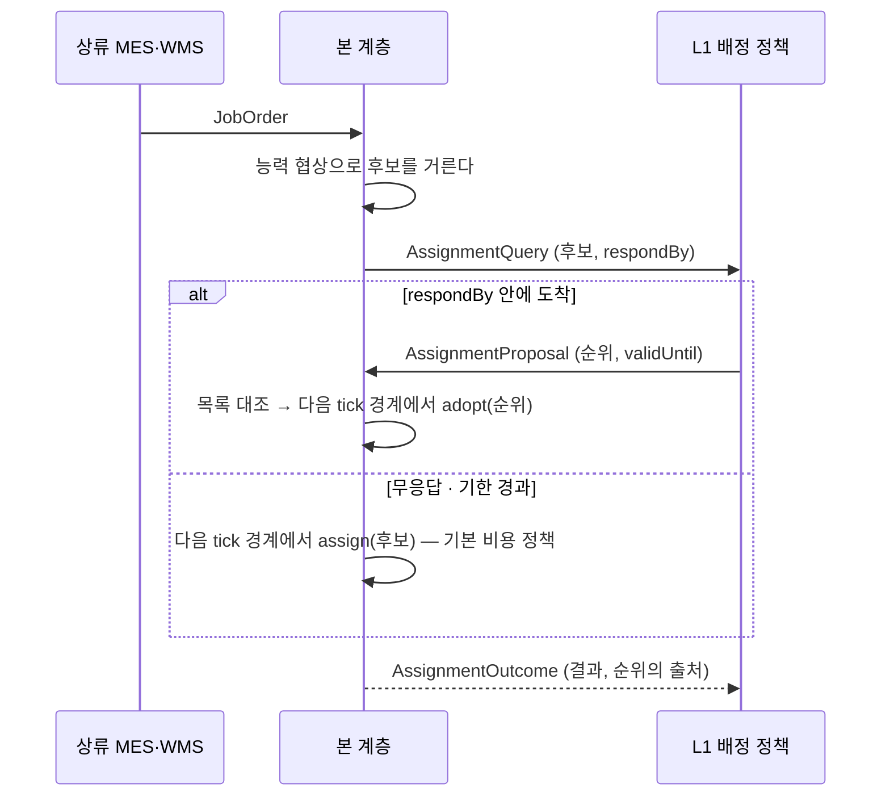
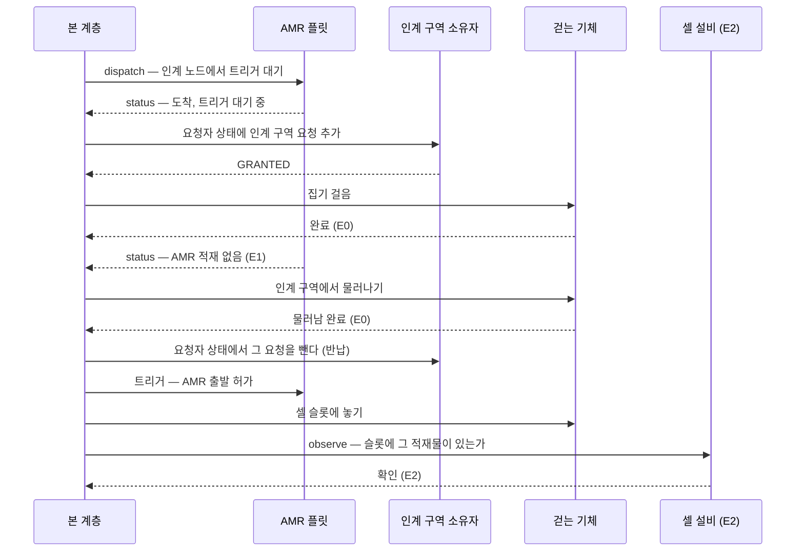

# 피어 시스템과의 통신 — 배정 정책(L1)과 공간 소유자(L3)

- **문서 상태**: 제안 (2026-09-25). **짓지 않습니다** — proto·포트·코드 변경 없음. 소비자가 붙는 PR 이 이 문서를 근거로 짓습니다(ADR 9)
- **이어받는 문서**: [오케스트레이션](../../orchestration.md) §1 세 층 · §2 자원 소유 대장 · §5 통로 소유자 절차 · §6 사건 조회면
- **참조 ADR**: [ADR 9](../../adr/0009-no-declaration-without-consumer.md) 소비자 존재 원칙 · [ADR 32](../../adr/0032-safety-boundary.md) 안전 경계 · [ADR 36](../../adr/0036-work-first-assignment-vs-execution.md) 기존 어휘 기반 · [ADR 41](../../adr/0041-assignment-policy-outside-decision-inside.md) 배정 정책은 밖, 결정은 안

---

## 1. 이 문서가 닫는 것

`orchestration.md` §1 은 오케스트레이션을 세 층으로 나눴습니다. L2(실행 보증)는 본 저장소의 것이고, L3(경로·교통)는 자원 소유자의 것이며, L1(작업 배정)은 **셀 내부라면 범위 안**이고 그 순위 정책은 밖으로 뺄 수 있습니다(ADR 41 §4). 두 경계 모두 자리와 방향은 확정되어 있지만 **무엇을 어떤 순서로 주고받는지**는 비어 있습니다. 비어 있는 동안 두 경계는 «범위 밖» 이 아니라 **미정의 경계**이며, 연동하는 날 각 배치가 저마다 다르게 채웁니다.

| 정한다 | 정하지 않는다 |
|---|---|
| 메시지의 종류·필드·의미, 누가 먼저 말하는가 | L1 의 순위 알고리즘, L3 의 교통 알고리즘 |
| 실패와 무응답을 어떤 상태로 받는가 | 걷는 기체의 통로와 인계 지점을 **누가** 소유하는가 — 현장의 결정(§15.154) |
| 권장 전송 바인딩 | 토픽 이름·포트 번호·기한 값 — 배치의 결정 |

**소유자 결정과 통신 설계를 분리합니다.** 이 문서의 L3 계약은 본 계층이 **요청하는 쪽**일 때의 계약입니다. 상대가 기존 소유자(§5 의 C)이든 상위 조정층(B)이든 모양은 같습니다. 본 계층이 **구간 소유자가 되는** 경우(C 의 한 갈래)에 내놓을 관문은 §5 의 «구간 예약 포트» 이며 이 문서의 대상이 아닙니다 — 그 방향은 §15.162 로 계속 열려 있습니다.

---

## 2. 전제

- **피어 시스템은 위에 있지 않습니다.** 이 문서에서 피어는 본 계층과 **명령 계층이 없는** 시스템입니다 — 권한이 대등하다는 뜻이 아닙니다. L3 소유자는 자기 구역에 대해서는 본 계층보다 권한이 크지만, 본 계층에 작업을 내리지도 본 계층의 지시를 받지도 않습니다. 상류(MES·WMS)의 `JobOrder` 는 본 계층으로 들어옵니다. L1 은 본 계층에 순위를 제안하는 상대이지 작업을 내리는 상위가 아닙니다.
- **기존 규율을 바꾸지 않습니다.** ADR 41 의 세 규칙(순위는 밖, 채택은 소유자가 tick 경계에서, 전량 거부 시 미배정)과 §5 의 구간 예약 규약(거절은 정상 경로, 무응답은 `IN_DOUBT`, 거부 이유는 기존 어휘로만)을 프로세스 간 프로토콜로 옮길 뿐입니다.
- **빌린 어휘와 지은 어휘를 가릅니다**(ADR 36).

| 갈래 | 항목 | 출처 |
|---|---|---|
| **빌림** | 구역 요청의 상태값·응답값·임대 기한·권한 상실 시 행동, 요청을 요청자 상태 스냅샷에 싣는 방식 | VDA 5050 3.0.0 §6.4 · §6.9 |
| **빌림** | 견적의 시간 칸 셋 — `deployment_time` · `finish_time` · `duration` | Open-RMF `rmf_api_msgs` 의 `task_estimate_result` |
| **빌림** | 트리거 대기와 해제라는 동기화 모양 | VDA 5050 3.0.0 사전 정의 액션 `waitForTrigger` · `trigger` |
| **지음** | L1 메시지 다섯(`AssignmentQuery` · `AssignmentProposal` · `AssignmentOutcome` · `ReassignmentProposal` · `ReassignmentOutcome`)과 그 필드, 후속 조치 열거(§3.2), 접수 확인 열거(§3.6) | «결정권 없는 자문형 순위» 를 다루는 기성 규격을 찾지 못했습니다. RMF 의 `dispatch_task_request` 는 배정 결정까지 상대에게 넘기는 모양이라 ADR 41 과 맞지 않습니다. 모양은 ADR 41 §4 가 «그대로 프로세스 간 프로토콜이 된다» 고 한 세 규칙에서 나옵니다 |
| **지음** | 구역 요청의 희망 기간, 구역 정의의 허용 최대 임대 기간, 걷는 기체용 권한 상실 해석(§4.5), 경로 구역의 일괄 요청(§4.4), 공간 대기 사건(§4.6) | 휴머노이드와 §5 규약 때문에 바꾸거나 더할 수밖에 없는 자리 |

- **VDA 5050 은 어댑터 뒤에 둡니다.** `scenarios.md` §1 규칙 1 대로 본 계층은 VDA 5050 을 구현하지 않습니다. 이 문서가 빌리는 것은 어휘와 규칙의 모양이며, 본 계층의 포트는 중립 이름을 쓰고 VDA 5050 으로의 대응은 구현체가 맡습니다. 원문 스키마를 엄격히 따르는 소유자와 붙을 때 값을 원문의 값으로 되돌리는 것도 구현체의 일입니다(예: §4.2 의 `QUEUED`).
- **본 계층은 여전히 소켓을 모릅니다.** 메시지의 인코딩은 순수 함수이며 전송은 담는 측의 몫입니다(`orchestration.md` §6·§7 과 같은 성질).

---

## 3. L1 — 배정 정책과의 통신

### 3.1 언제 이 프로토콜이 필요한가

ADR 41 §4 는 배정기를 별도 프로세스로 떼는 조건을 적었습니다 — **비용 함수가 현장별로 주 단위 변경을 요구하기 시작할 때**입니다. 그 전에는 기본 비용 정책(`Middleware.assign`)이 같은 프로세스에서 돌며 이 절은 필요 없습니다. 이 절은 그 조건이 성립한 날의 프로토콜입니다.

떼어 낸 L1 이 가져오는 가치는 **본 계층이 모르는 값**입니다. ADR 41 §3.4 가 본 계층의 비용 항을 본 계층이 실제로 아는 사실(진행 중 실행 수, 파지 여부)로 한정했으므로, 이동 거리·잔여 전력·충전 경합·셀 간 부하를 반영한 순위는 그것을 아는 쪽에서만 나옵니다.

| | 본 계층 | L1 |
|---|---|---|
| 아는 것 | 기체별 능력, 근거 등급 충족 가능성, 진행 중 실행 수, 파지 여부 | 이동 거리, 잔여 전력, 충전 경합, 셀 간 부하 |
| 하는 것 | 후보를 거르고, 채택 시점에 관문을 다시 건다 | 후보에 순위를 매긴다 |
| 결정권 | **있음** — `Middleware.adopt` | **없음** |

**후보를 거르는 자리는 아직 없습니다.** 기체별 능력 협상(`Negotiator`)은 `capability` · `registry` 모듈에 있지만 미들웨어 코어는 그것을 쓰지 않으며, 코어의 `capabilities` 는 기체가 아니라 논리적 능력을 열쇠로 합니다. 이 절의 «후보 목록» 은 **기체별로 «이 논리적 능력의 단위 스킬을 모두 가졌는가» 를 판정한 결과**이고, 그 거름을 짓는 것이 구현 PR 의 첫 일입니다. 거름이 없으면 §3.2 의 목록 대조는 아무도 거르지 않은 목록과 대조하는 것이 됩니다.

### 3.2 메시지

| 메시지 | 방향 | 싣는 것 |
|---|---|---|
| `AssignmentQuery` | 본 계층 → L1 | `queryId` · `jobOrderId` · 논리적 능력(`workMasterId`) · 요구 근거 등급 · 상류가 준 마감과 우선순위 · **후보 목록** · `respondBy` |
| `AssignmentProposal` | L1 → 본 계층 | `queryId` · `proposalId` · **순위 목록** · `validUntil` · 기체별 견적(선택) · 사유 산문(선택) · `basedOn`(재제안일 때만, §3.4) |
| `AssignmentOutcome` | 본 계층 → L1 | `queryId` · `proposalId`(있으면) · 결과(아래 표) · 후보별 후속 조치와 사유 산문(`UNASSIGNED` 일 때) · 순위의 출처(`PROPOSAL` 또는 `DEFAULT_POLICY`) |
| `ReassignmentProposal` | L1 → 본 계층 | `proposalId` · `executionId` · 후보 목록 · `validUntil` |
| `ReassignmentOutcome` | 본 계층 → L1 | `proposalId` · `MOVED`(옮긴 기체) 또는 `KEPT`(사유 산문) |

**`ReassignmentProposal` 의 후보도 같은 거름을 거칩니다.** 그 실행의 논리적 능력에 대해 거름을 통과하지 못한 기체가 후보에 있으면 받는 즉시 제안 전체를 거절합니다. `reassign` 도 `admits` 만 걸기 때문에, 이 대조가 없으면 L1 이 스킬 없는 기체나 없는 기체로 실행을 옮길 수 있습니다.

**`AssignmentOutcome` 의 결과는 `adopt` 가 실제로 돌려주는 모양을 따릅니다.**

| 결과 | 뜻 | 후보별 사유 |
|---|---|---|
| `ADOPTED` | 순위 중 한 기체가 관문을 통과해 접수됨 | **없음** — `adopt` 는 첫 통과에서 돌아가며 앞 후보들의 거절을 남기지 않습니다 |
| `UNASSIGNED` | 순위 전량이 관문에서 거부 | 있음 |
| `REJECTED` | 기체와 무관한 이유로 접수 불가(모르는 능력, 능력의 최고 등급을 넘는 요구 등급 등) | 없음 — 어느 후보로도 안 됩니다 |
| `IDEMPOTENT` | 같은 주문이 이미 접수되어 있음 | 없음 |

앞 후보들의 거절까지 L1 에 돌려주려면 `adopt` 가 바뀌어야 합니다. 그것은 이 문서가 아니라 구현 PR 의 판단입니다.

**필드 규약.**

- **후보 목록은 능력 협상을 통과한 기체만 싣습니다.** 그리고 **순위에 목록 밖의 기체가 있으면 받는 즉시 그 제안 전체를 거절합니다.** 관문(`admits`)은 사전 조건·점유·바닥 소유·작업 구역을 보지만 **그 기체가 해당 스킬을 가졌는지는 보지 않습니다** — 그 거름은 후보를 만드는 자리에 있습니다. 목록 밖 기체를 관문에만 맡기면 능력이 없는 기체가 `submit` 까지 갑니다. 그래서 이 경계의 방벽은 둘입니다: **수신 시 목록 대조**와 **채택 시 관문**.
- **견적은 시간 칸 셋만 받습니다.** `task_estimate_result` 의 `state` 는 항법 그래프의 웨이포인트 번호와 방위각을 싣는데, 좌표와 프레임은 어댑터에만 나타난다는 규율(`orchestration.md` §3)과 맞지 않습니다. 견적은 판정에 쓰지 않고 `AssignmentOutcome` 과 함께 적재만 합니다 — 나중에 «왜 이 순위였는가» 를 묻는 사람이 L1 에 다시 묻지 않게 하기 위해서입니다.
- **후보별 거절은 후속 조치 열거와 산문을 함께 싣습니다.** `Unassigned` 가 사유를 드는 이유는 배정기가 **무엇을 고쳐야 하는지** 알게 하기 위해서이고(`Assignment.kt`), §3.4 의 재제안 규칙도 L1 이 어떤 상태 변화를 기다려야 하는지 알아야 성립합니다. 산문만 주면 L1 은 문자열 대조에 기대게 됩니다. 그래서 `orchestration.md` §7.3 과 같은 기준으로 — **후속 조치가 다른가** — 열거를 둡니다.

| 후속 조치 | 관문의 어느 검사에서 나오는가 | 걸리는 범위 | L1 이 할 일 |
|---|---|---|---|
| `WAIT_FOR_STATE` | 점유(`occupancyViolation`) · 작업 구역(`workspaceViolation`) · 사전 조건 사슬(`chainRefusal`) | 점유는 주문 전체, 나머지는 그 기체 | 그 기체나 그 자리의 상태가 바뀐 뒤 다시 제안 |
| `FLOOR_UNOWNED` | 바닥 소유(`unownedFloor`) | **주문 전체** — 어느 기체로도 안 됩니다 | 다시 제안하지 않음. 현장이 소유자를 정할 일 |
| `ORDER_INCONSISTENT` | 주문과 계획의 불일치(`inconsistent`) | **주문 전체** | 다시 제안하지 않음. 상류가 주문을 고칠 일 |

  **질의를 닫는 것은 범위가 아니라 후속 조치입니다.** 아래의 덮기를 거친 뒤 후속 조치가 모두 «다시 제안하지 않음»(`FLOOR_UNOWNED` · `ORDER_INCONSISTENT`)인 `UNASSIGNED` 라면, 재제안이 풀 수 있는 것이 없으므로 `AssignmentOutcome` 이 그 질의를 **종결**로 표시하고 닫습니다(§3.3). 열어 두면 아무도 풀 수 없는 질의가 영원히 남습니다. 점유 거절은 범위가 주문 전체여도 `WAIT_FOR_STATE` 이므로 질의를 닫지 않습니다 — 자리가 비면 풀리는 거절입니다. 범위 열은 «기체를 바꾸면 답이 바뀌는가» 를 알려 줄 뿐입니다. `adopt` 는 한 번 짠 계획을 모든 후보에 똑같이 대므로 `inconsistent` · `occupancyViolation` · `unownedFloor` 는 기체를 바꿔도 답이 같습니다.

  **관문은 첫 거절에서 멈춥니다.** 검사 순서는 `inconsistent` → `chainRefusal` → `occupancyViolation` → `unownedFloor` → `workspaceViolation` 이므로, 사전 조건으로 먼저 거절된 기체는 주문의 바닥에 주인이 없어도 `WAIT_FOR_STATE` 로 보입니다. 그래서 한 결과 안에 «다시 제안하지 않음» 인 거절이 하나라도 있으면 **그 후속 조치가 `WAIT_FOR_STATE` 를 덮습니다.** 바닥에 주인이 없다는 사실은 기체를 바꾸거나 기다려서 풀리지 않기 때문입니다.

  **`adopt` 경로의 사전 조건 거절에는 기다리는 사람이 없습니다.** `submit` 경로에서는 사슬 거절이 조치 제안을 계산해 기록하고 가림도 거기서 판정하지만(`orchestration.md` §7), `adopt` 는 관문의 거절 사유만 남기고 그 기록을 거치지 않습니다. 그래서 순위 채택에서 나온 사슬 거절에는 승인할 제안이 남지 않으며, 그 자리로 승인을 시도하면 `NO_PROPOSAL` 입니다. 지금은 `WAIT_FOR_STATE` 가 맞습니다. `adopt` 도 제안을 기록하게 할지는 구현 PR 의 판단이며, 그렇게 바꾸면 이 경우를 사람을 기다리는 별도 후속 조치로 갈라야 합니다.

  열거는 **관문의 검사 종류**에 붙으며 검사의 세부 규칙에 붙지 않습니다. 검사를 더하면 열거가 늘 수 있지만 검사의 문턱이 바뀌어도 열거는 그대로입니다. 산문은 감사용이며 읽는 쪽은 **분해하지 않습니다** — 다른 기체와 주문의 식별자가 섞여 있고, 분해하는 순간 그 문장이 계약이 됩니다.

  **지금의 거절 값에는 이 열거를 받칠 구조가 없습니다.** `Admission.Refused` 는 산문 사유 하나만 듭니다. 구현 PR 이 거절마다 **검사 종류와 관련된 자리**를 구조로 달아야 하며, §3.4 의 «그 거절이 가리킨 자리» 는 그 구조에서 읽습니다. 산문에서 꺼내지 않습니다.
- **`proposalId` 는 멱등 열쇠입니다.** 같은 제안이 두 번 오면 두 번째는 무시하고 첫 번째의 결과를 다시 발행합니다.
- **기한 없는 제안은 받지 않습니다.** `validUntil` 이 없으면 낡은 순위가 언제까지나 유효합니다. `ReassignmentProposal` 도 같습니다.

### 3.3 흐름



- **제안은 도착 즉시 적용되지 않습니다.** 수신 시에는 형식·목록·기한만 보고 접수 확인만 돌려주며, 적용은 다음 tick 경계에서 `adopt` 가 합니다. 읽은 스냅샷과 적용하는 스냅샷이 같아야 한다는 ADR 41 §3.1 의 규칙입니다.
- **`queryId` 는 접수가 정해질 때 닫힙니다.** `ADOPTED` · `REJECTED` · `IDEMPOTENT` 가 나오면 — 제안으로든 기본 정책으로든 — 그 질의는 닫히고, 이후 도착한 제안은 적용하지 않고 «닫힌 질의» 로 적재만 합니다. 늦은 제안을 적용하면 이미 정한 실행이 조용히 바뀝니다. **`UNASSIGNED` 는 닫지 않습니다.** 미배정인 주문은 §3.4 의 규칙을 지키는 재제안을 같은 `queryId` 로 받습니다. 단, 덮기를 거친 뒤 후속 조치가 모두 «다시 제안하지 않음» 인 `UNASSIGNED` 는 종결로 표시하고 닫습니다(§3.2).

### 3.4 실패 처리

L1 의 실패는 **느리거나 나쁜 답**이지 거짓이 아닙니다(`orchestration.md` §1). L1 은 물리 부작용을 일으키지 않으므로 답을 못 받아도 모르는 물리 상태가 생기지 않으며, 그래서 이 경계에는 `IN_DOUBT` 가 없습니다.

| 상황 | 본 계층의 동작 | 이유 |
|---|---|---|
| 무응답 · `respondBy` 경과 | 기본 비용 정책으로 채택. 출처 `DEFAULT_POLICY` | L1 정지가 라인 정지가 되면 안 됩니다 |
| 순위 전량이 관문에서 거부 | `UNASSIGNED`. **다시 묻지 않습니다** | ADR 41 — 다시 물으면 본 계층이 중재자가 됩니다 |
| L1 의 재제안 | `basedOn` 이 **관련된** 상태 피드 사건을 가리킬 때만 받습니다. 관련된 사건이란 그 주문의 마지막 `AssignmentOutcome` 보다 뒤에 나왔고, 그 결과에서 `WAIT_FOR_STATE` 로 거절된 기체나 그 거절이 가리킨 자리에 관한 것입니다. 아니면 무시하고 적재 | ADR 41 §5 가 배제한 것은 중재자 역할만이 아니라 배정기와 관문 사이의 재시도 루프 자체입니다. **상태가 바뀌지 않았는데 같은 주문을 다시 제안하는 것**이 그 루프입니다. «아무 사건이든 뒤에 나왔으면 된다» 로 두면, 바쁜 라인에서는 무관한 사건이 늘 있으므로 같은 순위가 tick 마다 되풀이됩니다 |
| 순위에 목록 밖 기체 | 제안 전체 거절 | §3.2 — 능력 거름은 관문에 없습니다 |
| 닫힌 `queryId` 에 제안 도착 | 적용하지 않고 적재 | §3.3 |
| `ReassignmentProposal` | 다음 tick 경계에서 `reassign` 에 넘기고 결과를 `ReassignmentOutcome` 으로 발행 | `reassign` 은 실행의 기체를 바꾸는 쓰기입니다. tick 밖에서 부르면 단일 적용자가 깨집니다 |

**`reassign` 의 한계를 그대로 드러냅니다.** `reassign` 은 L1 이 준 후보의 **순서를 보지 않고**, 관문을 통과한 후보 중 진행 중 실행 수가 가장 적은 기체를 고르며, 이득이 문턱(`margin`)을 넘을 때만 옮깁니다. 그래서 L1 이 «공간 대기가 길다» 는 이유로 재배정을 제안해도, 부담이 비슷한 기체 사이에서는 `KEPT` 가 나옵니다. 공간 대기를 비용에 넣을지는 ADR 41 §3.4 를 다시 여는 일이며 이 문서의 결정이 아닙니다.

### 3.5 상태 피드

L1 은 배정의 결과를 봐야 다음 순위를 매길 수 있습니다. 그런데 **본 계층에는 프로세스 밖으로 나가는 실시간 사건 스트림이 없습니다.** v1 의 바깥 표면은 두 대장의 파일 내보내기(`orchestration.md` §6)와 루프백 승인면(§7)뿐입니다.

- 상태 피드는 **담는 측이 내야 합니다.** 본 계층은 이미 과제 전이·연결 상태·사건 적재를 만들고 있으며, 담는 측이 그것을 밖으로 냅니다.
- **L1 이 붙으면 담는 측에 대한 두 판단이 함께 바뀝니다.** 읽기 쪽으로는 `orchestration.md` §6 의 승격 조건이 성립합니다 — 읽는 쪽이 둘 이상이 되고, 파일 스캔 주기로는 배정에 늦습니다. 쓰기 쪽으로는 §7.4 의 넷째 조건 «밖에서 들어오는 쓰기» 가 성립합니다 — L1 의 제안 창구(§3.6)가 그 쓰기입니다. §7.4 는 쓰기를 `registry`(A)가 담는 것을 부적합하다고 정했으므로, **본 계층을 세우는 측이 제안 창구와 상태 피드를 함께 냅니다.** 승인면과 같은 자리입니다.
- **피드의 사건에는 식별자가 필요합니다.** 담는 측이 발행 순서대로 단조 증가하는 번호를 붙이며, §3.4 의 `basedOn` 이 이 번호를 가리킵니다.
- 피드에 **새로 필요한 사건은 공간 대기 하나**입니다(§4.6). 걸음이 구역 허가를 기다리는 동안 그 걸음은 나가지 않았으므로 과제 전이도 진행 정체 신호도 생기지 않습니다. 이 사건이 없으면 L1 은 공간 때문에 멈춘 실행을 볼 수 없습니다. L1 이 그 소비자입니다(ADR 9).

### 3.6 권장 전송

| 경로 | 바인딩 | 이유 |
|---|---|---|
| `AssignmentQuery` | 본 계층 → L1 발행 | 답을 기다리며 막히지 않습니다. 기한은 본 계층이 셉니다 |
| `AssignmentProposal` · `ReassignmentProposal` | L1 → 담는 측이 여는 요청 창구. 응답은 **접수 확인**뿐(`RECEIVED` · `IGNORED_CLOSED` · `IGNORED_NO_CHANGE` · `REFUSED_OFF_LIST` · `INVALID`) | L1 이 먼저 말할 통로가 있어야 재제안과 재배정 제안이 가능합니다. 채택 결과는 tick 이후에 나오므로 이 응답에 싣지 않습니다. 승인면(§7)과 같은 모양입니다 |
| `AssignmentOutcome` · `ReassignmentOutcome` · 상태 피드 | 담는 측의 사건 발행 | 본 계층은 L1 이 받았는지에 의존하지 않습니다 |

---

## 4. L3 — 공간 소유자와의 통신

### 4.1 대상 자원 둘

| 자원 | 언제 필요한가 | 소유자 |
|---|---|---|
| **통로 구역** | 걷는 기체가 셀 밖을 지날 때 | **미정**(«구멍», §15.154) |
| **인계 지점** | 걷는 기체가 AMR 위의 적재물을 **AMR 이 선 채로** 집을 때 | **미정** — 플릿은 자기 AMR 만 승인하므로(`FloorOwnership`) 걷는 기체의 진입을 승인할 주체가 없습니다. 통로와 같은 구멍입니다 |

**소유자가 정해지기 전에는 두 자원 모두 쓰지 않습니다.** 다만 지금 코드가 막는 범위는 좁습니다. `unownedFloor` 는 소유 대장이 붙어 있고 그 자리가 `Unowned` 로 적힌 배치에서만 막으며, 대장을 붙이지 않은 기본 배치(`FloorOwnership.None` → `NotDeclared`)에서는 검사하지 않습니다. 통로에 대해서는 그것이 이미 내려진 결정입니다 — 접으면 대장을 안 붙인 현장이 통째로 멈춥니다. **직접 인계는 다르게 둡니다.** 새로 여는 흐름이므로 쓰던 현장이 멈출 일이 없고, 그래서 인계 지점의 소유자가 **선언되어 있지 않으면**(`Unowned` 이든 `NotDeclared` 이든) 직접 인계를 접수하지 않습니다. 이 문서는 소유자가 정해진 날 쓸 계약을 미리 정할 뿐 구멍을 닫지 않습니다.

**거치대를 거치는 간접 인계는 L3 가 필요 없습니다.** AMR 이 거치대에 내려놓고 떠난 뒤 기체가 집는 흐름은 기존 `AmrFleetPort.dispatch` 와 `CellSignals.observe`(E2)로 이미 닫혀 있습니다. 두 기계가 한 자리에 **동시에** 있을 때만 이 절이 필요합니다.

### 4.2 메시지 — 요청은 스냅샷 안에만 있습니다

VDA 5050 3.0.0 §6.9 에서 요청은 **항상 요청자의 상태 메시지의 일부로** 전달되며 별도 요청 메시지가 없습니다. 이 모양을 그대로 따릅니다. 요청을 따로 보내는 메시지를 두면 요청의 정본이 둘이 되고, 둘이 어긋날 때 어느 쪽을 믿을지 정해야 합니다.

| 메시지 | 방향 | 싣는 것 |
|---|---|---|
| 구역 정의 | 소유자 → 본 계층 | `zoneSetId` · `zoneId` · 권한 상실 시 행동(`STOP` · `CONTINUE` · `EVACUATE`) · 허용 최대 임대 기간(선택) |
| 요청자 상태 | 본 계층 → 소유자 | **들고 있는 요청 전부.** 각 요청은 `requestId`(요청 시도마다 유일) · `robotId` · `zoneSetId` · `zoneId` · `requestType = ACCESS` · `requestStatus` · 희망 기간 |
| 응답 | 소유자 → 본 계층 | `requestId` · `responseType` ∈ {`GRANTED`, `QUEUED`, `REJECTED`, `REVOKED`} · `leaseExpiry`(선택) |

- **새 요청 = 스냅샷에 새 항목이 나타나는 것**이고, **반납 = 스냅샷에서 항목이 빠지는 것**입니다. 요청과 반납을 뜻하는 별도 메시지가 없습니다.
- **권한 상실 시 행동은 구역 정의에서 옵니다.** 원문에서도 이 값은 구역 정의에 있으며 응답에 실리지 않습니다. 본 계층은 요청 전에 그 구역의 정의를 알아야 하고, 정의를 모르는 구역은 요청하지 않습니다.
- **희망 기간은 지은 칸입니다.** 원문의 구역 요청에는 기간이 없지만 `orchestration.md` §5 는 요청이 구간과 **기간**을 지정한다고 정했습니다. 소유자는 이 값을 참고할 뿐이며, 실제 유효 기한은 응답의 `leaseExpiry` 가 정합니다.
- **스냅샷이므로 잃어도 복구됩니다.** 원문의 상태 메시지는 변경 시와 주기적으로 전체를 다시 싣습니다. 메시지 하나를 잃어도 다음 스냅샷이 복구하고, 본 계층이 재기동한 뒤에도 첫 스냅샷이 «지금 무엇을 들고 있는가» 를 다시 알립니다.
- **`requestStatus` 의 값.** 원문 §6.9 의 상태값은 `REQUESTED` · `QUEUED` · `GRANTED` · `REVOKED` · `EXPIRED` 로 적혀 있고 부속 표에는 `QUEUED` 가 빠진 넷이 있습니다. 본 계층은 응답을 그대로 반영하므로 `QUEUED` 를 포함한 다섯을 씁니다. 부속 표대로 넷만 받는 소유자와 붙을 때는 구현체가 `QUEUED` 를 `REQUESTED` 로 되돌려 보냅니다.

### 4.3 원문에서 그대로 가져오는 규칙

| 규칙 | 원문 | 여기서 중요한 이유 |
|---|---|---|
| **진입 전에 요청한다** | 주문에 그 구역이 포함되어 있어도 요청이 먼저입니다 | 배정이 통행 허가가 아닙니다. 둘은 소유자가 다릅니다 |
| **`QUEUED` 는 허가가 아니다** | 접수만 알린 것이며 계속 기다립니다 | 대기는 정상입니다. 그 걸음은 보내지 않습니다 |
| **`REJECTED` 면 하지 않는다** | 요청한 동작을 하지 않고 요청을 지울 수 있습니다 | 거절은 정상 경로입니다 |
| **임대는 소유자가 연장한다** | 같은 `requestId` 로 새 `leaseExpiry` 를 보냅니다 | 본 계층은 기한을 스스로 늘리지 않습니다 |
| **무응답은 허가가 아니다** | 허가되지 않은 것처럼 행동합니다 | §5 의 `IN_DOUBT` 규약과 같은 방향입니다 |
| **구역 안에서 권한을 잃으면 상태로 알리고, 행동이 끝날 때까지 항목을 둔다** | 이미 시작한 동작이면 `requestStatus` 를 `REVOKED` · `EXPIRED` 로 바꾸고 **권한 상실 시 행동이 끝날 때까지** 상태에 둡니다. 시작하지 않았으면 지웁니다 | **아래 §4.5 의 핵심입니다** |

### 4.4 지은 규칙 — 경로 구역의 일괄 요청

원문은 **겹친** RELEASE 구역이면 모두 허가받고 들어가라고 합니다. 본 계층은 이를 넓혀 **한 걸음의 경로에 걸린 구역을 걸음을 보내기 전에 모두 요청합니다.** 절반만 받고 출발하면 구역 사이에서 멈춥니다.

넓힌 대가는 **점유하며 대기**입니다. 일부를 `GRANTED` 로 든 채 나머지가 `QUEUED` 이면, 다른 요청자와 서로의 구역을 쥐고 기다리는 교착이 생깁니다. 소유자가 여럿이면(§5 의 C) 어느 소유자도 그 순환을 보지 못합니다. 그래서 두 규칙을 붙입니다.

- **전부 받지 못하면 받은 것을 놓습니다.** 걸음마다 기한을 두고, 기한 안에 전부 `GRANTED` 가 아니면 받은 요청을 스냅샷에서 빼고 걸음을 보내지 않습니다. 다시 요청할 때는 새 `requestId` 를 씁니다.
- **다시 요청하는 간격을 기체마다 흩뜨립니다.** 같은 두 요청자가 같은 박자로 다시 요청하면 같은 교착이 반복됩니다.

### 4.5 구역 안에서 권한을 잃었을 때

확인과 반납의 순서는 원문 §6.9 를 따릅니다. 핵심은 **`REVOKED` 보고는 «비웠다» 가 아니라 «알았다» 라는 확인**이라는 것입니다. 구역이 비었다는 신호는 **항목이 스냅샷에서 빠지는 것** 하나뿐입니다. 항목이 **언제** 빠지는지는 아래 표의 셋째 열이며, 여기서 본 계층은 원문과 갈립니다 — 원문에서 `STOP` 은 멈추는 순간 행동이 끝나므로 항목이 곧 빠지지만, 걷는 기체가 구역 안에 멈춰 서 있는데 항목을 빼면 소유자는 그 자리를 비었다고 봅니다. **셋째 열은 본 계층이 지은 규칙입니다.**

```text
구역 안에서 REVOKED 수신 또는 leaseExpiry 도달
  → 즉시: requestStatus 를 REVOKED · EXPIRED 로 바꿔 보고 (확인)
  → 구역 정의의 권한 상실 시 행동을 시작
  → 기체가 구역을 벗어난 것을 관측할 때까지 항목을 둔다
  → 벗어났으면: 항목을 뺀다 (이것이 반납)
```

걷는 기체에서 권한 상실 시 행동은 바퀴 달린 기계와 뜻이 다릅니다.

| 원문 값 | 걷는 기체에서의 해석 | 항목은 언제 빠지는가 |
|---|---|---|
| `STOP` | **적재물을 들고 선 채로 멈춘다.** 동력 차단이 아닙니다 | **빠지지 않습니다.** 기체가 구역 안에 서 있으므로 소유자는 그 자리를 계속 점유된 것으로 봐야 합니다. 본 계층은 소유자와 운영자에게 오류를 알리고 운영자 개입을 기다립니다(원문도 이 경우 치명 등급의 `RELEASE_LOST` 오류를 둡니다) |
| `CONTINUE` | 지금 걸음을 계속한다. 원문대로 걸음이 구역 안에서 끝나면 그 자리에서 기다린다 | 걸음이 구역 밖에서 끝났으면 벗어난 것을 관측한 뒤. **구역 안에서 끝났으면 빠지지 않으며** `STOP` 과 같이 운영자에게 갑니다 |
| `EVACUATE` | 구역 밖으로 걸어 나간다 | 벗어난 것을 관측한 뒤. **기체 프로파일이 퇴출 동작을 `YES` 로 선언한 경우만** 이 값을 받습니다. `UNKNOWN` 이면 `STOP` 으로 접습니다 |

- **`EVACUATE` 를 3값으로 받는 이유는 프로파일 규율과 같습니다.** 퇴출 경로를 계산할 수 있는지 입증되지 않은 기체에 퇴출을 시키면, 입증되지 않은 동작이 권한 없는 구역 안에서 일어납니다.
- **이 정지는 안전 기능이 아닙니다.** 소프트웨어 계약을 거치는 운영상의 정지이며, 비상정지·보호정지는 여전히 계약을 경유하지 않습니다(ADR 32). 동적 안정 기계가 동력을 끊으면 쓰러진다는 사실 때문에 «정지 = 동력 차단» 이 성립하지 않는다는 점만 반영합니다.
- **«벗어났다» 의 근거는 기체의 보고입니다**(E0). 구역 경계에 독립 감지가 있으면 그것이 더 강한 근거이지만, 그 설비는 이 문서가 전제하지 않습니다.

### 4.6 실패 처리

| 상황 | 본 계층의 동작 | 이유 |
|---|---|---|
| 무응답 | 그 요청은 `IN_DOUBT`. 걸음을 보내지 않음. 다음 스냅샷이 사실상 재전송이며, 걸음의 기한이 지나도 답이 없으면 **운영자에게** | §5 — 재전송은 조회 가능한 하류에만, 아니면 운영자 |
| `REJECTED` | 요청을 스냅샷에서 빼고 걸음을 보내지 않음. 실행은 대기, 공간 대기 사건 발행 | 거절은 정상 경로입니다 |
| `QUEUED` 지속 | 대기 유지. 공간 대기 사건 발행 | 기존 진행 정체 신호는 **이미 나간 걸음**의 것이라 이 대기를 드러내지 못합니다 |
| 구역 **밖**에서 `REVOKED` · 만료 | 요청을 빼고 걸음을 보내지 않음 | 들어가지 않았으니 할 일이 없습니다 |
| 구역 **안**에서 `REVOKED` · 만료 | §4.5 | 확인과 반납을 가릅니다 |
| 본 계층 재기동 | 첫 스냅샷에 들고 있던 요청을 다시 실음 | 담는 측이 요청 목록을 영속화합니다. 본 계층은 라이브러리이며 영속화가 없습니다 |
| 소유자 재기동 | 다음 스냅샷이 현재 요청을 다시 알림 | 스냅샷이라서 복구 절차가 따로 없습니다 |

**공간 대기 사건**은 `robotId` · `executionId` · `zoneId` · 대기의 종류(`QUEUED` · `REJECTED` · `IN_DOUBT`) · 대기 시작 시각을 싣습니다. L1(§3.5)과 운영자가 소비자입니다.

### 4.7 직접 인계 — 두 기계가 한 자리에

두 신호를 가릅니다. **적재물이 AMR 을 떠났다**는 것과 **기체가 인계 구역을 비웠다**는 것은 다른 사실이며, AMR 을 보내려면 둘 다 필요합니다. 앞만 보고 보내면 적재물은 옮겨졌지만 출발하는 AMR 옆에 기체의 팔이 남아 있을 수 있습니다.



- **트리거는 두 조건이 모두 서야 나갑니다.** 플릿이 AMR 에 적재물이 없다고 보고했고(`TransportStatus` 의 보유 여부, E1), 기체가 인계 구역에서 물러났다고 보고한 것(E0)입니다. 앞이 서지 않으면 집기가 실패했거나 적재물이 떨어진 것일 수 있으므로 트리거를 보내지 않고 운영자에게 넘깁니다. AMR 이 떠나면 적재물의 위치를 확인할 방법이 줄어듭니다.
- **E2 는 인계 지점이 아니라 놓은 자리에서 옵니다.** `CellSignals.observe` 는 셀의 자리를 봅니다. 집은 직후의 적재물은 기체의 손에 있으므로 셀 설비가 볼 수 없습니다. 그래서 논리적 완료(근거 등급 충족)는 셀 슬롯에 놓은 뒤에 판정합니다.
- **플릿이 기다림을 끝낼 수 있습니다.** 원문의 `waitForTrigger` 는 타임아웃을 플릿 관제의 책임으로 두며, 필요하면 플릿이 주문을 취소합니다. 그래서 «AMR 을 잡아 둔다» 는 보장이 아닙니다. 트리거 전에 플릿이 운반을 `CANCELLED` 나 `FAILED` 로 보고하면 — 플릿마다 타임아웃을 어느 쪽으로 보고할지 다릅니다 — 집기 전이면 집기를 보내지 않고, 집기 중이면 그 단위는 `OPERATOR_HOLD` 로 운영자에게 갑니다. `IN_DOUBT` 가 아닌 이유는 접수 여부를 모르는 것이 아니라, 취소라는 사건은 알되 **물리 결과를 모르는** 것이기 때문입니다.
- **트리거 대기를 지원하지 않는 플릿과는 직접 인계를 하지 않습니다.** 거치대를 거치는 간접 인계로 내려갑니다. 트리거 없이 «적당히 기다리는» AMR 과의 직접 인계는 무승인 경로입니다.
- **이 순서는 운영상의 연동이지 안전 기능이 아닙니다**(ADR 32). 사람과 기계의 충돌 방지는 여전히 독립 안전 계통의 몫입니다.

**`AmrFleetPort` 에 필요한 것**(구현 PR 의 몫). 이름은 중립으로 두고 VDA 5050 의 `waitForTrigger` · `trigger` 로의 대응은 구현체가 맡습니다.

| 필요 | 이유 |
|---|---|
| 운반 주문에 «목적지에서 트리거 대기» 선택 | 지금의 `TransportOrder` 에는 그 칸이 없습니다 |
| 상태에 «트리거 대기 중» 값 | 도착과 대기를 가릅니다 |
| 트리거를 보내는 동작 | 지금의 포트는 `dispatch` · `status` · `cancel` 뿐입니다 |
| 플릿이 트리거를 지원하는지의 선언 | `NO` 이면 직접 인계를 접수하지 않습니다 |
| 이 운반의 성공의 뜻 | 지금의 `DELIVERED` 는 «목적지 설비가 인수 ∧ AMR 이 용기를 보유하지 않음» 입니다. 직접 인계에서는 인수자가 설비가 아니라 기체이므로 성공 조건을 새로 적어야 합니다 |

**대장(`orchestration.md` §2)에 올릴 행**은 구현 PR 이 추가합니다. 소유자는 **미정**, 현재는 **구멍**, 관문은 그 PR 이 짓는 기호입니다.

### 4.8 권장 전송

허가가 나중에 올 수 있으므로(`QUEUED` → `GRANTED`) **비동기**입니다.

| 경로 | 바인딩 | 이유 |
|---|---|---|
| 요청자 상태 | MQTT 발행, 변경 시 + 주기 | 원문도 상태 메시지를 변경 시와 주기적으로 보냅니다. 스냅샷이므로 잃어도 다음 것이 복구합니다 |
| 응답 · 구역 정의 | MQTT 구독 | 원문의 응답 토픽과 같은 모양입니다. AMR 쪽 소유자가 이미 쓰는 전송에 맞춥니다 |
| 트리거 | `AmrFleetPort` 구현체가 플릿의 방식대로 | 플릿마다 다릅니다. 포트 뒤에 숨깁니다 |

---

## 5. 두 경계가 만나는 자리

L1 이 순위를 매길 때 공간을 모르면 **통행 허가를 받기 어려운 기체**에게 높은 순위를 줄 수 있습니다. 그래도 두 경계를 합치지 않습니다.

- **배정은 통행 허가가 아닙니다.** 채택된 기체도 걸음마다 구역을 요청하며, 받지 못하면 그 실행은 대기합니다.
- **대기는 공간 대기 사건으로 L1 에 보입니다**(§4.6). 그다음 재배정을 제안할지는 L1 이 정하지만, §3.4 의 한계대로 `reassign` 이 공간 대기를 이유로 옮겨 주지는 않습니다. 이 한계는 숨기지 않고 둡니다.
- **L1 이 공간 정보를 쓰고 싶으면 소유자에게 직접 묻습니다.** 본 계층이 소유자의 답을 L1 에 중계하면 본 계층이 소유하지 않은 값의 사본을 들게 됩니다(`orchestration.md` §1 — L3 을 L2 가 대신할 수 없다).

---

## 6. 구현 PR 이 증명해야 할 것

짓는 날 아래를 시험으로 박습니다. 상대는 전부 대역이며, 대역은 **이 문서의 규칙을 어기는 쪽으로도** 움직일 수 있어야 합니다. 각 단언은 결함을 주입해 실패하는 것을 먼저 확인합니다.

| 경계 | 시험이 확인할 것 |
|---|---|
| L1 | 무응답 시 기본 정책으로 채택되고 출처가 `DEFAULT_POLICY` 로 남는다 · 전량 거부 시 다시 묻지 않는다 · 상태 변화 없는 재제안을 받지 않는다 · 기한 지난 제안과 닫힌 질의의 제안을 적용하지 않는다 · 같은 `proposalId` 가 두 번 채택되지 않는다 · 목록 밖 기체가 든 제안이 거절된다 · 거름을 통과하지 못한 기체가 든 재배정 제안이 거절된다 · 재배정 제안이 tick 경계에서만 적용된다 · 무관한 사건을 `basedOn` 으로 든 재제안을 받지 않는다 · `UNASSIGNED` 뒤 관련 사건을 든 재제안은 같은 `queryId` 로 받는다 · 거절마다 후속 조치 열거가 실린다 · `FLOOR_UNOWNED` · `ORDER_INCONSISTENT` 만으로 나온 `UNASSIGNED` 는 질의를 닫는다 · 점유 거절만으로 나온 `UNASSIGNED` 는 질의를 닫지 않는다 · «다시 제안하지 않음» 이 `WAIT_FOR_STATE` 를 덮는다 |
| L3 | 무응답·`QUEUED` 에서 걸음이 나가지 않는다 · 경로 구역을 기한 안에 전부 못 받으면 받은 것을 놓는다 · 구역 안 회수 시 `REVOKED` 를 즉시 보고하되 벗어난 것을 관측하기 전에 항목을 빼지 않는다 · `STOP` 으로 멈춘 기체의 항목이 남는다 · `EVACUATE` 가 `UNKNOWN` 인 기체는 `STOP` 으로 접힌다 · 재기동 후 첫 스냅샷이 들고 있던 요청을 싣는다 · 정의를 모르는 구역은 요청하지 않는다 |
| 직접 인계 | AMR 적재 없음(E1) 전에 트리거가 나가지 않는다 · 기체가 물러나기 전에 트리거가 나가지 않는다 · 트리거 전 플릿 취소·실패가 집기 중이면 `OPERATOR_HOLD` 가 된다 · 트리거 미지원 플릿에서 직접 인계가 접수되지 않는다 · 인계 지점의 소유자가 `Unowned` 이든 `NotDeclared` 이든 직접 인계가 접수에서 막힌다 |

---

## 7. 남는 것

| 항목 | 성격 |
|---|---|
| 걷는 기체의 통로와 인계 지점을 누가 소유하는가 (§15.154) | **현장의 결정.** 이 문서는 누가 되든 요청하는 쪽의 계약이 같게 합니다 |
| 본 계층이 구간 소유자가 될 때의 관문 (§15.162) | 이 문서의 대상이 아닙니다. §5 의 «구간 예약 포트» 가 그 자리입니다 |
| 기체별 후보 거름 | 코어에 없습니다. 구현 PR 의 첫 일입니다(§3.1) |
| 제안 창구와 상태 피드를 내는 담는 측 | 본 계층을 세우는 측입니다. `orchestration.md` §7.4 의 쓰기 조건 때문에 `registry` 가 담지 않습니다(§3.5) |
| `adopt` 가 앞 후보들의 거절을 남길지 | 구현 PR 의 판단입니다(§3.2) |
| 공간 대기를 배정 비용에 넣을지 | ADR 41 §3.4 를 다시 여는 일입니다(§3.4) |
| 기한·임대 기간·재요청 간격의 값 | 배치의 설정. 계약은 필드만 정합니다 |
| 구역의 기하 표현 | 본 계층은 구역을 이름으로만 압니다. 좌표는 어댑터와 소유자의 것입니다(`orchestration.md` §3) |

> 마지막 대조: 2026-09-25 · sha256:d812f1612275 · 열림: §15.154, §15.162
