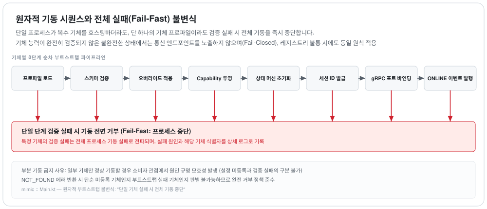

# `mimic` — 프로파일이 모는 로봇 에뮬레이터

**"어댑터 + 로봇" 한 쌍을 대신한다.** 계약(④)을 구현하되 그 거동은 **프로파일이 정한다** — 기종별 클래스가 없고,
새 기종은 JSON 한 장이다. 완료 기준 11 이 그것을 CI 조건으로 만든다.

---

## 이 모듈의 규칙 하나

★**결정성이 최우선이다.** 시드와 가상 시계를 고정하면 이벤트 시퀀스가 같다(§12.1). 그래서 여기에는 **배경 스레드가
없고** 브로커도 기본 스위트에서는 안 붙는다 — 자기 벽시계로 도는 것이 하나라도 있으면 그 규율이 깨진다.

`TaskHost` 가 `Seeded` 를 `private` 로 드는 것이 그 규율의 집행이다. 공개하면 전송·제어 코드가 그대로 잡을 수 있고, 실측으로
`getSnapshot` 에 추첨 한 줄을 넣었더니 **스위트가 통째로 초록이었다.** 시험이 못 잡는 문은 컴파일러가 닫는다.

---

## 무엇이 여기 있나

| 묶음 | 무엇 |
|---|---|
| `engine/` | 상태기계 둘 — 태스크(`TaskMachine`)와 스킬(`SkillMachine`). 진행률·결함·파지 추론·파라미터 검사·시드 |
| `transport/` | 계약의 gRPC 면. 응답 헤더 열(§5.5) · 이벤트 스트림과 재생 버퍼 · 전송 장애 주입 |
| `control/` | **제어 채널**(별도 proto). 시험이 로봇을 조종하는 문 — 결함 강제 · 침묵 · 래치 위반 · 시드 · 단일 걸음 |
| `profile/` · `RegistrySource.kt` | 프로파일을 파일에서 읽거나 레지스트리에서 **당긴다**(주기는 안 돈다 — §15.5) |
| `RobotInstance.kt` | 기체 하나의 전부. 세션·아는 사이트 이름·펌웨어 |

---

## 제어 채널이 왜 따로 있나

계약에 없는 것을 시험이 시켜야 하기 때문이다 — *지금 결함을 내라*, *침묵하라*, *종착한 태스크를 계속 수행 중인
것처럼 굴어라*. **그것을 계약에 넣으면 계약이 시험 도구가 된다.**

대가가 둘 적혀 있다: 제어 채널의 proto 는 `buf lint`·`breaking` 밖이고(§15.32 — 그래서 필드 번호를 미리
예약해 둔다), **인증이 없다**(§15.33 — 루프백 바인딩이 방어의 전부이고, 시험 도구이므로 감수한다).

---

## 이 모듈이 저장소에서 갖는 위험

★**미믹이 계약을 정의해버릴 수 있다**(§15.7). 계약이 애매한 자리를 미믹이 한 가지로 구현하면, 그 구현이 곧 계약이
되고 실물이 다르게 굴 때 실물이 틀린 것처럼 보인다. **그것이 관측된 적이 있다.**

방어는 둘이다 — 애매한 자리를 발견하면 **설계 문서를 먼저 고치고**, 미믹과 실물 경로가 같은 답을 내는지 **밖에서**
확인한다(`HostParityTest`).

---

## 정직하게 적어 둘 것

- **미믹은 로봇이 아니다.** 계약이 요구하는 거동을 프로파일대로 재현할 뿐이고, *미믹이 통과시킨 계약이 실물에서도
  통과한다는 보장은 이 범위에서 나오지 않는다*(§12.3).
- **`session_id` 가 ULID 가 아니라 기동 카운터다**(§15.21). 결정성과 *재기동하면 새 세션* 이 충돌해서다.
- **진행률이 일시정지 중에도 흐른다**(§15.26). 경과만 세기 때문이며 계약 위반은 아니다.

## 기동 — 부분 기동은 없다

<picture>
  <source media="(prefers-color-scheme: dark)" srcset="../docs/diagrams/startup.dark.svg">
  
</picture>

**어느 칸에서 걸려도 같은 곳으로 간다.** 기체 하나가 거부되면 프로세스 전체가 뜨지 않는다 — 부분 기동은
소비자에게 거짓말이기 때문이다. 없는 기체를 물으면 `NOT_FOUND` 가 나오는데, 설정에 없는 것인지 프로파일이
깨진 것인지 구별할 방법이 없다.

---

> 마지막 대조: 2026-09-11 · sha256:f1ffacabb7d8 · 열림: §15.5, §15.21, §15.26, §15.32, §15.33, §15.125, §15.7
